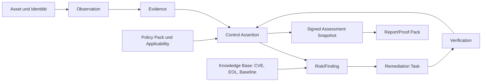
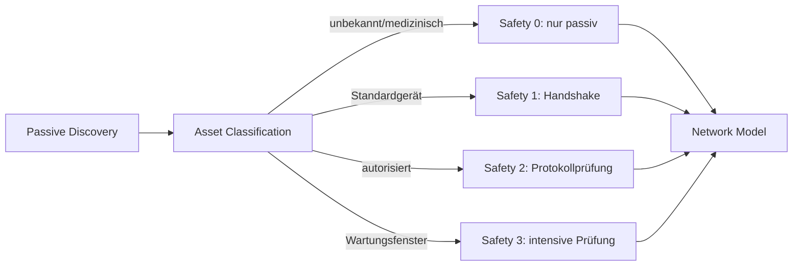

# PraxisShield – CTO- und Security-Architecture-Review 2026

**Stand:** 6. August 2026  
**Analysierter Stand:** lokaler Workspace `Praxis-AI` einschließlich der vollständigen Datei `docs/PRODUKTANALYSE_2026.md`  
**Ziel:** belastbare Produkt-, Sicherheits- und Architekturplanung für ein führendes Assessment-Produkt für kleine und mittlere Praxen in Deutschland

> Dieses Dokument ergänzt die vorhandene Produktanalyse. Vorhandene Funktionen werden nicht erneut als „fehlend“ verkauft. Jede Empfehlung ist als **Ausbau**, **Korrektur** oder **neue Fähigkeit** gekennzeichnet. Die Analyse ist eine technische und produktstrategische Bewertung, keine Rechtsberatung und kein Penetrationstest fremder Systeme.

---

## 1. Gesamturteil

PraxisShield besitzt bereits einen ungewöhnlich guten Kern für evidenzbasierte Bewertungen: Herkunftstypen für Nachweise, Score-Caps für Selbstauskünfte, Gates für grüne Bewertungen, versionierte Ergebnisse, Mandantentrennung, verschlüsselte Prüf- und Berichtspayloads sowie explizite Providerzustände. Das ist deutlich stärker als ein typischer MVP.

Das Produkt ist aber derzeit noch **eine Sammlung mehrerer Assessments**, kein einheitliches Security-Assessment-System. Fragebogen, WLAN, externer Check, Monitoring und KI-Bericht haben unterschiedliche Scores, unterschiedliche Abdeckungslogik und teilweise unterschiedliche Wahrheitsquellen. Das Dashboard zeigt als Hauptwert schlicht den zuletzt aktualisierten Teilscore. Ein LLM darf im Bericht Score, Ampel, Kategorien und eine vermeintliche DSGVO-Konformität erzeugen. Diese beiden Punkte bedrohen die Glaubwürdigkeit des gesamten Produkts stärker als ein fehlender Scanner.

Die erfolgversprechende Positionierung lautet daher nicht „Nessus für Arztpraxen“, sondern:

> **PraxisShield ist die kontinuierliche, evidenzbasierte Sicherheitssteuerung für Praxen: sicher messen, klinische Verfügbarkeit schützen, Maßnahmen nachweisen und gegenüber Leitung, IT-Dienstleister, Versicherung und Prüfern verständlich belegen.**

### 1.1 Strategische Differenzierung

PraxisShield sollte fünf Dinge verbinden, die Wettbewerber meist getrennt anbieten:

1. **Evidence Digital Twin:** Assets, Kontrollen, Beobachtungen, Nachweise, Risiken, Ausnahmen und Maßnahmen werden in einem nachvollziehbaren Graphen verbunden.
2. **SafeScan Healthcare:** Jede Probe besitzt eine Sicherheitsklasse; unbekannte oder medizinische Geräte werden zunächst passiv bzw. minimal-invasiv behandelt.
3. **Posture und Coverage getrennt:** Ein Sicherheitswert darf nie besser aussehen, weil Messungen fehlen. Neben dem Risikowert steht immer die Messabdeckung und Evidenzfrische.
4. **Proof Packs:** Versionierte Nachweispakete für § 390 SGB V/KBV, DSGVO Art. 32, BSI CyberRisikoCheck und – falls anwendbar – NIS2; keine pauschalen Rechtskonformitätsversprechen.
5. **Remediation-to-Verification:** Eine Empfehlung wird zur verantworteten Maßnahme mit Frist, Nachweis, Wiederholungsprüfung und dokumentiertem Restrisiko.

### 1.2 Zwölf-Monats-Zielbild

Nach zwölf Monaten sollte eine Praxis in weniger als 30 Minuten ein belastbares Erstbild erhalten, ohne empfindliche Geräte zu gefährden. Danach ergänzt ein Windows-Collector Messdaten, eine FRITZ!Box-Integration Netzwerkfakten und ein kontinuierlicher Cloud-Monitor externe Veränderungen. Das Produkt erzeugt nicht nur einen Bericht, sondern führt die Praxis bis zum verifizierten Abschluss der wichtigsten Maßnahmen.

Erfolg ist nicht „möglichst viele Findings“, sondern:

- keine kritische Falsch-Entwarnung;
- nachvollziehbare Herkunft jedes Ergebnisses;
- sinkende Zeit bis zur Risikoreduktion;
- verifizierte statt nur behauptete Maßnahmen;
- hohe Abdeckung bei minimaler Datenerhebung;
- keine Beeinträchtigung von Behandlung und Medizintechnik.

---

## 2. Vorgehen, geprüfte Artefakte und Grenzen

### 2.1 Vorgehen

- Die 732 Zeilen der bestehenden `PRODUKTANALYSE_2026.md` wurden vollständig gelesen.
- Architektur-, Inventar-, Scoring- und Betriebsdokumentation wurde mit dem aktuellen Quellcode abgeglichen.
- Mobile Native-Module, WLAN-Scanner, Portkatalog, Dashboard, Report-Pipeline, Monitoring, Inventar, Worker, Datenmodell und Tests wurden stichprobenartig bis auf Implementierungsebene geprüft.
- `npm run verify` wurde ausgeführt: Lint, TypeScript und Jest waren erfolgreich; 34 Suites liefen erfolgreich, 2 integrationsabhängige Suites waren übersprungen, 323 Tests bestanden und 4 Tests waren übersprungen.
- Rechts-, Plattform- und Wettbewerberaussagen wurden gegen aktuelle Primärquellen geprüft.

### 2.2 Grenzen

- Kein aktiver Scan eines Praxisnetzes und kein Test realer FRITZ!Box-, TI-, PVS- oder Medizingeräte.
- Kein vollständiges Red-Team, keine Binäranalyse der Release-Artefakte und keine formelle Datenschutz-Folgenabschätzung.
- Konkurrenzprodukte wurden anhand öffentlicher Herstellerdokumentation bewertet, nicht anhand bezahlter Labortests.
- Aufwandsschätzungen gelten für ein eingespieltes Team und enthalten Produkt-, Backend-, Client-, QA- und Security-Arbeit, aber keine externen Zertifizierungszeiten.

### 2.3 Bewertungsskalen

| Merkmal | Skala |
|---|---|
| Sicherheitsgewinn | **Kritisch** – verhindert falsche Freigaben oder große Angriffsflächen; **Sehr hoch**; **Hoch**; **Mittel**; **Niedrig** |
| Entwicklungsaufwand | **XS** 1–5 Personentage; **S** 1–3 Wochen; **M** 1–2 Monate; **L** etwa ein Quartal; **XL** 2–4 Quartale |
| Plattform | Android, iOS, Windows Agent, Linux Agent, macOS Agent, Router, Cloud, Web |

---

## 3. Was bereits stark ist – und erhalten werden muss

| Vorhandene Fähigkeit | Bewertung | Ausbau statt Neuerfindung |
|---|---|---|
| Evidenztypen `measured`, `inferred`, `self_reported`, `not_checked`, `unavailable` | stark | Auf alle Scan- und Monitoringdomänen vereinheitlichen; Freshness und Confidence ergänzen |
| Self-Report-Cap und Green Gates | stark | serverseitig als einzige Bewertungsinstanz durchsetzen |
| Versionierte Score-Berichte und Audit Trail | stark | auf unveränderliche Assessment-Snapshots und signierte Report-Manifeste erweitern |
| RLS-Tests und service-role Grenze | stark | kontinuierliche Mandantentests und Objekt-Storage-Policies ergänzen |
| AES-GCM für Checks und Berichte | stark | WLAN-/Topologiedaten und lokale Exporte einbeziehen; Schlüsselrotation planen |
| Explizite HIBP-Einwilligung und Providerstatus | stark | Einwilligung dauerhaft, versioniert, widerrufbar und zweckgebunden speichern |
| Rate Limits, Quotas und Idempotenz | stark | in modulare Middleware und providerbezogene Budgets überführen |
| WLAN-Audit und bounded scan | brauchbare Basis | adaptive Discovery, Sicherheitsprofile und echte Abdeckungsmetrik ergänzen |
| Externe Providerchecks | brauchbare Basis | Messlücken dürfen Score nicht erhöhen; Quellenbelege und Freshness hinzufügen |
| Fragebogen mit Drill-down-Nachweisen | gute Basis | an §-390-Anwendbarkeitsprofil und echte Kontrollbibliothek koppeln |

---

## 4. Verifizierte kritische Abweichungen zwischen Produktversprechen und Implementierung

### K-01 – Es existiert kein autoritativer Gesamtscore

**Befund:** Das Dashboard wählt als Primärscore den zuletzt aktualisierten Einzelwert aus Fragebogen, externem Check, Monitoring oder WLAN. In der Historie werden heterogene Messarten als eine Kurve dargestellt. Das Evidenzpanel stammt dennoch nur aus dem letzten Fragebogen.

**Problem:** Ein WLAN-Risikoscore und ein organisatorischer Reifegrad sind nicht austauschbar. Die Darstellung kann eine Verbesserung suggerieren, obwohl nur ein anderer Testtyp zuletzt lief.

**Korrektur:** Ein unveränderlicher `assessment_snapshot` aggregiert alle anwendbaren Kontrollen. Er enthält Posture, Coverage, Confidence, Freshness, Gating-Gründe, Kontroll- und Engine-Versionen. Domänenscores bleiben sichtbar, werden aber nicht als Gesamtscore ausgegeben.

**Plattform:** Cloud, Web, Android, iOS. **Sicherheitsgewinn:** Kritisch. **Aufwand:** L.

### K-02 – Das Sprachmodell bestimmt prüfbare Fakten

**Befund:** Der Report-Prompt fordert `security_score`, `ampel`, Kategoriescores und `dsgvo_compliance` vom Modell. Die Validierung prüft überwiegend Typ und Wertebereich. Zusätzlich existiert im Worker eine zweite, naive Fragebogenberechnung als Anteil positiver Antworten.

**Problem:** Derselbe Input kann andere Scores oder rechtlich missverständliche Aussagen erzeugen. Die dokumentierte deterministische Scoringlogik wird umgangen, während der Bericht dennoch ihre Versionsnummer trägt.

**Korrektur:** Nur die zentrale Rule/Scoring Engine erzeugt Werte, Status, Findings, Referenzen und Priorität. KI darf ausschließlich Erklärungen, zielgruppengerechte Zusammenfassungen und Formulierungsvorschläge aus bereits freigegebenen Fakten erstellen. Server ersetzt oder verwirft alle modellgenerierten Faktenfelder.

**Plattform:** Cloud. **Sicherheitsgewinn:** Kritisch. **Aufwand:** M.

### K-03 – Berichte sind nicht zuverlässig an ihre Evidenz gebunden

**Befund:** Die App sendet aktuelle Clientzustände; `checkId` ist optional und wird im normalen Flow nicht sauber durchgereicht. Der externe Check ist im Report-Aufruf derzeit `null`. Nach einem Neustart wird die vorhandene Reportliste nicht geladen; deterministische Detailfindings hängen am flüchtigen lokalen Zustand. Lokale und serverseitige PDF-Erzeugung unterscheiden sich.

**Problem:** Ein Bericht ist nicht vollständig reproduzierbar, kann vom Client veränderte Daten enthalten und verliert nach App-Neustart Kontext.

**Korrektur:** Reports werden ausschließlich aus serverseitig autorisierten Snapshot-IDs erzeugt. Ein Manifest enthält Hashes von Evidenz, Regeln, Textbausteinen und Template. Der Server rendert das kanonische PDF; die App cached lediglich. Historie wird beim Start geladen.

**Plattform:** Cloud, Web, Android, iOS. **Sicherheitsgewinn:** Kritisch. **Aufwand:** M.

### K-04 – Fehlende Messungen können als guter Monitoringzustand erscheinen

**Befund:** Nicht konfigurierte oder nicht verfügbare Provider werden transparent aufgeführt, reduzieren den Monitoringwert aber nicht. Die Berechnung beginnt bei 100 und schließt nicht geprüfte Findings aus. Die UI kann dennoch „stabil“, „Live“ oder einen sehr hohen Wert zeigen.

**Problem:** Fehlende Evidenz wird faktisch wie „kein Problem gefunden“ behandelt.

**Korrektur:** Posture und Coverage separat berechnen. Unter einer Mindestabdeckung gibt es keinen grünen Gesamtstatus. „Live“ nur bei tatsächlich laufender, frischer Messung; sonst „Letzte Messung“. Kritische Quellen besitzen Gate- oder Cap-Regeln.

**Plattform:** Cloud, Web, Android, iOS. **Sicherheitsgewinn:** Kritisch. **Aufwand:** S–M.

### K-05 – Native Probe-Verträge versprechen mehr als die Plattformen liefern

**Befund:** Die TypeScript-Schicht deklariert unter anderem mDNS, SNMP, SMB, DNS-Tests und IPv6-TCP. Android implementiert nur einen Teil, iOS noch weniger. Android-Geräteerkennung liest `/proc/net/arp`, das seit Android 10 für Apps nicht mehr zugänglich ist. Die gebaute iOS-Konfiguration weicht von der App-Konfiguration ab.

**Problem:** „Nicht gefunden“ kann technisch „nicht gemessen“ bedeuten. Plattformdrift erzeugt falsche Sicherheit.

**Korrektur:** Capability Negotiation zur Laufzeit: jede Probe liefert `supported`, `permission`, `executed`, `coverage`, `reason`, `timestamp`, `probe_version`. CI vergleicht JS-Vertrag, Android, iOS, Entitlements und Plist. Fehlende Probes werden nicht als negative Ergebnisse interpretiert.

**Plattform:** Android, iOS, Cloud. **Sicherheitsgewinn:** Sehr hoch. **Aufwand:** M.

### K-06 – Geräteinventar und Monitoringziele sind flüchtig

**Befund:** Datenbanktabellen und Typen existieren, der aktive Zustand liegt jedoch nur in einem nicht persistenten Zustandsspeicher. Beim ersten Zugriff können synthetische Beispieldaten angelegt werden. Monitoringziele nutzen denselben flüchtigen Zustand.

**Problem:** Neustarts vernichten den operativen Bestand und können Demoobjekte mit echten Assets vermischen.

**Korrektur:** Offline-first Repository mit lokaler verschlüsselter DB, Delta-Sync und serverseitiger Mandantenablage. Jedes Objekt erhält `source`, `observed_at`, `confidence`, `synthetic`, `deleted_at` und Konfliktversion. Beispieldaten nur in explizitem Demo-Modus.

**Plattform:** Cloud, Android, iOS, Web. **Sicherheitsgewinn:** Hoch. **Aufwand:** M.

### K-07 – WLAN- und Topologiedaten werden unnötig offen gespeichert

**Befund:** SSID, private Adressen, Gateway, DNS, WLAN-Details und Findings werden im Klartext-JSON der WLAN-Tabelle synchronisiert, obwohl für andere sensible Payloads bereits ein Verschlüsselungsmuster besteht.

**Problem:** Interne Topologie ist hochwertige Angreiferinformation und personenbezogen bzw. mandantensensibel kontextabhängig.

**Korrektur:** Nur Index-/Statusmetadaten im Klartext; Topologie client- oder serverseitig mit mandantengebundenem Schlüssel verschlüsseln. IP/MAC/BSSID in UI/Telemetry standardmäßig pseudonymisieren. Retention und Export/Löschung definieren.

**Plattform:** Cloud, Android, iOS, Web. **Sicherheitsgewinn:** Sehr hoch. **Aufwand:** S–M.

### K-08 – Compliance-Basis und Produktbegriffe sind teilweise veraltet

**Befund:** Die Dokumentation orientiert sich häufig an der früheren §-75b-Richtlinie. Die aktuelle Richtlinie beruht auf § 390 SGB V und hat seit Oktober 2025 erweiterte Anforderungen und Anwendbarkeitsprofile.

**Problem:** Veraltete Referenzen, unvollständige Kontrollabdeckung und pauschale „DSGVO-konform“-Aussagen erhöhen Haftungs- und Vertrauensrisiko.

**Korrektur:** Versionierter Policy Pack für § 390: Grundprofil, mittlere/große Praxis, große Praxis mit Medizingeräten und TI-spezifische Anforderungen. Produkttexte sagen „Nachweisstand“ oder „Kontrollabdeckung“, nicht „rechtskonform“. NIS2 wird über einen Eligibility Wizard nur bei Anwendbarkeit aktiviert.

**Plattform:** Cloud, Web, Android, iOS. **Sicherheitsgewinn:** Sehr hoch. **Aufwand:** M–L.

### K-09 – Mobile Release-Härtung ist unvollständig

**Befund:** Der iOS-Build enthält nur einen Teil der deklarierten Bonjour-Services und kein sichtbares Wi-Fi-Information-Entitlement. Android fordert breite Alt-/Overlay-/WLAN-Berechtigungen und erlaubt App-Backup. Die Android-Nativeprobe ist zusätzlich im Config-Plugin dupliziert.

**Problem:** Scans funktionieren je Build unterschiedlich; unnötige Berechtigungen und Backups vergrößern Datenschutz- und Angriffsfläche.

**Korrektur:** Permission-Minimierung, explizite Backup-Regeln, iOS-Entitlement und Plist-Generierung testen, Native-Code aus einer Quelle generieren, Device-Farm-Smoke-Tests. Android-17-Local-Network-Permission früh berücksichtigen.

**Plattform:** Android, iOS. **Sicherheitsgewinn:** Hoch. **Aufwand:** S–M.

### K-10 – Der Worker ist ein Skalierungs- und Sicherheitsengpass

**Befund:** Auth, Provider, Scoringhilfen, KI, Bericht, PDF, Datenschutz und Backoffice befinden sich in einer Worker-Datei mit mehr als 5.000 Zeilen und rund 39 Routen.

**Problem:** Änderungen haben große Blast Radius; Policy, Autorisierung und Fehlerbehandlung driften leichter auseinander.

**Korrektur:** Vertikale Module mit gemeinsamen Auth-/Role-/Consent-/Quota-Middlewares, typed contracts, `/api/v1`, Schema- und Contract-Tests sowie per-Route Datenklassifikation.

**Plattform:** Cloud. **Sicherheitsgewinn:** Hoch. **Aufwand:** L.

---

## 5. Zielprodukt und mentale Modelle

### 5.1 Vier getrennte Ergebnisdimensionen

Jeder Nutzer sieht vier klar getrennte Größen:

| Dimension | Bedeutung | Beispiel |
|---|---|---|
| **Posture** | Wie sicher sind die nachweislich geprüften, anwendbaren Kontrollen? | 68/100 |
| **Coverage** | Welcher Anteil der anwendbaren Kontrollen wurde mit ausreichender Evidenz geprüft? | 74 % |
| **Confidence** | Wie belastbar sind Herkunft, Qualität und Konsistenz der Evidenz? | mittel |
| **Freshness** | Wie aktuell sind die Nachweise bezogen auf ihre individuelle Gültigkeit? | 81 % aktuell |

Ein Ampelstatus wird nur grün, wenn alle vier Gate-Regeln erfüllt sind. Ein hoher Posture-Wert bei 25 % Coverage wird als „unzureichend gemessen“, nicht als „sicher“ dargestellt.

### 5.2 Evidence Digital Twin



### 5.3 Assessment-Lebenszyklus

1. Praxisprofil bestimmt anwendbare Kontrollen.
2. Nutzer autorisiert Scope, Zeitraum und Sicherheitsprofil.
3. Mobile App, Router, Agent, Cloud und Selbstauskunft erzeugen Beobachtungen.
4. Normalisierung und Entity Resolution ordnen sie Assets/Kontrollen zu.
5. Rule Engine erzeugt deterministische Assertions und Findings.
6. Scoring Engine berechnet Posture, Coverage, Confidence und Freshness.
7. Snapshot wird unveränderlich gespeichert und signiert.
8. Maßnahmen werden zugewiesen, terminiert und mit Evidenz abgeschlossen.
9. Wiederholungsprüfung verifiziert Abschluss oder öffnet die Maßnahme erneut.

---

## 6. Benutzererlebnis und Produktdesign

### 6.1 Informationsarchitektur

Die Hauptnavigation sollte nach Nutzeraufgaben statt Technikmodulen aufgebaut sein:

- **Übersicht:** Lage, Messabdeckung, Veränderungen und nächste beste Aktionen.
- **Prüfen:** geführte Erstprüfung, Netzwerkscan, Cloud-/Router-/Agent-Checks.
- **Risiken:** konsolidierte Findings, nicht einzelne Scannerlisten.
- **Maßnahmen:** Verantwortliche, Fristen, Status, Akzeptanz und Wiederholungsprüfung.
- **Inventar:** Assets, Identitäten, Netze, Anbieter, Datenklassen und Beziehungen.
- **Nachweise/Berichte:** Snapshots, Proof Packs, Exporte und Verlauf.
- **Einstellungen:** Praxisprofil, Rollen, Integrationen, Einwilligungen, Retention.

Technische Module bleiben als Filter und Diagnoseansicht erhalten. Das beantwortet die drei Nutzerfragen: „Was ist gefährlich?“, „Was soll ich als Nächstes tun?“ und „Wie belege ich die Verbesserung?“

### 6.2 Dashboard

**Ausbau:** Oben stehen Gesamtlage und Abdeckung nebeneinander, einschließlich Zeitstempel und Vergleich nur mit demselben Assessmenttyp. Danach folgen maximal drei „Next Best Actions“ nach erwarteter Risikoreduktion pro Aufwand, kritische neue Veränderungen, überfällige Aufgaben und Evidenzlücken. Preis-/Planwerbung wandert aus dem primären Arbeitsbereich.

**Technik:** `assessment_snapshot` statt Wahl des neuesten Teilscores; serverseitig erzeugte Delta-Events; Dashboard Query/API mit stabiler View; Skeletons und inkrementelles Laden.

**Plattform:** Web, Android, iOS. **Sicherheitsgewinn:** Sehr hoch. **Aufwand:** M.

### 6.3 Risikoanzeige und Farben

- Farbe ist redundante Codierung, nie alleinige Information; Icon, Text und Muster ergänzen Rot/Gelb/Grün.
- Kritikalität und Status werden getrennt: ein kritisches Risiko kann „in Bearbeitung“ sein, bleibt aber kritisch.
- Grau bedeutet „nicht gemessen“, nicht „neutral“.
- Blau kennzeichnet Information/Verbesserung, nicht Sicherheit.
- WCAG-AA-Kontrast, Dynamic Type, Screenreader-Texte, Fokusreihenfolge und Touchziele werden CI-/QA-Kriterien.
- Scoreänderungen zeigen Ursache und Datenbasis: „+4 durch verifizierte MFA“, nicht nur einen grünen Pfeil.

**Plattform:** Web, Android, iOS. **Sicherheitsgewinn:** Mittel. **Aufwand:** S.

### 6.4 Diagramme

Sinnvolle Visualisierungen sind:

- Posture/Coverage-Matrix statt Tachometer;
- Trend nur für identische Engine-/Policy-Version oder mit sichtbarer Versionsgrenze;
- Risiko-Burndown nach Schweregrad und Status;
- Netzwerk-/Abhängigkeitsgraph nur für IT-Verantwortliche;
- Kontroll-Heatmap nach KBV-Profil;
- Evidenzfrische als Alterungsverlauf.

Zu vermeiden sind 3D-Charts, dekorative Donuts, gemischte Scores in einer Linie und Ranglisten zwischen Praxen. Benchmarks dürfen nur ausreichend anonymisiert und nach Größe/Profil vergleichbar sein.

### 6.5 Geführte Bedienung

Ein Assessment Wizard erfasst Praxisgröße, Standorte, Beschäftigte, TI-Betriebsart, Medizingeräte, PVS, Cloud, Heimarbeit, mobile Nutzung, externen IT-Dienstleister und gewünschte Scanintensität. Er erklärt vor jedem aktiven Schritt Daten, Risiko, Dauer und Abbruchmöglichkeit. Unterbrechungen werden sicher fortgesetzt.

Empfehlungen erhalten drei Ebenen:

1. eine verständliche Zusammenfassung für die Praxisleitung;
2. exakte technische Schritte für IT-Dienstleister;
3. Nachweis- und Rücksetzplan einschließlich möglicher Betriebsunterbrechung.

**Plattform:** Web, Android, iOS. **Sicherheitsgewinn:** Hoch. **Aufwand:** M.

### 6.6 Berichte

Es werden getrennte Reporttypen benötigt:

- **Managementbericht:** Lage, Top-Risiken, klinische/betriebliche Wirkung, Maßnahmenbudget.
- **Technischer Bericht:** Evidenz, Assets, Probes, Rohbelege, Reproduktion, Fix und Rollback.
- **Nachweispaket:** Kontrollmatrix, Gültigkeit, Verantwortliche, Ausnahmen und Signatur.
- **IT-Dienstleister-Auftrag:** konkrete umsetzbare Tickets ohne unnötige Patientendaten.
- **Cyberversicherungs-/Incident-Readiness-Auszug:** Backup, MFA, EDR, Logging und IR-Nachweise.

Jede Aussage trägt Quelle, Messzeit, Confidence, Anwendbarkeit und Regelversion. „Nicht geprüft“ erscheint prominent. KI-Text ist als generierte Erläuterung kenntlich und darf keine neue Tatsachenbehauptung hinzufügen.

### 6.7 Performance und Zuverlässigkeit

- Screens erhalten Budgets: Time-to-Interactive <2 s aus Cache, API-p95 <500 ms für Read Views, keine >100-ms-JS-Blocks.
- Große Inventare werden paginiert/virtualisiert; Netzwerkgraphen lazy geladen.
- Scans laufen als persistierbare Jobs mit Checkpoint, Pause, Abbruch und Hintergrundfortsetzung, soweit das OS erlaubt.
- Lokaler Cache ist verschlüsselt, größenbegrenzt und besitzt Migrations-/Recovery-Tests.
- Jeder „Erfolgreich“-Status wird erst nach bestätigter Persistenz gezeigt.

### 6.8 Produktfunktionen: behalten, reduzieren, ergänzen

**Behalten und ausbauen:** evidenzbasierter Fragebogen, WLAN-Audit, externe Checks, Monitoring, Inventar, verschlüsselte Reports, Mehrpraxisfähigkeit.

**Reduzieren oder umgestalten:**

- Preis-/Plan-CTA nicht als zentrale Dashboard-Karte.
- Beispieldaten nicht automatisch in Produktionsinventare mischen.
- Kein einzelner „magischer“ Score ohne Abdeckung.
- Keine generische KI-Chatfunktion als Hauptfeature.
- Keine Dopplung lokaler und serverseitiger Berichtswahrheiten.
- `traffic_analysis` nicht nennen, solange kein Traffic analysiert wird.
- Keine „Live“-Bezeichnung für periodische Snapshots.
- Keine universelle Aussage „DSGVO-konform“ oder „Netz sicher“.

**Erwartete Basisfunktionen:** Agenten-/Connectorstatus, Assetverantwortung, Änderungsverlauf, Exporte, Rollen, Benachrichtigungen, Maßnahmenworkflow, Wiederholungsprüfung, Auditlog, SSO/MFA, Backup-/Restore-Nachweise und Supportdiagnose.

**Premiumfähig:** Multi-Standort, MSP-/IT-Dienstleister-Portal, automatisierte Proof Packs, Windows-Agent, Routerconnector, Entra/M365, kontinuierliches Exposure Monitoring, individuell gebrandete Berichte, API/Webhooks, längere Retention und Benchmarking.

---

## 7. Netzwerkanalyse – weit über Portscans hinaus

### 7.1 Grundprinzip: Beobachten, modellieren, dann prüfen

Ein einzelner Portscan ist nur eine Momentaufnahme. PraxisShield sollte ein Netzmodell aus mehreren Quellen bilden: lokales Interface, ARP/Neighbor Discovery, mDNS/DNS-SD, SSDP/UPnP, DHCP-Leases, Routertabellen, Switch-MAC-Tabellen, passive Agentbeobachtung, DNS- und Gatewayinformationen sowie freigegebene aktive Probes. Jede Entdeckung wird als Beobachtung mit Quelle und Gültigkeit gespeichert; Entity Resolution führt sie probabilistisch zusammen.

Der Scanplan entsteht aus dem Modell:



### 7.2 WLAN

**Prüfungen:** tatsächlicher Security Type, WPA2/WPA3-Modus, Enterprise/PSK, WPS, Gastnetztrennung, Client Isolation, PMF/802.11w, schwache Legacy-Modi, SSID/BSSID-Wechsel, Rogue-/Evil-Twin-Indikatoren, Kanal-/Bandhygiene, Mesh-/Repeaterkonsistenz, Default-SSID-Indizien, Captive Portal und unerwartete zweite Gateways.

**Technik:** Android liefert verfügbare Verbindungs- und Scaninformationen nur permission- und OS-abhängig; iOS kann mit passendem Entitlement und erfüllten Systembedingungen Informationen zum aktuellen Netz liefern, aber keinen allgemeinen WLAN-Survey. Router/Agent werden deshalb primäre Messquelle für Konfiguration, BSSID-Liste und verbundene Geräte. Kein Deauth, keine Handshake-Sammlung, kein Passwortcracking im Standardprodukt.

**Sicherheitsgewinn:** Hoch. **Aufwand:** M–L. **Plattform:** Android, iOS, Windows Agent, Linux Agent, macOS Agent, Router.

### 7.3 LAN, IPv4 und IPv6

**Prüfungen:** vollständiger autorisierter Prefix statt fester elf IPs; ARP/ND-Abdeckung; doppelte IPs; fremde DHCP-/Router Advertisements; unerwartete Default Gateways; IPv6 trotz IPv4-Firewall; öffentliche/ULA/Link-local Adressen; SLAAC/DHCPv6; DNS über IPv6; unerwartete Transition-/Tunnelmechanismen; dual-stack Dienstabweichungen; Routing-Asymmetrie.

**Technik:** Collector wählt adaptive Strategien nach Prefixgröße und Zeitbudget. Bei `/24` kann er bounded vollständig prüfen, bei größeren Netzen kombiniert er Router-/DHCP-Daten, passive Beobachtung und priorisierte Ziele. Ergebnis enthält `hosts_expected`, `hosts_attempted`, `hosts_observed`, `methods` und Blind Spots. IPv6 nutzt Neighbor Discovery und explizite Zielquellen; kein blindes Scannen von `/64`.

**Sicherheitsgewinn:** Sehr hoch. **Aufwand:** L. **Plattform:** Windows Agent, Linux Agent, macOS Agent, Router; Mobile ergänzend.

### 7.4 DNS

**Prüfungen:** konfigurierte Resolver, Abweichung zwischen DHCP und Endgerät, DNSSEC-Validierung, DoT/DoH-Policy, bekannte Filterkategorien mit ausschließlich kontrollierten Testdomains, Split-DNS, Rebind-Schutz, öffentliche Rekursion, Zonenübertragung bei autorisierten internen Servern, veraltete Suchdomänen, WPAD/LLMNR/mDNS-Risiko, Resolvererreichbarkeit über IPv6 und unerwartete DNS-Manipulation.

**Technik:** deterministische Testzone unter eigener Kontrolle mit signierten Antworten; Resolvertests lokal und cloudseitig; niemals echte Malwaredomains abrufen. Ergebnisse nach Praxisgerät, Netzsegment und Transport unterscheiden.

**Sicherheitsgewinn:** Hoch. **Aufwand:** M. **Plattform:** Agents, Router, Cloud, Mobile eingeschränkt.

### 7.5 DHCP, Gateway und Routing

**Prüfungen:** Rogue-DHCP-Indizien, Lease-Dauer, DNS-/NTP-/Gateway-Optionen, unautorisierte statische Netze, Managementzugang, Default Credentials als Self-Report plus sichere Connectorprüfung, WAN-Exposition, Double NAT, Portweiterleitungen, UPnP/PCP/NAT-PMP, statische Routen, Remote Administration, Firmware, Zeit/NTP und Konfigurationsbackup.

**Technik:** Routerconnector bevorzugen; Agents beobachten mehrere DHCP-Antworten und Routingtabellen. Änderungen erzeugen Drift-Events, keine sofortige Schwachstelle ohne Kontext.

**Sicherheitsgewinn:** Sehr hoch. **Aufwand:** M–L. **Plattform:** Router, Agents.

### 7.6 VLAN, Gastnetz und Segmentierung

**Prüfungen:** nicht nur Existenz eines Gastnetzes, sondern zulässige Kommunikationsmatrix zwischen Praxis-PCs, Server/PVS, Medizingeräten, VoIP, Kameras, Druckern, Gast/BYOD, Management, Backup und TI. Kritisch sind beispielsweise SMB/RDP vom Gastnetz, Internetzugang von Geräten ohne Bedarf, Managementzugang aus Benutzer-VLANs und unkontrollierter lateraler Verkehr.

**Technik:** Pro Segment ein Collector oder kontrollierte Testendpunkte; Router-/Firewallregelimport; deklarierte Sollmatrix versus gemessene Erreichbarkeit. Regelübersetzung in einen herstellerneutralen Connectivity Graph. Sicherheitsprofile verhindern Tests gegen empfindliche Geräte.

**Sicherheitsgewinn:** Sehr hoch. **Aufwand:** L–XL. **Plattform:** Agents, Router, Cloud, Web.

### 7.7 Firewall, VPN und Zero Trust

**Firewall:** Inbound/Outbound-Regeln, Any/Any, geöffnete Verwaltung, Shadow Rules, Logging, Ablauf temporärer Regeln, IPv4/IPv6-Parität und Bezug zum Asset Owner.

**VPN:** Protokoll und Kryptografie, MFA, Split-Tunnel, Clientupdates, Benutzer-/Gerätebindung, verwaiste Profile, Standortkopplungen, Full-Tunnel-DNS, Adminzugang, Schlüsselalter und Widerruf. WireGuard ist nicht automatisch sicher, wenn Schlüssel gemeinsam genutzt oder nie rotiert werden.

**Zero Trust:** Für kleine Praxen pragmatisch als explizite Identität, gerätebezogene Vertrauenssignale, Least Privilege, segmentierte Dienste, MFA und zeitbegrenzter Dienstleisterzugriff. Kein Verkauf eines Buzzwords oder Zwang zu komplexer Enterprise-Infrastruktur.

**Sicherheitsgewinn:** Sehr hoch. **Aufwand:** L. **Plattform:** Router, Agents, Cloud, Web.

### 7.8 Port- und Protokollprüfung

Der bestehende Katalog mit elf Ports wird zu einem versionierten Servicekatalog ausgebaut: Dienst, Transport, erwartete Banner/TLS, sichere Probe, Safety Class, Timeout, CVE-CPE-Regeln und klinischer Kontext.

Zusätzliche Familien: DNS, DHCP, NTP, HTTP(S), SSH, Telnet, FTP/TFTP, SMTP/IMAP/POP, LDAP/LDAPS, Kerberos, RDP, WinRM, SMB/NetBIOS, SNMP, IPP/JetDirect, VNC, Datenbanken, NAS, Hypervisor, Container APIs, Backupserver, VoIP/SIP, DICOM 104/11112, HL7/MLLP, herstellerspezifische medizinische Dienste und TI-nahe Komponenten. Ein offener Port allein ist kein Finding; Protokoll, Exposition, Assetklasse und Sollzustand bestimmen das Risiko.

**Sicherheitsgewinn:** Hoch. **Aufwand:** L. **Plattform:** Agents; Mobile nur Safety-1-Subset.

---

## 8. Geräteerkennung und Asset Intelligence

### 8.1 Erkennbare Klassen

PraxisShield sollte folgende Klassen unterscheiden, ohne eine Genauigkeit vorzutäuschen, die die Daten nicht hergeben:

| Klasse | Sinnvolle Signale | Zusätzliche sicherheitsrelevante Daten |
|---|---|---|
| Windows-/Linux-/macOS-PC und Server | DHCP, mDNS, SMB, RDP/SSH, TLS, Agent | OS-Build, EOL, Patch, EDR, Firewall, Verschlüsselung, lokaler Admin, Dienste |
| Drucker/MFP/Scanner | IPP, SNMP, JetDirect, Web UI, OUI | Firmware, Default-/shared credentials, Addressbuch, SMB-Ziel, TLS, Speicherlöschung |
| NAS/Backup | SMB/NFS/Web UI/OUI | RAID ist kein Backup, Immutable/offline Kopie, Restoretest, MFA, Snapshots, Replikation |
| Router/Firewall/AP/Repeater/Switch | LLDP/CDP, SNMP, UPnP, TR-064, OUI | Firmware, Managementpfad, Regeln, VLAN, Ports, Mesh, Remotezugriff, Configbackup |
| Kamera/IoT/VoIP | SSDP, SIP, ONVIF, mDNS, OUI | Cloudbindung, Default-Zugang, Internetbedarf, Firmware/EOL, Segment |
| Medizingerät | DICOM, HL7, OUI, Hostname, Herstellerimport, manuelle Bestätigung | Hersteller/Modell/Firmware, Zweck, Risikoklasse, Wartung, Freigaben, Remote Service |
| TI/PVS-Komponente | manuelle Zuordnung, sichere Discovery, Connectorimport | Betriebsart, Verantwortlicher, Update-/Supportstatus, Segment, Abhängigkeiten |
| Virtualisierung | Hypervisor-UI/API, Agent, Netzwerkdaten | Host/Guest-Zuordnung, Managementexposition, Snapshot-/Backupstatus |
| Docker/Kubernetes | lokale Agentabfrage, autorisierte API | Images, Tags/Digests, privileged, Secrets, exposed API, RBAC, Patch/EOL |
| Cloud/SaaS/Identität | Connector, DNS, OAuth/SSO-Inventory | Owner, Region, AVV/C5, MFA, Gastkonten, App-Consent, letzte Nutzung |

### 8.2 Assetdatensatz

Jedes Asset braucht: stabile interne ID; Praxis/Standort/Segment; Namen und Aliase; IP/MAC nur verschlüsselt; Typ und Subtyp; Hersteller/Modell/Version; OS/Firmware; Owner; technischer Verantwortlicher; Datenklasse; Kritikalität für Behandlung; Internetbedarf; Zugriffswege; Abhängigkeiten; Lifecycle/EOL; letzte Beobachtung; Quellen; Confidence; Agentstatus; Wartungsfenster; Scan-Safety-Class; Findings; Ausnahmen; Löschstatus.

### 8.3 Entity Resolution

MAC-Adressen rotieren, IPs wechseln und Hostnamen sind unzuverlässig. Eine regelbasierte, später probabilistische Auflösung kombiniert Router-ID, Agent-ID, Zertifikatsfingerprint, OUI, Hostname, Services und zeitliche Koexistenz. Automatische Zusammenführungen benötigen Schwellenwerte; unsichere Fälle werden als Vorschlag angezeigt und sind reversibel.

### 8.4 Unbekanntes und Drift

Neue Geräte, wiederkehrende ehemalige Geräte, Klassenwechsel, neue Dienste, neue öffentliche Exposition, DNS-/Gatewaywechsel und plötzlich fehlende kritische Assets sind Ereignisse. Baseline-Lernen braucht eine Einlernphase und Wartungsfenster, sonst entsteht Alert Fatigue.

**Sicherheitsgewinn:** Sehr hoch. **Aufwand:** L. **Plattform:** Cloud, Web, Agents, Router, Mobile.

---

## 9. Router – FRITZ!Box zuerst, herstellerneutral weiter

### 9.1 FRITZ!Box-Connector

TR-064 ist der sinnvollste erste Routerconnector. Die Implementierung muss die tatsächlich angebotenen Services und Actions dynamisch aus den Service Descriptions ermitteln; nicht jede FRITZ!OS-/Modellkombination bietet dieselben Daten.

**Read-only mögliche Daten je Capability:** Modell/FRITZ!OS, Updatezustand, WAN-/IPv6-Status, Hosts und bekannte Geräte, WLAN-/Gastnetzstatus, Mesh-/Repeaterbeziehungen, Portfreigaben, UPnP-Konfiguration, Verbindungsstatus, Ereignisinformationen soweit API/Export dies sicher zulässt, VPN/WireGuard-Metadaten ohne Geheimnisse sowie DNS-/Zeiteinstellungen, sofern exponiert.

**Sicherheitsdesign:**

- separater FRITZ!Box-Benutzer mit minimalen Rechten;
- lokale Verbindung, bevorzugt verschlüsselter TR-064-Port;
- Credentials im OS-Keystore, nicht in Cloud oder Logs;
- Action-Allowlist; keine Konfigurationsänderung in Phase 1;
- Capability Manifest pro Gerät und Firmware;
- sensible Werte lokal normalisieren, nur benötigte Evidenz synchronisieren;
- explizite erneute Freigabe vor späteren Write-Actions;
- Connector-Testmatrix mit Emulator/Fixtures und ausgewählten echten Modellen.

**Nutzen:** Der Router sieht Geräte, Leases, WLAN und Freigaben zuverlässiger als die Mobile App. **Sicherheitsgewinn:** Sehr hoch. **Aufwand:** M–L. **Plattform:** Router plus Mobile/Agent als lokaler Connector, Cloud für Auswertung.

### 9.2 FRITZ!Box-Prüfregeln

- Firmware/EOL und automatische Updates;
- Internetfreigaben, Remote Management und MyFRITZ-Kontext;
- UPnP-Freigaben und unerwartete Änderungen;
- Gastnetz aktiv, getrennt und ohne unerlaubten Zugriff;
- WLAN-Modus, WPS, PMF und geteilte Schlüssel;
- IPv6-Firewall und Freigaben getrennt von IPv4;
- Mesh-/Repeater-Firmware und Konfigurationsdrift;
- VPN-Profile, Schlüsselalter, Benutzerbindung und unnötige Dauerzugänge;
- unbekannte/wiederkehrende Geräte;
- DNS-/NTP-/Routingänderungen;
- Konfigurationsbackup, Adminrollen und Ereignisaufbewahrung als geführter Nachweis, wenn nicht messbar.

### 9.3 Weitere Hersteller

Nach Telemetrie und Kundennachfrage: Ubiquiti UniFi, Sophos, Lancom, Securepoint, OPNsense/pfSense, Cisco/Meraki, Fortinet und Telekom-/ISP-Geräte. Architektur: herstellerneutraler Router-Datenvertrag, connector-spezifischer Adapter, einheitliche Rule Engine. Keine Screen-Scraping-Connectoren als dauerhafte Strategie; nur dokumentierte APIs, SNMP read-only oder geprüfte Exporte.

**Priorisierung:** FRITZ!Box zuerst als Produktwette; UniFi/Sophos/Lancom/Securepoint nach realer Installationsbasis. **Aufwand:** je Connector M–L.

---

## 10. Betriebssystemprüfungen

### 10.1 Windows

**Messbar mit Agent/PowerShell/WMI/MDM/Entra-Connector:** Edition/Build/EOL, Updatealter und ausstehender Reboot, Defender/EDR, Firewallprofile, BitLocker und Recovery-Key-Escrow, Secure Boot/TPM, lokale Administratoren, Autologon, RDP/NLA, SMBv1/Signing/Encryption, LLMNR/NetBIOS, PowerShell-/Event-Logging, Credential Guard, LSASS-Schutz, AppLocker/WDAC, Browserstatus, Office-Makros, lokaler Passwortstatus/LAPS, Backup/Restore, Dienste, Freigaben, Zertifikate, USB-Richtlinien, Zeitsynchronisation und Domänen-/Entra-Zugehörigkeit.

**Besonders praxisrelevant:** PVS-/Labor-/Druckertreiber-Kompatibilität und Herstellerfreigaben. Maßnahmen dürfen nicht blind Updates oder Hardening erzwingen, sondern markieren Abhängigkeit, Testgruppe, Rollback und Wartungsfenster.

**Sicherheitsgewinn:** Sehr hoch. **Aufwand:** L für Agent v1, fortlaufend für Rules. **Plattform:** Windows Agent, Cloud, Web.

### 10.2 Linux

OS/Kernel/EOL, Paketupdates, Secure Boot optional, nftables/iptables, SSH-Policy, sudoers, lokale Konten/Keys, offene Dienste, TLS, Auditd/Journald, Zeit, Full-Disk Encryption, Backup, Container, File Permissions, unattended updates, SELinux/AppArmor, Kernelparameter und Integritätsmonitoring. Distributionen werden über Adapter und OVAL-/herstellerspezifische Feeds normalisiert.

**Sicherheitsgewinn:** Hoch. **Aufwand:** M–L. **Plattform:** Linux Agent, Cloud.

### 10.3 macOS

macOS-Version/EOL, FileVault, Gatekeeper/XProtect, Firewall, SIP, Secure Token, lokale Admins, MDM-Status, Updates, Login Items, System Extensions, Privacy Permissions, Screen Sharing/Remote Login, File Sharing, Browser, Backup, Zertifikate und Konfigurationsprofile. Apple-APIs und `system_profiler`/Profile nur mit minimalen Rechten verwenden.

**Sicherheitsgewinn:** Hoch. **Aufwand:** M–L. **Plattform:** macOS Agent, Cloud.

### 10.4 Android

Direkt messbar: OS-/Security-Patchlevel, Gerätemodell, Screenlock-/Biometrie-Verfügbarkeit in begrenztem Umfang, Root-/Integrity-Indikatoren, Appversion, Netzwerkverbindung, VPN-Zustand eingeschränkt, App-eigene sichere Speicherung und lokale Netztests entsprechend Berechtigungen. Mit Android Enterprise/MDM zusätzlich Verschlüsselung, Compliance, Work Profile, App-Inventar, Updatepolicy und Managed Configurations.

Nicht ohne weiteres messbar: vollständiges fremdes App-Inventar, globale Security Settings, zuverlässige ARP-Tabelle, unbeschränkte WLAN-Scans oder Hintergrund-Netzwerkscans. Ergebnisse müssen `unsupported` statt „bestanden“ zeigen.

**Sicherheitsgewinn:** Mittel–hoch. **Aufwand:** M. **Plattform:** Android, optional MDM-Connector.

### 10.5 iOS/iPadOS

Direkt messbar: App-/OS-Basisdaten, Geräte-/App-Attestierung, aktuelles WLAN in den von Apple erlaubten Fällen, lokale Verbindungsprobes, eigener Schutzstatus und sichere Schlüsselablage. Mit MDM: OS-Compliance, Passcode-/Verschlüsselungsrichtlinie, Managed Apps, Zertifikate, VPN, Restriktionen und Lost Mode gemäß Verwaltungsmodell.

Nicht möglich für eine normale App: beliebige WLAN-Umgebung erfassen, ARP-/Neighbor-Tabelle lesen, fremde Apps vollständig inventarisieren, Firewall-/Systemkonfiguration prüfen oder dauerhaft im Hintergrund scannen. Dafür sind Router, Agent oder MDM nötig.

**Sicherheitsgewinn:** Mittel. **Aufwand:** M. **Plattform:** iOS, optional MDM-Connector.

---

## 11. Sicherheitsprüfungs-Katalog

### 11.1 Priorisierte Prüffamilien

| Familie | Konkrete Prüfungen | Primäre Plattform | Gewinn / Aufwand |
|---|---|---|---|
| Schwache Netzwerkprotokolle | Telnet/FTP/TFTP, SMBv1, unverschlüsseltes LDAP/HTTP, SNMPv1/v2c, RDP ohne NLA, LLMNR/NBNS | Agents, Router | sehr hoch / M |
| TLS und Zertifikate | TLS 1.0/1.1, Cipher, Kettenfehler, Ablauf, Hostname, Self-signed im Kontext, Schlüsselstärke, HSTS extern | Agents, Cloud | hoch / M |
| DNS/Domain/Email | DNSSEC, DMARC/SPF/DKIM, MX/TLS, Leakprüfung mit Einwilligung, Shadow-Domain, DoH/Filter | Cloud, Agents | hoch / M |
| Active Directory | DC/EOL, Privileged Groups, alte Konten, Kerberoast-/Delegationsrisiken, LDAP Signing/Channel Binding, NTLM, GPO, LAPS, Tiering | Windows Agent | sehr hoch / L |
| Entra ID/M365 | MFA/Conditional Access, Legacy Auth, Adminrollen, Gäste, App Consents, risky sign-ins, Secure Score Actions, Auditretention | Cloud Connector | sehr hoch / L |
| Endpoint | Patch/EOL, EDR/AV, Firewall, Disk Encryption, lokale Admins, Secure Boot, Browser/Office | Agents/MDM | sehr hoch / L |
| Backup/Recovery | 3-2-1, offline/immutable, Verschlüsselung, MFA, Jobstatus, Restoretest, RPO/RTO, PVS-/Konfigurationsbackup | Agent/Connector/Self-report | kritisch / M–L |
| Logging/Detection | zentrale Quellen, Zeit, Retention, Alarmrouting, Testalarm, Admin-/Auth-/EDR-/Firewall-/Backup-Events | Agent/Cloud | sehr hoch / L |
| Netzwerksegmentierung | Soll-/Ist-Matrix, Gast/BYOD/Medizin/Backup/Management/TI, IPv6-Parität | Agents/Router | sehr hoch / L |
| Firmware/EOL | Router, AP, NAS, Drucker, Medizingerät, Switch, Kamera, TI-Komponente | Router/Agent/Knowledge Base | sehr hoch / L |
| Identität/Passwort | MFA, Passwortmanager, geteilte Konten, Joiner/Mover/Leaver, Recovery, Dienstkonten, Fernwartung | Cloud/Agent/Self-report | sehr hoch / M |
| Shadow IT/SaaS | DNS/Browser/SSO/Expense-Import nur datensparsam, Owner, AVV, Region, MFA, letzte Nutzung | Agent/Cloud | hoch / L |
| Incident Response | Plan, Rollen, Kontaktliste, Offlinekopie, Meldewege, Tabletop, Backup-/Downtime-Übung | Web/Self-report | sehr hoch / M |
| Supply Chain | IT-Dienstleisterzugänge, AVV, C5/ISO-Nachweis, Unterauftragnehmer, Support/EOL, Remote-Service-Fenster | Web/Cloud | hoch / M |
| Application/API | ASVS/MASVS-Kontrollen, Secrets, Dependency/SBOM, SAST/DAST, AuthZ, Rate limit, Storage/RLS | Cloud/CI/Mobile | sehr hoch / laufend |

### 11.2 Active Directory – sichere Tiefe

Phase 1 nutzt read-only PowerShell/LDAP und prüft Baselines ohne Passwortangriffe. Phase 2 kann BloodHound-artige Beziehungen lokal berechnen und nur abstrahierte Angriffspfade synchronisieren. Keine Hash-Dumps, Kerberoasting oder intrusive Exploitation im Standard. Prüfungen mit offensivem Charakter benötigen getrennten Auftrag, Wartungsfenster und qualifizierte Durchführung.

### 11.3 Entra ID und SaaS

Connectoren verwenden least-privilege OAuth Scopes, Tenant-Admin-Consent nur wo zwingend, getrennte Tokens je Praxis, Rotation/Widerruf und nachvollziehbare Datenfelder. Ein Microsoft Secure Score wird als Fremdindikator importiert, aber nicht blind in den PraxisShield-Gesamtscore übernommen; PraxisShield zeigt zugrunde liegende Maßnahmen und Produktabhängigkeit.

### 11.4 Backup als klinische Resilienz

Ein grüner Backupstatus erfordert nicht nur „Job erfolgreich“, sondern mindestens aktuelle Kopie, getrennte/immutable Kopie, geschützte Administration und einen frischen erfolgreichen Restore-Nachweis. PVS-/Dokumenten-/Bild-/Konfigurationsdaten werden nach kritischem Geschäftsprozess modelliert. Der Bericht zeigt RPO/RTO und Ausfallwirkung, nicht Patientendaten.

### 11.5 Incident Response und Monitoring

Monitoring soll Änderungen und Kontrollversagen erkennen, nicht lediglich periodisch Scores neu berechnen. Ereignisse werden dedupliziert und korreliert: neues öffentliches Asset + neues Zertifikat + DNS-Änderung ergibt einen Fall. Für kleine Praxen werden klare Eskalationen angeboten: „Praxisleitung“, „IT-Dienstleister“, „Datenschutz“, „Versicherung“, „Behörde – rechtlich prüfen“. Keine automatische externe Meldung ohne ausdrücklichen Auftrag.

---

## 12. Desktop-Agent und lokaler Collector

### 12.1 Produktform

Zuerst Windows, weil es die größte funktionale Lücke schließt; tatsächliche Kundenverteilung muss durch datensparsame Onboarding-Telemetrie validiert werden. Danach macOS und Linux mit gemeinsamer Core Library. Ein **portable Collector** für einmalige Audits und ein **persistenter Agent** für kontinuierliche Evidenz teilen Probes und Datenvertrag.

### 12.2 Erfassbare Daten

- Endpoint-Hardening aus Abschnitt 10;
- Prozesse/Dienste nur regelbezogen, kein pauschaler Datenabzug;
- installierte Software mit Version/EOL/CVE;
- lokale Benutzer/Gruppen und privilegierte Veränderungen;
- Firewall-/Netzprofil, Interfaces, Routing, DNS, Neighbor-/ARP-Daten;
- lokale Freigaben, Listener und Zertifikate;
- EDR/AV/Backup/Update/Logging-Zustand;
- Browser-/Office-/Remote-Access-Baselines;
- autorisierte Subnetz- und Segmentprobes;
- Hardware-/Virtualisierungs-/Containerinformationen;
- Nachweise aus MDM/Domain/Entra, wenn verbunden.

### 12.3 Agent-Sicherheitsarchitektur

- signierte, reproduzierbare Builds; SBOM; kontrollierte Update-Ringe und Rollback;
- ausgehende mTLS-Verbindung, gerätegebundene kurzlebige Identität und widerrufbare Enrollment-Tokens;
- keine eingehenden Ports;
- least privilege; privilegierter Helper klein und über IPC-Allowlist erreichbar;
- signierte Probe-Manifeste; serverseitig keine beliebige Shellausführung;
- lokale Queue verschlüsselt, Größen-/TTL-Limits, Backpressure;
- Datenschutzfilter vor Upload; Rohdaten bleiben lokal, wenn normalisierte Assertion genügt;
- Tamper- und Health-Status transparent; Deinstallation dokumentiert;
- Wartungsfenster, CPU-/Netzbudgets und Kill Switch;
- jede Probe mit Timeout, Safety Class und Ressourcenbudget.

### 12.4 Agent-Rollout

MSI/Intune/GPO für Windows, PKG/MDM für macOS, DEB/RPM oder Container für Linux. Für IT-Dienstleister: Mandantenpakete, Ablaufdatum, stiller Rollout und Massenstatus. Kein globales MSP-Token.

**Sicherheitsgewinn:** Sehr hoch. **Aufwand:** XL für plattformübergreifende Reife; Windows v1 L.

---

## 13. Mobile Möglichkeiten und Grenzen

### 13.1 Rolle der Mobile App

Mobile ist der niedrigschwellige Einstieg, der lokale Autorisierungs- und Bedienkanal und eine ergänzende Netzperspektive. Mobile darf nicht als vollständiger Netzwerksensor vermarktet werden.

| Fähigkeit | Android | iOS | Ergänzung |
|---|---|---|---|
| aktuelles Netz/Gateway/DNS | gut, permissionsabhängig | eingeschränkt, entitlement-/systemabhängig | Router/Agent zuverlässig |
| aktive TCP-Handshakes | möglich mit Limits | möglich mit Local-Network-Prompt | Agent für Breite/Background |
| SSDP/mDNS | möglich, OS-/Multicastregeln | möglich mit Bonjour-Deklaration | Router/Agent vollständiger |
| ARP/Neighbor-Inventar | `/proc/net` ungeeignet | keine öffentliche API | Router/Agent |
| WLAN-Survey/Sicherheitsmodus | Android begrenzt | kein allgemeiner Survey | Router/AP-Connector |
| Hintergrundscan | stark beschränkt | stark beschränkt | persistenter Agent |
| OS-/App-Hardening fremder Apps | nur MDM/Enterprise sinnvoll | nur MDM sinnvoll | MDM Connector |

### 13.2 Notwendige mobile Korrekturen

- iOS `Access WiFi Information` nur mit sauberer Begründung und Entitlement; `NEHotspotNetwork.fetchCurrent` capability-basiert verwenden.
- Alle benötigten Bonjour-Servicearten aus einer einzigen Buildquelle generieren und CI-verifizieren.
- Android alte Storage-/Overlay-/unnötige Wi-Fi-Change-Rechte entfernen; Backupdaten explizit ausschließen oder verschlüsselt definieren.
- Für Android 16/17 den Übergang zur Local Network Permission testen.
- Scan im Vordergrund, verständlicher Scope, Pause/Abbruch und Bildschirm-an-Hinweis; keine versteckte Dauerüberwachung.
- Native Contract Tests auf echten OS-Versionen; Emulatorerfolg reicht nicht.

### 13.3 Zusammenspiel mit Desktop-Agent

Die App startet und autorisiert den Scan, zeigt Fortschritt und Maßnahmen. Der Agent übernimmt vollständige Discovery, OS-Checks, Segmentmessung und Hintergrundmonitoring. QR-/One-time-Code verbindet Agent und Praxis; die Cloud verteilt nur signierte Scanpläne. So bleiben Mobilbeschränkungen ehrlich und UX trotzdem einfach.

---

## 14. KI – echte Sicherheitsintelligenz mit harten Grenzen

### 14.1 Sinnvolle KI-Funktionen

1. **Finding-Korrelation:** ähnliche Beobachtungen zu einer Ursache bündeln, etwa EOL-Server + SMBv1 + flaches Netz.
2. **Praxis Exposure Graph:** wahrscheinliche Angriffspfade vom Internet/Gast/BYOD zu PVS, Backup und administrativen Identitäten priorisieren.
3. **Next Best Action:** erwartete Risikoreduktion, Aufwand, Ausfallrisiko und Abhängigkeiten optimieren.
4. **Asset Classification:** aus OUI, Services, Hostnamen und Nutzerbestätigung Kandidaten erzeugen – immer mit Confidence.
5. **Anomalieerkennung:** standortspezifische Drift bei Geräten, DNS, Zertifikaten, Diensten und Konfiguration erkennen.
6. **Evidence Gap Planner:** berechnen, welche nächste Messung die Unsicherheit am stärksten reduziert.
7. **Remediation Copilot:** freigegebene Runbooks an Umgebung/Hersteller anpassen, inklusive Test und Rollback.
8. **Report Narration:** deterministische Fakten für Praxisleitung oder IT-Dienstleister verständlich formulieren.
9. **Control Mapping Assistant:** vorhandene Evidenz mehreren Framework-Kontrollen zuordnen, mit menschlicher Freigabe.
10. **Support Diagnostics:** Logs datensparsam clustern und wahrscheinliche Ursache vorschlagen.
11. **Threat-to-Practice Translation:** aktuelle Schwachstellen/Bedrohungen gegen das lokale Inventar und Exposition spiegeln.
12. **What-if-Simulation:** zeigen, wie Segmentierung, MFA oder EOL-Austausch den Risikopfad verändert.

### 14.2 Verbotene oder stark begrenzte KI-Rollen

KI darf nicht:

- Scores, Ampeln, Complianceurteile oder Finding-Schweregrade als Wahrheit festlegen;
- selbstständig aktive Scans ausweiten oder Exploits ausführen;
- ungeprüfte Befehle an Agents senden;
- Patientendaten oder unnötige Rohtopologie verarbeiten;
- Quellen erfinden oder Maßnahmen als verifiziert markieren;
- rechtliche Meldepflichten autonom entscheiden oder Nachrichten versenden.

### 14.3 Technische Guardrails

- Retrieval nur aus versionierter Regel-/Runbook-/Quellenbibliothek;
- strukturierter Fakteninput als **nicht vertrauenswürdige Daten**, getrennt von Systeminstruktionen;
- Output-Schema mit Feld-Allowlist; keine sicherheitsrelevanten Modellfelder;
- Prompt-Injection-Tests mit SSID, Hostname, Zertifikat und Banner;
- PII-/Secret-Redaction vor Provideraufruf; EU-/Retention-/Trainingseinstellungen vertraglich prüfen;
- Modell-/Promptversion, Quellen und Reviewstatus im Auditlog;
- Golden Sets, Halluzinationsrate, Faktentreue und Regression Gates;
- Fallback auf deterministische Templates; Berichtserzeugung darf nicht vom Modell abhängen.

**Sicherheitsgewinn:** Hoch, wenn assistiv; negativ, wenn autoritativ. **Aufwand:** M–L fortlaufend. **Plattform:** Cloud, Web.

---

## 15. Zielarchitektur

### 15.1 Module und Verantwortungsgrenzen

| Modul | Verantwortet | Verantwortet ausdrücklich nicht |
|---|---|---|
| Asset Service | Assets, Identitäten, Netze, Beziehungen, Entity Resolution | Risikoentscheidung |
| Capability Broker | Sensor-/Connectorfähigkeiten und Berechtigungen | „bestanden“, wenn Sensor fehlt |
| Scan Orchestrator | autorisierte Jobs, Scope, Budgets, Safety, Retry, Checkpoint | fachliche Bewertung |
| Probe Runtime | signierte Probes, Rohbeobachtungen, lokale Filter | frei programmierbare Remote-Shell |
| Evidence Service | Normalisierung, Herkunft, Freshness, Hash, Chain of Custody | Berichtstext |
| Policy/Rule Engine | Applicability, Assertions, Findings, Gates, Kontrollmapping | LLM-Ausgabe |
| Scoring Engine | Posture, Coverage, Confidence, Freshness, Versionierung | hübsche Erzählung |
| Knowledge Service | CVE/CPE, EOL, Herstellerhinweise, Baselines, Quellen | ungeprüfte Auto-Fixes |
| Remediation Service | Owner, Frist, Status, Risikoakzeptanz, Retest | Scannersteuerung außerhalb Scope |
| Report Service | Snapshot, Manifest, Templates, Signatur, Export | neue Sicherheitsfakten |
| AI Service | Erklärung, Korrelationvorschlag, Priorisierungshilfe | Score/Ampel/Complianceentscheidung |
| Integration Gateway | Router, Entra, MDM, Backup, Ticketing, Webhooks | domänenspezifische Regeln |

### 15.2 Plugin-System

Ein Plugin ist kein beliebiger Code-Upload, sondern ein signiertes Paket aus deklarativen Elementen und optional geprüfter Runtime:

```yaml
id: smb-signing
version: 2.1.0
safety_class: 1
platforms: [windows-agent, linux-agent]
capabilities: [tcp-connect, smb-negotiate]
inputs: [authorized_asset]
timeout_ms: 3000
data_classification: internal-topology
observation_schema: smb.observation.v2
rules: [SMB-001, SMB-002]
rollback: none-required
```

Registry, Signatur, Mindestengine, Permissions, Ressourcenbudget, Datenklasse, Testfixtures und Kill Switch sind verpflichtend. Marketplace-/Drittanbieterplugins erst nach stabiler interner SDK und Sandbox; medizinische Plugins benötigen zusätzliche Safety Review.

### 15.3 Regel-Engine

Kontrollen, Prüfschritte und Scores müssen getrennt werden:

- **Control:** gewünschter Zustand, Framework-Mappings und Applicability.
- **Check:** Methode, die Evidenz für/gegen einen Zustand erzeugt.
- **Assertion:** deterministisches Ergebnis für eine Kontrolle.
- **Finding:** konkrete Abweichung mit betroffenen Assets.
- **Score Policy:** Gewicht, Cap und Gate; unabhängig vom Erklärungstext.

Regeln sind versioniert, rückwärts auswertbar und mit Golden Fixtures getestet. Änderungen erzeugen eine sichtbare Versionsgrenze; historische Snapshots werden nicht still neu bewertet. Optional kann eine „Recalculated View“ klar getrennt berechnet werden.

### 15.4 Scan-Engine

Ein Scanjob enthält Praxis, Standort, autorisierte Prefixe/Assets, ausgeschlossene Ziele, Safety Level, erlaubte Probes, Zeitfenster, Rate/Concurrency, Laufzeit, Datenretention und Einwilligungs-/Mandatsbeleg. Preflight prüft lokales Netz, Gateway, Batterie/Strom, Erreichbarkeit des Collectors und Konflikte. Not-Aus wirkt lokal und cloudseitig.

Scheduling erfolgt je Probe und Asset, nicht als monolithischer Scan. Backpressure, Jitter, Circuit Breaker und „stop on instability“ schützen das Netz. Discovery und Schwachstellenprüfung sind getrennte Phasen. Alle Ergebnisse unterscheiden `passed`, `failed`, `not_applicable`, `not_checked`, `unsupported`, `permission_denied`, `timeout`, `error`.

### 15.5 Knowledge Base

Die Wissensbasis normalisiert CPE/purl/SWID, CVE, CVSS, EPSS/Exploitation-Signale, Hersteller-Security-Advisories, EOL-Daten und PraxisShield-Runbooks. Matching besitzt Confidence und Beleg; nur Versionsnähe reicht nicht für ein bestätigtes CVE. Offline-Packs sind signiert und inkrementell. Jede Empfehlung enthält Quelle, Veröffentlichungs-/Prüfdatum und betroffene Versionen.

### 15.6 Synchronisierung und Offlinefähigkeit

- Lokale verschlüsselte SQLite-/äquivalente Datenbank statt ausschließlich flüchtigem Store.
- Outbox mit idempotenten Operations-IDs; serverseitige Versions-/Tenantprüfung.
- Konflikte feld- oder objektbezogen, keine stillen Last-Write-Wins bei Status/Risikoakzeptanz.
- Große Payloads chunked und resumable; Metadaten zuerst.
- Schlüssel im Secure Enclave/Keystore; Logout, Device Revocation und Remote Wipe des App-Caches.
- Vollständige Kernbewertung offline möglich, Cloud/KI/Provider klar als nicht verfügbar.

### 15.7 API

`/api/v1` mit OpenAPI/JSON Schema, generierten Clienttypen, Fehlercodes, Pagination, Idempotency und Deprecation Policy. Autorisierung wird pro Route und Objekt geprüft. Webhooks sind signiert, replay-geschützt und tenantgebunden. Interne Servicecalls verwenden mTLS/Workload Identity. Contract Tests müssen gegen App, Agent und Worker laufen.

### 15.8 Datenmodell – zentrale neue Entitäten

- `assessment_profiles`, `policy_pack_versions`, `control_applicability`;
- `assets`, `asset_identifiers`, `asset_relations`, `observations`;
- `evidence_items`, `control_assertions`, `findings`;
- `assessment_snapshots`, `snapshot_components`, `score_explanations`;
- `scan_authorizations`, `scan_jobs`, `probe_executions`, `sensor_capabilities`;
- `remediation_tasks`, `task_evidence`, `risk_acceptances`, `verification_runs`;
- `connector_installations`, `connector_credentials_ref`, `connector_health`;
- `consent_records`, `retention_policies`, `audit_events`, `report_manifests`.

Rohpayloads und personenbezogene/topologische Daten werden verschlüsselt; suchbare Metadaten werden minimiert und klassifiziert.

### 15.9 Skalierbarkeit und Betrieb

- Queue-basierte Scan-/Reportjobs statt lange Request-Laufzeiten;
- Provideradapter mit isolierten Timeouts, Retry, Circuit Breaker und Kostenbudget;
- per-tenant Fairness, Quotas und Prioritätsklassen;
- OpenTelemetry Traces, strukturierte Logs ohne Secrets/Topologie, SLOs und synthetische Tests;
- getrennte Produktions-/Supportzugänge, Just-in-Time-Admin, unveränderliches Auditlog;
- Backup/Restore-Übungen für Supabase/Storage/Secrets und dokumentierte RPO/RTO;
- Feature Flags mit sicheren Defaults und Kill Switch für Probes/Connectoren;
- Datenresidenz, Unterauftragsverarbeiter, Retention und Löschbelege als Produktfunktion.

### 15.10 Secure SDLC und Lieferkette

- Dependency Update Policy und Upgrade vom veraltenden Mobile-Stack in getesteten Schritten;
- SAST, Secret Scanning, Dependency/Container Scanning, SBOM, signierte Releases und Provenance;
- DAST/API-AuthZ-Tests, RLS-/Storage-Policy-Tests, mobile MASVS-Testplan;
- Threat Modeling je neuer Datenquelle/Connector;
- externe Penetrationstests vor Agent-GA und jährlich bzw. nach wesentlichen Änderungen;
- Vulnerability Disclosure Policy, Security Contact und Patch-SLAs;
- Restore-, Schlüsselrotations- und Incident-Tabletops.

---

## 16. Compliance und Nachweisstrategie

### 16.1 § 390 SGB V und KBV-IT-Sicherheitsrichtlinie

Die Richtlinie gilt profilabhängig. PraxisShield muss zunächst Anwendbarkeit bestimmen und darf nicht alle Anforderungen pauschal auf jede Praxis werfen.

| Profil | Richtlinienlogik | Produktumsetzung |
|---|---|---|
| Grundprofil | Anforderungen für alle Praxen | Personal, Awareness, Firewall, Netzplan, Updates/EOL, Malware, Backup, Zugriff, Mobile/Wechseldatenträger, E-Mail, Web/Cloud |
| mittlere Praxis | zusätzliche Anforderungen nach Praxisgröße | zentrales Logging/Alarmierung, TLS, Need-to-know, Kerberos, mobile Policy/Apprechte |
| große Praxis | weitere Anforderungen | Schulungswirksamkeit, Segmentierung, sichere Protokolle, MDM, verschlüsselte Medien, Mailserver/Spam/Backup |
| große Praxis mit Medizingeräten | gerätespezifische Anforderungen | Defaultzugänge, Wartungsprotokolle, Logs, unnötige Dienste/Konten, Segmentierung |
| TI | betriebsartabhängige Anforderungen | Installation/Dokumentation/Physik, paralleler Internetzugang, Hosted Connector VPN, TI-Gateway, Clientauth, Updates, Admincredentials |

Die Anlagen enthalten zusammen 92 nummerierte Anforderungen, aber nicht alle sind für jede Praxis gleichzeitig anwendbar. Jede Kontrolle erhält Rechtsquelle, Version, Anwendbarkeitsregel, erforderliche Evidenz, Prüfmethode und Gültigkeitsdauer. Der derzeitige allgemeine/Healthcare-Schalter reicht dafür nicht aus.

### 16.2 DSGVO

PraxisShield unterstützt den Nachweis technischer und organisatorischer Maßnahmen, Risikobewertung, Verarbeitungstätigkeit rund um das Produkt, Löschung und Datenminimierung. Es darf nicht aus einem Scan „DSGVO-konform“ ableiten. Art.-32-Nachweise sind Kontextbelege, keine umfassende Rechtsprüfung. Datenschutz-Folgenabschätzung, AVV, Unterauftragnehmer, Drittlandtransfer, Betroffenenrechte, Rollen-/Löschkonzept und TOM-Dokumentation gehören in das eigene Betriebsmodell.

### 16.3 NIS2

NIS2 ist für typische kleine Einzelpraxen oft nicht anwendbar, kann aber größere Praxen/MVZ erfassen. Ein Wizard fragt Größe und finanzielle Schwellen sowie Sonderkonstellationen ab, dokumentiert Ergebnis/Quelle und empfiehlt im Zweifel fachkundige Rechtsprüfung. Erst dann werden Governance, Risikomanagement, Vorfallmeldung, Lieferkette, Business Continuity, Kryptografie, MFA, Training und Leitungspflichten als NIS2-Pack aktiviert.

### 16.4 BSI, DIN SPEC 27076, ISO 27001, CIS und OWASP

- **BSI CyberRisikoCheck/DIN SPEC 27076:** gute strukturierte KMU-Erstaufnahme; PraxisShield kann Interview, Nachweis und Maßnahmenexport abbilden, ohne eine autorisierte Prüferrolle vorzutäuschen.
- **ISO 27001:** Kontrollmapping und ISMS-Artefakte anbieten, aber keine Zertifizierung behaupten. Kontext, Risiko, Ziele, Verantwortlichkeiten und Verbesserungszyklus sind wichtiger als Checkboxen.
- **CIS Controls:** technischer Querschnitt und Priorisierung für kleine Organisationen; Mapping auf Safeguards/Implementation Groups.
- **OWASP ASVS/MASVS:** primär für PraxisShield selbst und für optionale Webanwendungschecks; keine aggressive DAST-Prüfung fremder PVS ohne Auftrag.

### 16.5 Proof Packs

Ein Proof Pack enthält Profil/Anwendbarkeit, Kontrollstatus, Evidenzreferenzen, Gültigkeit, Abweichungen, Maßnahmen, Risikoakzeptanzen, Verantwortliche, Signatur und Änderungslog. Rohdaten werden nur bei Bedarf beigefügt. Prüferzugriff ist zeitlich begrenzt und read-only. Das Pack sagt „durch PraxisShield belegter Stand zum Datum X“, nicht „garantiert konform“.

---

## 17. Konkurrenzanalyse

### 17.1 Vergleich

| Produktklasse | Stärke | Was PraxisShield übernehmen sollte | Nicht kopieren / eigene Chance |
|---|---|---|---|
| Microsoft Secure Score / Defender | Maßnahmenkatalog, Status, Priorisierung, Microsoft-Telemetrie | Planned/Risk accepted/Alternative mitigation, Punkte/Impact, direkte Umsetzungsschritte | kein Microsoft-only Score; Praxis-, Router-, Medizingeräte- und Nachweisfokus |
| Nessus / Tenable | große Pluginbasis, Version Detection, Safe Checks | signierte Checks, Safety-Metadaten, CVE-/CPE-Wissen, Wartungsprofile | kein ungefilterter Enterprise-Scanner auf Medizingeräten |
| OpenVAS/Greenbone | offene Feed-/Scannerarchitektur | Feedversionierung und transparentes Checkwissen | UX und Betrieb nicht an Scannerexperten ausrichten |
| Qualys VMDR | Asset/Sensor/Agent-Verknüpfung, priorisierte Exposure-Sicht | Sensorfusion, Assetkritikalität, Risk Signals | keine undurchsichtige Einzahl ohne Coverage |
| Rapid7 InsightVM | Remediation Projects und Verification | Owner, Frist, Awaiting Verification, automatisches Reopen | Workflow für kleine Praxen deutlich vereinfachen |
| Fing | einfache Geräteerkennung und Nutzerzugang | schnelle Discovery, verständliches Inventar | tiefergehende Evidenz, Safety und Compliance statt Consumer-Liste |
| Lansweeper | breites Inventar und Normalisierung | Assetgraph, Software-/Lifecycle-Inventar | Datenminimierung und Praxisprofil als Vorteil |
| PRTG / Checkmk | Monitoring, Discovery, Sensorstatus | explizite Sensorhealth, Scheduling, Baselines, Alarmwege | Assessment/Remediation/Proof statt Metrikflut |
| Wazuh | Endpointtelemetrie, Regeln, Compliance | Agent Health, lokale Rules, Logkorrelation | kleiner sicherer Agent und kuratierte Findings statt SIEM-Betriebsaufwand |
| Nmap | transparente Discovery/Service Detection | bewährte Protokoll-/Versionssignaturen, exakte Coverage | nicht Nmap-Ausgabe als Produktbericht ausgeben |

### 17.2 Funktionslücken gegenüber professionellen Produkten

- keine robuste Sensor-/Agentarchitektur;
- keine umfassende Asset- und Software-Normalisierung;
- keine CVE/EOL/Exploitability Knowledge Base;
- keine Scan-Plugin-Lifecycle-/Feedinfrastruktur;
- kein verlässlicher Remediation- und Verification-Workflow;
- keine Exposure-/Attack-Path-Korrelation;
- unzureichende Segment-/IPv6-/Routertiefe;
- keine Connectoren für Identity, MDM, Backup, Ticketing;
- kein Sensor-Health-/Coverage-Modell;
- kein enterprise-tauglicher API-/Webhook-/MSP-Betrieb.

### 17.3 PraxisShield-spezifische Alleinstellungsmerkmale

1. **Clinical Availability Guard:** Safety Profiles und Wartungsfreigaben speziell für medizinische/legacy Geräte.
2. **Praxis Exposure Graph:** technische Angriffspfade plus Behandlungsausfall und Datenklasse.
3. **Evidence Freshness Budget:** Evidenz verliert kontrollabhängig Gültigkeit; Status wird automatisch unsicherer.
4. **Proof Pack Generator:** dieselbe Evidenz wird nachvollziehbar auf § 390, Art. 32, BSI und optional NIS2 gemappt.
5. **Remote-Service Window:** Hersteller-/IT-Dienstleisterzugänge zeitlich begrenzen und Änderungen belegen.
6. **Failure-Domain Map:** Single Points of Failure für Internet, PVS, Identität, Backup, TI und Telefonie erkennen.
7. **Privacy-Minimized Sensor Fusion:** Rohdaten lokal, normalisierte Evidenz in der Cloud.
8. **Change-driven Reassessment:** Nur von einer Änderung betroffene Kontrollen neu bewerten und erklären.
9. **Downtime Risk:** Vertraulichkeit, Integrität und klinische Verfügbarkeit gemeinsam priorisieren.
10. **Agentless-to-Agent Ladder:** sofortiger mobiler Quick Check, danach Router/Collector/Agent ohne Produktwechsel.

---

## 18. Messgrößen und Produktgovernance

### 18.1 Kernmetriken

- Anteil Snapshots mit Coverage ≥80 %;
- False-Negative-/False-Positive-Rate je Regel auf Golden/Lab-Datensätzen;
- Anteil Findings mit überprüfbarer Quelle und Assetbezug;
- Median Time to Acknowledge / Remediate / Verify nach Schweregrad;
- Anteil Maßnahmen, die nach Retest geschlossen bleiben;
- Scanabbruch-/Fehlerrate und ungeplante Netzbeeinträchtigungen;
- Agent-/Connector-Health und Evidenzfrische;
- Bericht-Reproduzierbarkeit aus Snapshot/Manifest;
- Anteil aktiver Praxen, die drei wichtigste Maßnahmen abschließen;
- Supportfälle aufgrund missverständlicher Ergebnisse.

### 18.2 Release Gates

- Kein grüner Status mit kritischem fehlendem Sensor oder abgelaufener Evidenz.
- Keine sicherheitsrelevante Aussage ausschließlich aus LLM-Ausgabe.
- Jede aktive Probe besitzt Safety Class, Timeout, Testfixture und Kill Switch.
- Jede neue Datenart besitzt Klassifikation, Retention, Export-/Löschpfad und Threat Model.
- Mobile Native Capability Matrix wird auf unterstützten echten OS-Versionen geprüft.
- RLS/AuthZ/Storage-, Report-Reproduzierbarkeits- und Restoretests sind grün.

---

## 19. Zwölf-Monats-Roadmap und Team

### Phase 0 – Vertrauen reparieren (0–6 Wochen)

Autoritativer serverseitiger Reportinput; KI aus Score/Ampel/Compliance entfernen; Dashboardwerte ehrlich trennen; Monitoring Coverage Gates; Inventar persistieren; WLAN-Daten schützen; mobile Permissions/Entitlements bereinigen; §-390-Terminologie und Claims korrigieren.

### Phase 1 – Assessment OS (Monat 2–4)

Assessment Snapshot, Control/Applicability Model, Coverage/Confidence/Freshness, Scan Authorization, Remediation Workflow, Reportmanifest, modularer Worker/API v1, verbesserte adaptive Discovery und Safety Profiles.

### Phase 2 – Messkraft (Monat 4–7)

Windows Collector/Agent v1, FRITZ!Box read-only Connector, Assetgraph/Entity Resolution, segmentierte Netztests, TLS/SMB/DNS-Baselines, CVE/EOL Knowledge Base und Agent Health.

### Phase 3 – Kontinuierliche Steuerung (Monat 7–10)

Change Events, Evidenzalterung, Entra/M365- und Backupconnector, Proof Packs, MSP-/Multi-Standort-Portal, Webhooks/Ticketing und verifizierte Maßnahmen.

### Phase 4 – Differenzierung (Monat 10–12)

Exposure Graph, Next Best Action, Failure-Domain/Downtime-Modell, macOS/Linux Collector Beta, zweite Routerfamilie, Benchmarking mit Datenschutzschwellen und externes Security Assessment.

### Empfohlenes Kernteam

- CTO/Principal Security Architect;
- 2 Backend/Platform Engineers;
- 2 Endpoint/Network Engineers (Windows und cross-platform/native);
- 2 Mobile Engineers (Android/iOS/React Native);
- 1 Web/Product Engineer;
- 1 Security Content/Compliance Engineer mit Healthcare-Fokus;
- 1 Product Designer/Research;
- 1 QA/SDET mit Device-/Network-Lab;
- anteilig SRE, Datenschutz/Recht und externe medizinische Geräteexpertise.

Ohne dedizierten Security-Content-Owner veraltet die Regelbibliothek. Ohne Lab mit Router-, Windows-, NAS-, Drucker- und simulierten Medizingeräten bleibt Scan-Sicherheit unzureichend testbar.

---

## 20. Konsolidierter Produkt-Backlog

Die Einträge aus der bestehenden Produktanalyse wurden übernommen, wo sie weiterhin gelten, aber neu geordnet, mit den verifizierten Lücken zusammengeführt und mit testbaren Ergebnissen versehen. „Plattform“ benennt die primären Lieferorte, nicht jede konsumierende UI.

### 20.1 Must Have

| ID | Beschreibung, Problem und Nutzen | Technische Umsetzung / Abnahme | Sicherheitsgewinn | Aufwand | Plattform | Priorität |
|---|---|---|---|---|---|---|
| M-01 | **Autoritativer Assessment Snapshot.** Verhindert, dass der zuletzt laufende Teilscan als Gesamtlage erscheint. | Server aggregiert versionierte Control Assertions; Posture/Coverage/Confidence/Freshness getrennt; Dashboard/History verwenden nur vergleichbare Snapshots. | Kritisch | L | Cloud, Web, Android, iOS | Must |
| M-02 | **KI von Score, Ampel und Compliance entkoppeln.** Beseitigt nicht reproduzierbare Sicherheitsurteile. | Modelloutput enthält nur Textbausteine; alle Fakten serverseitig aus Snapshot; Manipulationstest beweist, dass LLM keinen Score ändern kann. | Kritisch | M | Cloud | Must |
| M-03 | **Berichte an unveränderliche Evidenz binden.** Schließt Clientmanipulation und verlorenen Kontext aus. | Pflicht-`snapshot_id`; Reportmanifest mit Hash/Version; kanonisches Server-PDF; Historie lädt nach Neustart; Reproduktion bit-/inhaltlich geprüft. | Kritisch | M | Cloud, Web, Android, iOS | Must |
| M-04 | **Coverage Gates für Monitoring und alle Scanner.** Fehlende Provider dürfen keinen grünen Zustand erzeugen. | Kritische Quellen/Abdeckung definieren Caps; UI zeigt „nicht ausreichend gemessen“; Tests für unavailable/not_configured/timeout. | Kritisch | S–M | Cloud, Web, Mobile | Must |
| M-05 | **Native Capability Contract.** Beendet Phantomprüfungen und Plattformdrift. | Jede Probe meldet Support/Permission/Ausführung/Coverage/Grund/Version; CI vergleicht TS, Kotlin, Swift, Plist, Entitlements und Manifest. | Sehr hoch | M | Android, iOS, Cloud | Must |
| M-06 | **SafeScan Healthcare.** Verhindert Beeinträchtigung unbekannter oder medizinischer Geräte. | Safety Classes 0–3, passive-first, Assetklassifizierung, Stop-on-instability, Allow-/Deny-Listen, Wartungsfenster; unbekannte Medizinziele nie aktiv >S1. | Kritisch | M | Agents, Mobile, Cloud | Must |
| M-07 | **Dokumentierte Scan-Autorisierung.** Belegt Scope und schützt vor unbeabsichtigten Fremdscans. | Praxis/Standort/Prefix/Assets/Ausschlüsse/Zeitraum/Safety/Verantwortlicher/Version speichern; Ablauf, Widerruf und Audit; rechtliche Texte fachlich prüfen lassen. | Sehr hoch | S–M | Web, Mobile, Cloud | Must |
| M-08 | **Adaptive Netzabdeckung statt elf fixer Ziele.** Reduziert massive False Negatives. | Prefix-aware Discovery, Router-/Agentdaten, Coverage-Kennzahlen, Zeit-/Ratebudget; niemals „keine Geräte“, wenn nur Teilmenge geprüft wurde. | Sehr hoch | L | Agents, Router, Mobile | Must |
| M-09 | **Aktueller §-390-Policy-Pack.** Ersetzt veraltete §-75b-Logik und unvollständige Profile. | Versionierte 92 Kontrollanforderungen mit Applicability für Größe, Medizingeräte, TI; Quellen/Evidenz/Gültigkeit; juristischer Fachreview. | Sehr hoch | L | Cloud, Web, Mobile | Must |
| M-10 | **Persistentes Offline-first Inventar.** Verhindert Datenverlust und macht Monitoring belastbar. | Verschlüsselte lokale DB + Supabase Repository/Delta Sync; source/confidence/synthetic; Demoobjekte nur Demo-Modus; Migration-/Konflikttests. | Hoch | M | Cloud, Web, Mobile | Must |
| M-11 | **WLAN-/Topologiedaten schützen.** Reduziert Schaden bei Datenabfluss. | Payloadverschlüsselung, minimierte Indizes, Pseudonymisierung in Telemetrie, Retention/Löschung/Export; bestehende Datensätze migrieren. | Sehr hoch | S–M | Cloud, Mobile, Web | Must |
| M-12 | **Mobile Permission- und Build-Härtung.** Macht Messungen zuverlässig und reduziert Berechtigungen. | iOS Entitlement/Bonjour aus Single Source; Android Storage/Overlay/unnötige Rechte entfernen, Backupregeln; reale Device-Matrix inkl. Android-17-Pfad. | Hoch | S–M | Android, iOS | Must |
| M-13 | **Remediation-to-Verification Workflow.** Wandelt Findings in belegte Risikoreduktion. | Owner, Due Date, Planned/In progress/Risk accepted/Alternative/Awaiting verification/Verified; Retest schließt oder öffnet erneut. | Sehr hoch | M | Cloud, Web, Mobile | Must |
| M-14 | **Handlungsorientiertes Dashboard.** Löst „Was jetzt?“ und verhindert Scorefehlinterpretation. | Drei Next Best Actions, Coverage/Freshness, Changes, overdue Tasks; Planwerbung entfernen; kausale Score-Deltas. | Hoch | M | Web, Android, iOS | Must |
| M-15 | **Worker modularisieren und API v1 etablieren.** Reduziert Autorisierungs- und Änderungsrisiko. | Vertikale Module, gemeinsame Middlewares, OpenAPI, generierte Clients, Contract Tests, Deprecation; bestehende Clients migrationsfähig. | Hoch | L | Cloud | Must |
| M-16 | **Einheitliche Ergebniszustände und Evidenzfrische.** Verhindert, dass Error/Unsupported als Pass zählt. | Kanonisches Enum plus per-Control TTL/Decay; alle Engines migrieren; Exhaustiveness-Tests. | Kritisch | M | Cloud, alle Sensoren | Must |
| M-17 | **Consent Registry.** HIBP/Provider- und zukünftige Connector-Einwilligungen dürfen nicht nur UI-Zustand sein. | Zweck, Scope, Textversion, Actor, Zeitpunkt, Ablauf, Widerruf; Scheduler prüft Consent vor jedem Lauf. | Sehr hoch | S | Cloud, Web, Mobile | Must |
| M-18 | **Produktclaims und Fehlertexte korrigieren.** Verhindert falsche „Live“, „sicher“ und „DSGVO-konform“-Aussagen. | Claim-Inventory; freigegebene Terminologie; UI/Reports/Marketing/README aktualisieren; Snapshot- und Coveragebezug verpflichtend. | Hoch | S | Web, Mobile, Dokumentation | Must |
| M-19 | **Supply-Chain-/Release-Baseline.** Schützt die Assessment-Plattform selbst. | SBOM, Secret/SAST/Dependency Scan, signierte Releases, Upgradeplan, RLS/AuthZ/Storage Gates, Security Contact und Patch-SLAs. | Sehr hoch | M | CI, Cloud, Mobile | Must |
| M-20 | **Betriebs- und Recovery-Baseline.** Ein Securitytool ohne getesteten Restore ist unglaubwürdig. | RPO/RTO, Backup/Restore-Test, Schlüsselrotation, JIT-Admin, Observability ohne Topologieleaks, Incident Runbook/Tabletop. | Sehr hoch | M | Cloud | Must |

### 20.2 High Priority

| ID | Beschreibung, Problem und Nutzen | Technische Umsetzung / Abnahme | Sicherheitsgewinn | Aufwand | Plattform | Priorität |
|---|---|---|---|---|---|---|
| H-01 | **Windows Collector/Agent v1.** Liefert die wichtigsten Messdaten, die Mobile nicht sehen kann. | Signierter MSI, mTLS Enrollment, Updates/Patch/EOL, Defender, Firewall, BitLocker, Admins, SMB/RDP, Backup, Netzwerk; keine Remote-Shell. | Sehr hoch | L | Windows Agent, Cloud | High |
| H-02 | **FRITZ!Box read-only Connector.** Erhöht Geräte-, WLAN- und Freigabenabdeckung. | TR-064 Capability Discovery, minimaler Benutzer, verschlüsselte lokale Verbindung, Action-Allowlist, Fixtures/echte Modellesuite. | Sehr hoch | M–L | Router, Mobile/Agent, Cloud | High |
| H-03 | **Assetgraph und Entity Resolution.** Beendet doppelte/flüchtige Gerätelisten. | Identifiers/Relations/Confidence, reversible Merge-Vorschläge, Source/Freshness, IP-/MAC-Wechseltests. | Sehr hoch | L | Cloud, Web, Agents, Router | High |
| H-04 | **Versionierter Service-/Probe-Katalog.** Erweitert Portscan um Kontext und sichere Handshakes. | TCP/UDP-Katalog, TLS/Banner/CPE, Safety/Timeout; DICOM/HL7/SICCT-/TI-nahe Familien mit Labtest. | Hoch | L | Agents, Mobile-Subset | High |
| H-05 | **Segmentierungs-Soll/Ist-Matrix.** Erkennt laterale Wege zu PVS/Backup/Medizin. | Segmentrollen, erlaubte Kanten, Collector je Segment oder Routerregelimport; IPv4/IPv6-Tests; visualisierte Abweichungen. | Sehr hoch | L | Agents, Router, Cloud, Web | High |
| H-06 | **CVE/EOL Knowledge Service.** Macht Inventar zu verwertbarer Exposure Intelligence. | signierte Feeds, CPE/purl Matching mit Confidence, Herstellerquellen, EOL, Offlinepacks, Quellen-/Zeitangabe. | Sehr hoch | L | Cloud, Agents | High |
| H-07 | **TLS-/Zertifikats-Engine intern und extern.** Deckt schwache Verschlüsselung, Ablauf und Fehlkonfiguration auf. | SNI/Chain/Hostname/Protocol/Cipher/Key, internal CA context; safe handshakes, Regressionfixtures. | Hoch | M | Agents, Cloud | High |
| H-08 | **SMB/Windows-Netzbaseline.** Hoher Praxisnutzen bei Legacy und Ransomware-Risiko. | SMB1, Signing/Encryption, Guest, exposed shares, RDP NLA, LLMNR/NBNS; sichere Negotiation statt Loginversuch. | Sehr hoch | M | Windows/Linux Agent | High |
| H-09 | **DNS-/DHCP-/Gateway-Drift.** Erkennt Manipulation und Fehlrouting. | kontrollierte DNS-Testzone, Resolver/DNSSEC/DoT-Policy, Rogue-DHCP-Indizien, Route-/Gatewaybaseline und Change Events. | Hoch | M | Agents, Router, Cloud | High |
| H-10 | **Backup- und Restore-Evidence.** Verifiziert Resilienz statt Selbstauskunft. | Connector/Agent für Jobstatus, immutable/offline, Adminschutz; periodischer Restorebeleg, RPO/RTO und Prozessbezug. | Kritisch | M–L | Agents, Cloud, Web | High |
| H-11 | **Entra ID/M365 Connector.** Deckt MFA, Legacy Auth, Admins und App Consents ab. | least-privilege Graph Scopes, tenantgebundene Tokens, revoke/health; Maßnahmen statt blindem Secure-Score-Import. | Sehr hoch | L | Cloud, Web | High |
| H-12 | **AD Read-only Assessment.** Erkennt zentrale Identitäts- und Lateral-Movement-Risiken. | signiertes PowerShell/LDAP-Modul; stale/admin/delegation/NTLM/LDAP/LAPS/GPO; keine Passwortangriffe. | Sehr hoch | L | Windows Agent, Cloud | High |
| H-13 | **Agent-/Connector-Health und Coverage.** Sensorstille darf nicht als ruhige Lage erscheinen. | Heartbeat, letzte erfolgreiche Probe, Berechtigung, Version, Queue, Clock; Gates/Alerts und Health-SLO. | Kritisch | M | Agents, Router, Cloud | High |
| H-14 | **Reportvarianten und Proof Packs.** Erfüllt Leitung, IT und Prüfnachweis ohne Datenüberladung. | deterministische Management-/Technik-/§390-/Art32-Pakete, manifestiert/signiert, zeitlich begrenzte Prüferfreigabe. | Hoch | M | Cloud, Web, Mobile | High |
| H-15 | **Technische Runbooks mit Test/Rollback.** Verhindert riskante Pauschalempfehlungen. | kuratierte versionierte Hersteller-/OS-Schritte, Preconditions, Ausfallrisiko, Rollback, Verification; Fachreview. | Sehr hoch | L fortlaufend | Cloud, Web | High |
| H-16 | **Change-driven Monitoring.** Findet neue Risiken schneller und mit weniger Lärm. | Baselines für Asset/Service/DNS/Cert/Config; Deduplizierung, Wartungsfenster, korrelierte Cases. | Sehr hoch | L | Cloud, Agents, Router | High |
| H-17 | **Rollenmodell für Praxis und IT-Dienstleister.** Klärt Verantwortung ohne überbreite Mandantensicht. | Owner/Manager/Technician/Auditor/Read-only, objektbezogene Rechte, JIT-Prüfer, Cross-tenant AuthZ-Tests. | Sehr hoch | M | Cloud, Web, Mobile | High |
| H-18 | **Offline Job-/Sync-Engine.** Verhindert verlorene Scans in schwachen Netzen. | verschlüsselte Outbox, Idempotenz, Checkpoints, Retry/Backpressure, Konfliktauflösung, Größen-/TTL-Limits. | Hoch | M | Mobile, Agents, Cloud | High |
| H-19 | **App-/API-Security-Gates.** Die eigene Plattform bleibt belastbar. | ASVS/MASVS-Testplan, API Object AuthZ, Prompt Injection, Local Storage, dependency/release und externe Pentests. | Sehr hoch | M fortlaufend | Cloud, Mobile, Web | High |
| H-20 | **Datenschutz-Lifecycle.** Minimiert Topologie-, Identitäts- und Berichtsdaten. | Datenklassifikation je Feld, Retention, Tenant Export/Löschbeleg, Key Rotation, Support-Redaction, DSFA-Input. | Sehr hoch | M | Cloud, Web, Mobile | High |

### 20.3 Medium Priority

| ID | Beschreibung, Problem und Nutzen | Technische Umsetzung / Abnahme | Sicherheitsgewinn | Aufwand | Plattform | Priorität |
|---|---|---|---|---|---|---|
| P-01 | **macOS Collector.** Schließt relevante Apple-Arbeitsplätze ein. | signiertes/notarisiertes PKG, FileVault/SIP/Gatekeeper/Firewall/Admin/Update/Sharing; gemeinsamer Agent Core. | Hoch | L | macOS Agent, Cloud | Medium |
| P-02 | **Linux Collector.** Deckt Server, NAS-nahe Hosts und Container ab. | DEB/RPM, distro adapter, packages/EOL/SSH/firewall/audit/containers, root-helper minimal. | Hoch | L | Linux Agent, Cloud | Medium |
| P-03 | **Zweite Routerfamilie.** Vermeidet Herstellerbindung. | anhand Kunden-Telemetrie UniFi/Lancom/Sophos/Securepoint wählen; Adapter gegen Routervertrag. | Hoch | M–L | Router, Cloud | Medium |
| P-04 | **Firewallregel-Import/Analyse.** Findet Any/Any, Managementexposition und IPv6-Drift. | read-only API/export parser, normalisiertes Regelmodell, Shadow-/Expiry-/Loggingregeln, keine Autoänderung. | Sehr hoch | L | Router, Cloud, Web | Medium |
| P-05 | **MDM Connectoren.** Macht Mobile-Compliance messbar. | Intune/Apple/Android Enterprise nach Kundennachfrage; minimal scopes, Device Compliance Assertions. | Hoch | L | Cloud, Android, iOS | Medium |
| P-06 | **Softwareinventar und SBOM der Praxisassets.** Verbessert EOL/CVE-Erkennung. | lokales Normalize/Hashing, purl/CPE, privacy allowlist, Delta-Upload; Owner/Business Criticality. | Hoch | M–L | Agents, Cloud | Medium |
| P-07 | **Remote-Service Window.** Reduziert dauerhafte Hersteller-/Dienstleisterzugänge. | Zugangsregister, Owner, Zweck, Ablauf, Connector-/Firewall-Beleg, Alert bei Überschreitung. | Sehr hoch | M | Web, Cloud, Router/Agent | Medium |
| P-08 | **Incident-Readiness-Modul.** Macht Reaktion praktisch übbar. | Rollen/Kontakte/Offlineplan, Tabletop Wizard, Testalarm, Nachweise und Maßnahmen; keine automatische Meldung. | Hoch | M | Web, Mobile, Cloud | Medium |
| P-09 | **NIS2 Eligibility und Policy Pack.** Unterstützt größere MVZ ohne kleine Praxen zu überfrachten. | Schwellen-/Sektorenwizard, versionierte Begründung, anwendbare Controls/Proof; Rechtsreview. | Hoch | M | Web, Cloud | Medium |
| P-10 | **BSI CyberRisikoCheck Mapping.** Eröffnet KMU-/Beraterworkflow. | versionierter Fragen-/Kontrollimport, Evidenzreuse, Export; keine Prüferautorisierung behaupten. | Mittel–hoch | M | Web, Cloud | Medium |
| P-11 | **Ticketing/Webhooks.** Verankert Maßnahmen im IT-Dienstleisterprozess. | signierte Webhooks, Jira/Linear/ServiceNow/Email später nach Markt; Statussync mit Konfliktregeln. | Mittel | M | Cloud, Web | Medium |
| P-12 | **Multi-Standort-/MSP-Portal.** Macht Premiumbetrieb skalierbar. | Hierarchie, delegierte Rollen, Templates, standortbezogene Scores/Coverage, strikte tenant isolation. | Hoch | L | Web, Cloud | Medium |
| P-13 | **Evidence Gap Planner.** Priorisiert Messung statt nur Reparatur. | Rule-based Expected Information Gain zuerst; KI nur für Erklärung; Ein-Klick nächste Prüfung. | Hoch | M | Cloud, Web, Mobile | Medium |
| P-14 | **Exposure Graph v1.** Bündelt Assets, Exposition, Identität und Kritikalität. | deterministische Pfadregeln, keine autonome Exploitation; Confidence und Annahmen sichtbar. | Sehr hoch | L | Cloud, Web | Medium |
| P-15 | **Netzwerkgraph und Netzdokumentation.** Erfüllt Betrieb/§390 besser als Geräteliste. | Asset-/Segment-/Gateway-/Routerbeziehungen, Layout, Export, Änderungsverlauf, verschlüsselte Details. | Hoch | M–L | Web, Cloud | Medium |
| P-16 | **Evidence Freshness/Decay.** Verhindert dauerhaft grüne alte Nachweise. | TTL je Kontroll-/Evidenztyp, Warnfenster, automatische Gates, Recheckplanung und sichtbare Alterung. | Sehr hoch | M | Cloud, alle Clients | Medium |

### 20.4 Nice to Have

| ID | Beschreibung, Problem und Nutzen | Technische Umsetzung / Abnahme | Sicherheitsgewinn | Aufwand | Plattform | Priorität |
|---|---|---|---|---|---|---|
| N-01 | **Benchmarking mit Privacy Thresholds.** Gibt Kontext ohne Praxen offenzulegen. | nur Kohorten mit Mindestgröße, Differential-Privacy-/Aggregation-Prüfung, Größen-/Profilvergleich, Opt-in. | Niedrig–mittel | M | Cloud, Web | Nice |
| N-02 | **Cyberversicherungs-Auszug.** Reduziert Doppelarbeit bei Anträgen. | konfigurierbare Evidenzfelder, Zeitraum/Quelle, keine Garantie; versichererspezifische Templates erst nach Partnerschaft. | Mittel | S–M | Cloud, Web | Nice |
| N-03 | **White-Label-Berichte.** Unterstützt IT-Dienstleistervertrieb. | Theme/Logo/Kontakt ohne Veränderung von Signatur, Fakten und Pflichtdisclaimern. | Niedrig | S | Cloud, Web | Nice |
| N-04 | **QR-/Label-Inventur.** Verknüpft physische Assets und digitale Beobachtungen. | zufällige Asset-ID, Offline Scan, Foto optional lokal/verschlüsselt, keine Patientendaten. | Mittel | M | Android, iOS, Web | Nice |
| N-05 | **Lieferanten-/SaaS-Register.** Strukturiert AVV, Region, C5/ISO, Owner und EOL. | kontrolliertes Register, Erinnerungen, Evidence Upload, Connector später. | Hoch | M | Web, Cloud | Nice |
| N-06 | **Wartungsfensterkalender.** Reduziert Scan- und Updateausfälle. | standort-/assetbezogene Fenster, Timezone/DST, Freigabe und Not-Aus; Kalenderintegration optional. | Mittel | S–M | Web, Cloud, Agents | Nice |
| N-07 | **What-if-Simulation.** Unterstützt Budgetentscheidungen. | deterministische Neuberechnung auf geklontem Snapshot; klar als Simulation; keine Persistenz als Fakt. | Mittel | M | Web, Cloud | Nice |
| N-08 | **Erklärbare Management-Narrative.** Erhöht Verständlichkeit ohne neue Fakten. | freigegebene Templates + optional KI, Quellenverweise, Tone/Audience Selector, Faktentreuetests. | Mittel | S–M | Cloud, Web | Nice |
| N-09 | **PVS-/TI-Herstellerkatalog.** Verbessert Kontext und Lifecycle. | kuratierte Metadaten/Supportlinks, manuelle Bestätigung; keine Patientendaten/undokumentierte Zugriffe. | Hoch | M fortlaufend | Cloud, Web | Nice |
| N-10 | **Support-Diagnosepaket.** Verkürzt Fehlerklärung datensparsam. | Nutzerpreview, automatische Secret/IP/SSID-Redaction, Ablauf und Einmalupload, Audit. | Mittel | S | Mobile, Agents, Cloud | Nice |

### 20.5 Zukunftsideen

| ID | Beschreibung, Problem und Nutzen | Technische Umsetzung / Abnahme | Sicherheitsgewinn | Aufwand | Plattform | Priorität |
|---|---|---|---|---|---|---|
| Z-01 | **Clinical Downtime Digital Twin.** Priorisiert nicht nur CVSS, sondern Behandlungsausfall. | Prozess-/Assetabhängigkeiten, RTO, Szenariosimulation, von Praxis bestätigte Annahmen. | Sehr hoch | XL | Cloud, Web | Zukunft |
| Z-02 | **Automatisierte Exposure-Path-Korrelation.** Findet kombinierte Wege, die Einzeltools übersehen. | Graph Rules plus ML-Ranking, nachvollziehbare Pfade, Labvalidierung, keine Autoexploitation. | Sehr hoch | XL | Cloud | Zukunft |
| Z-03 | **Privacy-preserving föderierte Anomaliemodelle.** Lernt Flottenmuster ohne Rohdatenpool. | lokale Features, Secure Aggregation/Differential Privacy, Opt-in, Red-Team gegen Leakage. | Hoch | XL | Agents, Cloud | Zukunft |
| Z-04 | **Signiertes Evidence Ledger.** Erhöht Beweiskraft über lange Zeiträume. | append-only Hashchain/Merkle receipts, Schlüsselrotation und unabhängige Verifikation; kein Blockchain-Zwang. | Hoch | L | Cloud, Web | Zukunft |
| Z-05 | **Herstellerfreigegebene Medizingeräte-Scanprofile.** Verbindet tiefe Prüfung mit Betriebssicherheit. | Partnerschaften, Modell-/Firmwareprofile, Labzertifizierung, signierte Safety Manifests. | Kritisch | XL | Agents, Cloud | Zukunft |
| Z-06 | **Lokale Edge-Appliance.** Erlaubt Multi-Segment- und Dauerbetrieb ohne Cloudrohdaten. | gehärtete Appliance/VM, Remote Attestation, signed updates, local analytics, store-and-forward. | Sehr hoch | XL | Linux Agent/Router, Cloud | Zukunft |
| Z-07 | **Change Impact Recalculation.** Bewertet nur tatsächlich betroffene Kontrollen neu. | Dependency graph von Beobachtung→Assertion→Finding→Score, incremental engine, explainable delta. | Hoch | L | Cloud | Zukunft |
| Z-08 | **Kryptographisch gebundene Geräteidentität.** Reduziert Spoofing bei kritischen Assets. | Agent-/TPM-Attestation, Zertifikate und Routerbeobachtung kombinieren; Fallback/Privacy. | Sehr hoch | XL | Agents, Cloud | Zukunft |
| Z-09 | **Automatisierte sichere Korrekturen.** Verkürzt Zeit bis Behebung bei reversiblen Kontrollen. | nur allowlisted, signierte Playbooks, Vier-Augen-Freigabe, Backup/Rollback/Verify; zunächst Lab/Canary. | Sehr hoch | XL | Agents, Router, Cloud | Zukunft |
| Z-10 | **Sektor-Threat Intelligence für Praxen.** Übersetzt Kampagnen in lokal relevante Handlungen. | vertrauenswürdige Feeds, Inventarmatching, Confidence, TLP/Sharingregeln, kuratierte Actions. | Hoch | L–XL | Cloud, Web | Zukunft |

---

## 21. Konkrete Inkonsistenzen und Dokumentationskorrekturen

1. `README.md` nennt teilweise Technologien/Funktionen, die der aktuelle Package-/Codebestand nicht bestätigt, darunter Teile des UI-/Mocking-/Edge-Function-Stacks. Die technische Wahrheit sollte automatisch aus ADRs, Package-Lock und Deploymentmanifesten abgeleitet bzw. regelmäßig geprüft werden.
2. Das Inventar ist im Datenmodell angelegt, wird im aktiven Store aber nicht persistent synchronisiert. „Lokal persistiert“ und ein produktiver Cloudbestand sind aktuell nicht deckungsgleich.
3. Der Reportflow behauptet bzw. impliziert kombinierte Ergebnisse, sendet im regulären UI aber den externen Check nicht mit und bindet keine verpflichtende Check-ID.
4. Die Scoringdokumentation beschreibt eine zentrale deterministische Engine, tatsächlich existieren mehrere fachlich inkompatible Berechnungen und ein LLM-Score.
5. `traffic_analysis` suggeriert Verkehrsanalyse, obwohl der aktuelle Scan keine Paketinhalte oder Flows analysiert. Umbenennen in tatsächliche Phase oder implementieren und datenschutzrechtlich neu bewerten.
6. `encrypted_payload` schützt Prüf-/Reportpayloads, die WLAN-Topologie wird dagegen überwiegend offen gespeichert. Datenklassifikation muss feldübergreifend statt tabellenweise erfolgen.
7. Die iOS-Konfiguration aus `app.json` und der gebaute Native-Stand sind nicht synchron. Generierung/CI muss die Quelle der Wahrheit erzwingen.
8. Automatisch erzeugte Seed-Assets müssen im Produkt klar „Demo“ sein und dürfen nie in echte Monitoring- oder Nachweisstände einfließen.
9. Die Begriffe „KBV-nah“, „§ 75b“ und „DSGVO-konform“ müssen gegen § 390, konkrete Richtlinienversion und begrenzten Nachweisumfang ersetzt werden.
10. Die bestehende Abschlussprüfung enthält historische Findings, von denen mehrere im aktuellen Code bereits behoben sind. Findings benötigen Status, Verifikationsdatum und Code-/Releasebezug, damit alte Berichte nicht als aktueller Stand gelesen werden.

---

## 22. Was bewusst nicht gebaut werden sollte

- kein Exploit-/Passwortangriffsmodus im Self-Service-Produkt;
- keine automatische aggressive Prüfung unbekannter Medizingeräte;
- kein Paketmitschnitt von Patienten-/Praxisverkehr als Standard;
- kein vollständiger Cloud-Upload von Prozesslisten, DNS-Verlauf, MAC/IP/BSSID oder Logs ohne konkreten Regelbedarf;
- keine autonome KI, die Scanner steuert, Systeme verändert oder Rechtsurteile fällt;
- keine ungesicherte Plugin-Marketplace-Ausführung;
- kein Scorebenchmark, der Praxen zu kosmetischem Optimieren motiviert;
- kein stiller Auto-Fix an Router, Identität oder Endpoint;
- kein Screen Scraping von Router-/PVS-Oberflächen als tragfähige Integration;
- keine PVS-Datenabfrage mit Patienteninhalt, wenn Metadaten/Nachweis genügen;
- keine NIS2-Komplexität für offensichtlich nicht betroffene Kleinstpraxen;
- keine versprochene Zertifizierung durch einen automatisch erzeugten Bericht.

---

## 23. Entscheidungen für die ersten 30 Tage

1. **Eine Produktmetrik festlegen:** Posture, Coverage, Confidence und Freshness ersetzen den „neuesten Score“.
2. **KI-Vertrag ändern:** Berichte akzeptieren vom Modell keine Sicherheitsfakten mehr.
3. **Server als Wahrheitsquelle:** Report nur aus Snapshot-/Check-IDs; Clientdaten sind nie autoritativ.
4. **§-390-Control Owner ernennen:** Kontrollbibliothek mit fachlichem und rechtlichem Review aufbauen.
5. **SafeScan Policy verabschieden:** Sicherheitsklassen, Ausschlüsse, Stopbedingungen und Haftungs-/Autorisierungsprozess.
6. **Windows-Agent-Scope einfrieren:** zehn hochwirksame Checks statt breite unvollständige Sammlung.
7. **FRITZ!Box-Lab aufbauen:** reale Modell-/Firmwarematrix, read-only Benutzer und Capability Fixtures.
8. **Datenschutzinventur durchführen:** WLAN, Inventar, Logs, KI, Provider, Reports, Backups und Supportdaten.
9. **Mobile Build-Matrix reparieren:** Entitlements, Plist, Manifest, Backup und echte Device-Smokes.
10. **Golden Assessment einrichten:** dieselbe Testpraxis muss über App, API, Bericht und PDF exakt denselben Snapshot liefern.

Die 30-Tage-Phase sollte keine neue große Premiumfunktion liefern. Ihr Ergebnis ist ein vertrauenswürdiger Bewertungs- und Berichtsvertrag, auf dem Agent, Router und KI sicher aufbauen können.

---

## 24. Primärquellen und aktuelle Referenzbasis

### Recht, Gesundheit und Standards

- [§ 390 SGB V – IT-Sicherheit in der vertragsärztlichen Versorgung](https://www.gesetze-im-internet.de/sgb_5/__390.html)
- [KBV – IT-Sicherheit in Praxen](https://www.kbv.de/praxis/digitalisierung/it-sicherheit)
- [KBV – Richtlinie nach § 390 SGB V (PDF)](https://www.kbv.de/documents/infothek/rechtsquellen/bekanntmachungen/richtlinien/IT-Sicherheitsrichtlinie_390_KBV.pdf)
- [BSIG 2025 § 28 – besonders wichtige und wichtige Einrichtungen](https://www.gesetze-im-internet.de/bsig_2025/__28.html)
- [KBV-Praxisinformation zu NIS2 (PDF)](https://www.kbv.de/documents/infothek/publikationen/praxisinfo/praxisinfo-it-sicherheit-nis-2.pdf)
- [BSI – Angebote für kleine und mittlere Unternehmen / CyberRisikoCheck](https://www.bsi.bund.de/EN/Themen/Unternehmen-und-Organisationen/Informationen-und-Empfehlungen/KMU/KMU.html)
- [ISO – ISO/IEC 27001](https://www.iso.org/standard/27001.html)

### Plattform- und Routergrenzen

- [Apple – Access Wi-Fi Information Entitlement](https://developer.apple.com/documentation/bundleresources/entitlements/com.apple.developer.networking.wifi-info)
- [Apple – NEHotspotNetwork.fetchCurrent](https://developer.apple.com/documentation/networkextension/nehotspotnetwork/fetchcurrent%28completionhandler%3A%29)
- [Android – Wi-Fi permissions](https://developer.android.com/develop/connectivity/wifi/wifi-permissions)
- [Android 10 – Einschränkungen für `/proc/net`](https://developer.android.com/about/versions/10/privacy/changes)
- [Android – Wi-Fi scanning overview](https://developer.android.com/develop/connectivity/wifi/wifi-scan)
- [Android – Local Network Permission](https://developer.android.com/privacy-and-security/local-network-permission)
- [AVM – TR-064 configuration technical note (PDF)](https://avm.de/fileadmin/user_upload/Global/Service/Schnittstellen/AVM_Technical_Note_-_Konfiguration_ueber_TR-064.pdf)
- [AVM – TR-064 first steps (PDF)](https://avm.de/fileadmin/user_upload/Global/Service/Schnittstellen/AVM_TR-064_first_steps.pdf)

### Wettbewerbsfunktionen

- [Microsoft – Secure Score improvement actions](https://learn.microsoft.com/en-us/defender-xdr/microsoft-secure-score-improvement-actions)
- [Tenable Nessus – Plugins und Safe Checks](https://docs.tenable.com/nessus/Content/Plugins.htm)
- [Rapid7 InsightVM – Remediation Workflow](https://docs.rapid7.com/insightvm/remediation-workflow/)
- [Qualys VMDR – Assets and vulnerabilities](https://docs.qualys.com/en/vmdr/latest/mergedProjects/search_in_vmdr/assets/manage_asset_and_vulnerabilities_details.htm)
- [Paessler PRTG – Auto-discovery und Sensorbetrieb](https://www.paessler.com/manuals/prtg/group_settings)
- [Nmap – Service and version detection](https://nmap.org/book/vscan.html)

---

## 25. Schlussfolgerung

PraxisShield muss in der nächsten Phase nicht möglichst viele weitere Checknamen ansammeln. Es muss zuerst garantieren, dass jede Aussage dieselbe überprüfbare Bedeutung hat: **Was wurde wo, wann, womit, mit welcher Abdeckung und welcher Sicherheit gemessen – und wurde die Korrektur anschließend verifiziert?**

Wenn die Must-Haves umgesetzt sind, wird aus dem aktuellen Funktionsbündel ein vertrauenswürdiges Assessment-System. Windows-Agent, FRITZ!Box-Connector und §-390-Proof-Pack liefern danach die höchste marktfähige Messkraft. Exposure Graph, SafeScan Healthcare und klinische Ausfallmodellierung bilden schließlich einen verteidigbaren Vorsprung gegenüber generischen Vulnerability-, Monitoring- und Inventarprodukten.

---

## Anhang A – Abdeckungsindex der beauftragten Themen

| Beauftragter Bereich | Primäre Abschnitte | Backlog-Schwerpunkte |
|---|---|---|
| UX, UI, Dashboard, Navigation, Berichte, Risiko, Farben, Diagramme, Bedienbarkeit, Performance | 6 | M-01–M-04, M-13–M-18, H-14, H-18 |
| Produktdesign, fehlende/unnötige/erwartete/Premium-Funktionen und USPs | 1, 5, 6.8, 17.3, 22 | M-13, H-14, P-12, N-02–N-05, Z-01–Z-10 |
| WLAN, LAN, IPv4/IPv6, DNS, DHCP, Gateway, Routing, VLAN, Gastnetz, Firewall, VPN, Zero Trust, Segmentierung | 7 | M-06–M-08, H-04–H-09, P-04, P-15 |
| Geräteerkennung: PCs bis Medizingeräte, IoT, Virtualisierung, Docker/Kubernetes | 8 | M-10, H-03, H-06, P-06, N-09 |
| FRITZ!Box, TR-064, Firmware, Gastnetz, Freigaben, VPN/WireGuard, DNS, WPS, Mesh, Repeater, IPv6 und andere Router | 9 | H-02, P-03, P-04 |
| Windows, Linux, macOS, Android, iOS | 10 | H-01, P-01, P-02, P-05, M-12 |
| Fehlkonfigurationen, Protokolle, TLS, Zertifikate, DNS, AD, Entra, SMB, Backup, Logging, Patch, Firmware, MFA, Passwörter, Shadow IT, IR, Monitoring | 11 | H-06–H-13, H-16, P-05–P-09 |
| Desktop-Agent und zusätzlich erfassbare Daten | 12 | H-01, H-13, P-01, P-02, Z-06, Z-08 |
| Mobile Möglichkeiten, OS-Grenzen und Agentenergänzung | 13 | M-05, M-08, M-12, H-18 |
| KI jenseits Chatbot | 14 | M-02, P-13, P-14, N-07, N-08, Z-02, Z-03 |
| Modularisierung, Plugin-, Regel-, Scan-, KI- und Reporting-Engine, Sync, API, Offline, Skalierung | 15 | M-01–M-05, M-15–M-17, H-18–H-20 |
| § 390/KBV, DSGVO, NIS2, BSI, ISO, CIS, OWASP | 16 | M-09, M-18, H-14, P-09, P-10 |
| Microsoft, Nessus, OpenVAS, Qualys, Rapid7, Fing, Lansweeper, PRTG, Checkmk, Wazuh, Nmap | 17 | H-03, H-06, H-13–H-16, P-12, P-14 |
| vollständiger priorisierter Produkt-Backlog | 20 | 20 Must, 20 High, 16 Medium, 10 Nice, 10 Zukunft = 76 Einträge |
