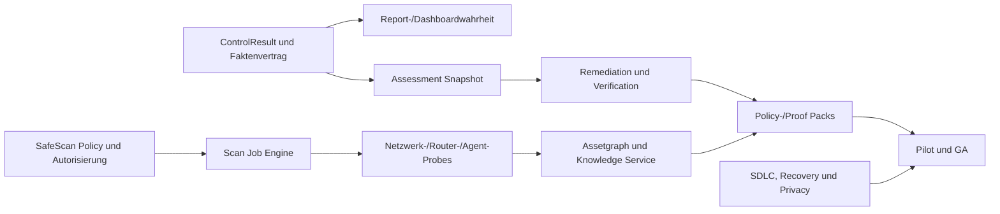

# PraxisShield — Umsetzungsplan 2026

**Stand:** 2026-08-10
**Grundlage:** `docs/PRODUKTANALYSE_2026.md` (Analyse A) und `docs/CTO_SECURITY_ARCHITECTURE_REVIEW_2026.md` (Analyse B, Codex)
**Zweck:** Beide Analysen am Code gegenprüfen, Widersprüche auflösen und sämtliche konsolidierten Themen in einen umsetzbaren, phasenbasierten Masterplan überführen. Der Plan trennt den sofortigen kritischen Pfad, den Ausbau innerhalb des ersten Produktjahres und die späteren strategischen Fähigkeiten. Kein Punkt darf ohne expliziten Status verschwinden.

**Leseregel:** Abschnitte 1–7 dokumentieren Vergleich und Entscheidungsherleitung. Der **verbindliche Umsetzungsplan beginnt in Abschnitt 8**. Bei Abweichungen haben Abschnitte 8–18 Vorrang.

---

## 1. Bewertung von Analyse B (Codex-Review)

### 1.1 Am Code verifiziert

Alle folgenden Befunde wurden vor Erstellung dieses Plans im Quellcode nachgeprüft — belegt, nicht übernommen:

| Befund | Status | Beleg |
|---|---|---|
| K-01 Kein autoritativer Gesamtscore | **bestätigt** | `app/(tabs)/dashboard/index.tsx:169-206` sortiert Fragebogen-, Domain-, Monitoring- und WLAN-Score nach `checkedAt` und nimmt den neuesten. Ein WLAN-Risikoscore kann so zur Headline-Zahl der Praxis werden. |
| K-02 LLM bestimmt prüfbare Fakten | **bestätigt** | `lib/ai/report.ts:119-146` übernimmt `security_score`, `ampel`, `scores_by_category` und `dsgvo_compliance` aus der Modellantwort. `validateReport` prüft nur Typ und Wertebereich (`clampScore`), nicht Herkunft. |
| K-03 Berichte nicht an Evidenz gebunden | **bestätigt** | `lib/ai/report.ts:16` (`checkId?: string`), `lib/ai/report-service.ts:8` (`checkId: string \| null`) — die Bindung an einen Prüfdatensatz ist optional. |
| K-06 Inventar flüchtig | **bestätigt** | `lib/store/inventory.ts:44` erzeugt den Store ohne `persist`-Middleware. Reiner In-Memory-Zustand; ein Neustart löscht den operativen Bestand. |
| K-07 WLAN-Topologie im Klartext | **bestätigt** | `supabase/migrations/20260624150000_initial_schema.sql:75-85`: `wlan_scans` führt `network_info` und `vulnerabilities` als offene `jsonb`-Spalten **neben** `encrypted_payload`. `lib/security/wlan.ts:584` schreibt `network_info` unverschlüsselt. |
| K-10 Worker-Monolith | **bestätigt** | `workers/hono/src/index.ts`: 5.132 Zeilen. |

### 1.2 Wo Analyse B überzeichnet oder Vorhandenes übersieht

Analyse B stellt einleitend zu: „Vorhandene Funktionen werden nicht erneut als ‚fehlend' verkauft." An vier Stellen hält sie das nicht ein. In einem Dokument, dessen Kernthese „nichts behaupten, was nicht gemessen wurde" lautet, ist das relevant:

1. **Das Control-Result-Modell existiert bereits — freigegeben und teilweise implementiert.** `docs/CONTROL_RESULT_MODEL.md` (Status W2, freigegeben 2026-07-23) definiert genau das, was Analyse B unter M-16 als neu vorschlägt, einschließlich des Leitsatzes „not_checked ≠ passing", der Migrationsphasen und der Berichtstrennung zwischen Management-Empfehlung und technischer Aktion. Im Code ist es zu großen Teilen umgesetzt: `lib/security/scoring.ts` führt `applicability`, `applicability_reason`, die `unknown`/`conditional`-Abbildung und dokumentierte Invarianten mit Verweis auf ebendieses Dokument (`scoring.ts:660-690`). **Konsequenz:** M-16 ist keine Neuentwicklung, sondern eine Ergänzung um die Sensor-Zustände (`unsupported`, `permission_denied`, `timeout`, `error`) und um Freshness/TTL. Der Aufwand ist deutlich geringer als „M".

2. **Das Anwendbarkeitsmodell ist nicht der von B beschriebene flache Schalter.** B kritisiert: „Der derzeitige allgemeine/Healthcare-Schalter reicht dafür nicht aus." Tatsächlich dokumentiert `docs/HEALTH_PROFILE_CONTROLS.md` (W4) ein Profilmodell mit verbindlichen Regeln: `not_applicable` wird neutral aus Score **und** Coverage entfernt, ungeklärte Anwendbarkeit ist `conditional` + `unknown` und nie automatisch `not_applicable`, jede Abweichung braucht einen `applicability_reason`, und Änderungen am Profilnenner erzwingen eine neue `SCORING_VERSION`. Das ist das technische Fundament des Policy-Packs. Es enthält derzeit jedoch erst eine freigegebene MVP-Kontrolle und ersetzt weder die fachliche Modellierung der 92 Richtlinienanforderungen noch Evidenzdefinition, Quellenpflege und Rechtsreview. **M-09 bleibt daher M–L; eingespart wird primär die Grundarchitektur.**

3. **„Synthetische Beispieldaten im Inventar" braucht Präzisierung.** `createPracticeSeedInventory` (`lib/inventory/inventory.ts:214-240`) erzeugt keine zufällig erfundenen Geräte, sondern leitet zwei Inventarobjekte aus echten Praxisfeldern ab (`practice.domain`, `practice.email`) und markiert sie nur über das ID-Präfix `seed-`. Sie sind trotzdem nicht beobachtete Assets. Das reale Risiko besteht aus fehlender Persistenz, fehlendem strukturiertem Herkunftsfeld und einer möglichen späteren Synchronisierung als reguläres Inventarobjekt.

4. **Demo-Daten sind bereits abgesichert.** `buildDemoDashboard` (`lib/monitoring/service.ts:184`) ist über `assertDemoPracticeAccess` und `AppConfig.isDemoMode` gegen den Produktionspfad abgeriegelt. Den von B implizierten Vermischungspfad gibt es im Monitoring nicht — nur im Inventar, und dort ohne Demo-Bezug.

*Kleinigkeit:* B nennt „rund 39 Routen"; tatsächlich sind es 36 registrierte Handler. Der Befund trägt auch mit 36.

### 1.3 Rechtsgrundlage: verifiziert, Produktclaims trotzdem prüfen

**K-08 (§ 75b → § 390 SGB V) ist anhand aktueller Primärquellen bestätigt.** Die gesetzliche Grundlage ist [§ 390 SGB V](https://www.gesetze-im-internet.de/sgb_5/__390.html). Die KBV veröffentlicht die geltende [IT-Sicherheitsrichtlinie nach § 390 SGB V](https://www.kbv.de/documents/infothek/rechtsquellen/bekanntmachungen/richtlinien/IT-Sicherheitsrichtlinie_390_KBV.pdf) und erläutert die aktuellen Anforderungen auf ihrer [Themenseite IT-Sicherheit](https://www.kbv.de/praxis/digitalisierung/it-sicherheit). Die alte §-75b-Bezeichnung wird im Produkt nicht weitergeführt.

Juristische und fachliche Prüfung bleibt für konkrete Kontrollzuordnungen, Anwendbarkeit, Werbeaussagen und Nachweisformulierungen erforderlich. Sie blockiert aber weder die korrekte Paragrafenbezeichnung noch den technischen Aufbau eines versionierten Policy-Packs.

### 1.4 Gesamturteil

**Analyse B ist die wichtigere der beiden** — nicht weil sie länger ist, sondern weil sie eine Fehlerklasse gefunden hat, die A strukturell übersehen musste.

A fragt: *„Misst die App, was sie zu messen behauptet?"* → Nein, fünf von zehn Probes fehlen.
B fragt: *„Bedeutet die angezeigte Zahl überhaupt etwas Definiertes?"* → Nein.

Die zweite Frage liegt unter der ersten. Solange der Primärscore der zuletzt aktualisierte Teilwert ist und das Sprachmodell Score, Ampel und DSGVO-Aussage selbst formuliert, macht mehr Prüftiefe die Lage **schlechter**: Mehr Messungen speisen dann nur mehr nicht reproduzierbare Zahlen. Nach Plan A wäre Q1 damit vergangen, Prüfmodule auf ein kaputtes Wahrheitsfundament zu setzen.

Der zweite große Beitrag von B ist die Trennung **Posture / Coverage / Confidence / Freshness**. A hatte das Evidenzmodell und erklärte es zum unantastbaren Vermögenswert — übersah aber, dass es keine Abdeckungsdimension besitzt. Genau deshalb konnte A den Befund K-04 nicht finden: **fehlende Messungen sehen im Monitoring heute wie „kein Problem" aus.** Das ist die exakte Verletzung des Prinzips, das A verteidigen wollte.

**Schwächen von B:**

- **Zwanzig Must-Haves sind keine Must-Have-Liste.** A hat 14, B hat 20, zusammen 90 Einträge. Eine Liste, auf der alles kritisch ist, priorisiert nicht — sie verschiebt die Priorisierung auf den, der umsetzen soll.
- **Die Teamempfehlung (elf Personen) ist keine Planung, sondern eine Voraussetzung, die das Projekt nicht hat.** Abschnitt 5 rechnet das um.
- **B verliert die billigen Hebel von A.** Die vollständige IEEE-OUI-Datenbank (A: S-09, Aufwand 1) verschwindet in H-03 (Aufwand L). Die WLAN-Reichweite außerhalb der Praxis (A: S-22 — „Ihr WLAN ist auf der Straße empfangbar", Aufwand 2, extrem überzeugend) fehlt ganz. Ebenso Typosquatting (A: S-19). Der Gastnetz-Isolationstest (A: S-08, Aufwand 2) geht in H-05 (Aufwand L) auf und verliert seine Eigenständigkeit. Unten zurückgeholt.
- **B driftet in der UX vom eigentlichen Nutzer weg.** Siehe D2.

---

## 2. Verhältnis der beiden Analysen

### 2.1 Unabhängige Konvergenz — die belastbarsten Aussagen

Dreizehn Punkte wurden unabhängig voneinander gefunden. Übereinstimmung aus zwei getrennten Untersuchungen ist das stärkste verfügbare Signal; diese Punkte brauchen keine Diskussion mehr, sondern einen Termin:

| Thema | Analyse A | Analyse B |
|---|---|---|
| Medizingeräte-Schutz vor jedem Scan-Ausbau | B-5 / M-01 | M-06 SafeScan |
| Dokumentierte Scan-Autorisierung | B-6 / M-02 | M-07 |
| Adaptive Discovery statt 11 fixer IPs | B-3 / M-05 | M-08 |
| Phantom-Probes / Capability-Vertrag | B-1 / M-03, M-04 | M-05 |
| Remediation-Loop mit Verifikation | B-11 / M-10 | M-13 |
| Handlungsorientiertes Dashboard, Tarifkarte raus | B-10 / M-09, M-11 | M-14 |
| Worker modularisieren | B-7 / M-13 | M-15 |
| FRITZ!Box TR-064 read-only | B-9 / S-01 | H-02 |
| Windows-Agent als Evidenz-Durchbruch | S-02 | H-01 |
| CVE-/EOL-Wissensbasis | B-8 / S-04 | H-06 |
| Entra ID / M365 für messbare MFA | S-21 | H-11 |
| Berichtsvarianten je Zielgruppe | S-12 | H-14 |
| `traffic_analysis` umbenennen | Kap. 12 | 21.5 |

Beide lehnen übereinstimmend ab: KI im Scoring, aggressive Scan-Techniken, NIS2 als Verkaufsargument für Kleinstpraxen, Ranglisten zwischen Praxen, Login- und Default-Credential-Versuche.

### 2.2 Echte Widersprüche

| # | Analyse A | Analyse B | Auflösung |
|---|---|---|---|
| W-1 | § 75b SGB V als Basis und zentraler USP | § 390 SGB V, § 75b veraltet | **§ 390 ist durch Gesetz und KBV-Richtlinie bestätigt.** Fachreview prüft Mapping, Anwendbarkeit und Claims, nicht mehr die Paragrafenfrage. |
| W-2 | Score-Ring raus, **Ampel + ein Satz** als Primärelement | Posture und Coverage nebeneinander, dazu Confidence und Freshness | **Beide, getrennt nach Ebene** (D2). |
| W-3 | Port-Katalog-Erweiterung ist Must-Have Q1 (M-06, M-07) | Service-Katalog ist High Priority (H-04), nach der Wahrheitskette | **B hat recht** — mit einer Ausnahme für die medizinischen Ports, siehe S1-6. |
| W-4 | Offline-Modus: Should Have (S-14) | Offline-Engine: High (H-18) | **B**, aber erst Stufe 3. Kein Blocker. |
| W-5 | Evidenzmodell ist fertig — „nicht anfassen" | Muss um Coverage/Freshness erweitert und serverseitig erzwungen werden | **B.** A verteidigt das Modell und übersieht dessen Lücke. |

### 2.3 Was beide übersehen haben

Beim Verifizieren aufgefallen, in keiner Analyse benannt:

- **Der Seed-Mechanismus läuft für jede Praxis, nicht nur im Demo-Modus** (`lib/store/inventory.ts:50-60`). Seed-Einträge tragen dieselbe Objektform wie echte Inventarobjekte, unterscheidbar nur am ID-Präfix. Ein späteres Sync-Verfahren lädt sie ohne explizite Markierung als Nutzerdaten hoch.
- **Die Score-Labels verstärken die Fehlinterpretation aktiv.** Sie lauten „Echter Fragebogen-Score", „Echter WLAN-Scan" (`dashboard/index.tsx:175-199`). Das Wort „Echter" suggeriert Verlässlichkeit genau dort, wo vier unvergleichbare Größen austauschbar dargestellt werden. Eine Zeile Aufwand, gehört in Stufe 0.
- **Es gibt bereits einen offenen 8-Phasen-Plan** (`docs/reviews/03-full-code-review-phasenplan.md`) aus einem früheren Code-Review (Stabilität, Datenschutz, Mobile, A11y, Härtung, Performance, Wartbarkeit, Dependencies). Dieser Plan ist **kein Konkurrent** zum vorliegenden: Er behandelt Code-Qualität, nicht Produktstrategie. Seine Phasen 2 (Evidence-Integrität), 4 (Accessibility) und 5 (API-Härtung) überschneiden sich jedoch mit Stufe 0 und 1 und sollten dort mitgezogen statt separat terminiert werden.

---

## 3. Entscheidungsherleitung vor Sprint 1

Diese Entscheidungen blockieren Arbeit. Sie kosten Tage, nicht Wochen — aber ohne sie läuft die Umsetzung in die falsche Richtung.

**D1 — Kontrollmapping und Claims fachlich prüfen.** § 390 SGB V ist als aktuelle Grundlage bestätigt. Offen sind die exakte Richtlinienversion im Produkt, Anwendbarkeitsprofile, Evidenzanforderungen und zulässige Nachweis-/Marketingformulierungen. *Blockiert:* Freigabe des Policy-Packs und rechtliche Claims, nicht dessen technische Architektur. *Aufwand:* extern, 1–2 Wochen Vorlauf — **sofort beauftragen**, parallel zu Phase 0.

**D2 — Zwei Darstellungsebenen festlegen.** Widerspruch W-2 löst sich auf, wenn man die Zielgruppen trennt. A hat den Nutzer richtig gesehen: Für eine Praxisinhaberin ohne IT-Kenntnisse sind vier Kennzahlen keine Verbesserung gegenüber einer — es sind vier Zahlen ohne Referenz statt einer. B hat das Datenmodell richtig gesehen: Ohne diese vier Größen ist keine ehrliche Aussage möglich.

> **Festlegung:** Das Vier-Größen-Modell wird vollständig gebaut und ist die interne Wahrheit. Die **Praxis-Sicht** zeigt daraus Ampel + einen Satz + drei Maßnahmen + einen Abdeckungshinweis im Klartext („Auf Basis von 12 der 18 prüfbaren Bereiche"). Die **Technik-Sicht** zeigt alle vier Größen numerisch. Umschaltbar, nicht gemischt.

**D3 — SafeScan-Policy verabschieden.** Sicherheitsklassen 0–3, Ausschlusslisten, Stopp-Bedingungen, Wartungsfenster, Haftungsprozess. *Blockiert:* jede aktive Prüfung. Muss als Dokument existieren, bevor Code entsteht.

**D4 — Windows-Agent-Scope einfrieren.** Zehn Checks, nicht dreißig. Vorschlag: Patchstand/Reboot, OS-EOL, Defender/EDR, Firewallprofile, BitLocker, lokale Administratoren, SMBv1/Signing, RDP/NLA, Backup-Jobstatus, Netzwerkkonfiguration. *Blockiert:* Stufe 2.

**D5 — Teamgröße realistisch annehmen.** Siehe Abschnitt 5. Bestimmt, ob der Plan zwölf oder dreißig Monate dauert — und muss vor der Kommunikation nach außen fallen, nicht danach.

---

## 4. Verdichteter Vorentwurf des kritischen Pfads

> **Leitprinzip:** Zuerst muss jede angezeigte Zahl eine definierte, reproduzierbare Bedeutung haben. Erst danach lohnt es sich, mehr zu messen. Die folgende Verdichtung bleibt als Begründung erhalten; die vollständige normative Phasenplanung steht in Abschnitt 8 ff.

Jede Stufe hat ein Abnahmekriterium. Eine Stufe ist nicht fertig, weil die Tickets zu sind, sondern wenn das Kriterium erfüllt ist.

### Stufe 0 — Wahrheitskette (Woche 1–8)

**Kein neues Feature.** Diese Stufe fügt nichts hinzu; sie stellt sicher, dass das Vorhandene bedeutet, was es anzeigt.

Zentraler Gedanke: **K-01 bis K-04 und M-16 sind nicht fünf Probleme, sondern eines** — „die angezeigte Zahl hat keine definierte Herkunft". Ein Arbeitsstrang, nicht fünf Tickets in fünf Sprints.

| # | Maßnahme | Konkret | Herkunft |
|---|---|---|---|
| S0-1 | **Ergebniszustände vervollständigen** — vorhandenes `ControlResult`-Modell um Sensor-Zustände (`unsupported`, `permission_denied`, `timeout`, `error`) und Erhebungszeitpunkt erweitern; Exhaustiveness-Tests | `lib/security/scoring.ts`, Ziel schon in `docs/CONTROL_RESULT_MODEL.md` | B: M-16 (**reduziert**, Fundament existiert) |
| S0-2 | **KI von Fakten entkoppeln** — `security_score`, `ampel`, `scores_by_category`, `dsgvo_compliance` aus dem Modellvertrag entfernen; Server setzt sie aus der Scoring-Engine ein | `lib/ai/report.ts:119-146`, Report-Prompt im Worker | A: 8.2 / B: M-02 |
| S0-3 | **Server als Wahrheitsquelle für Berichte** — `checkId`/`snapshotId` verpflichtend, Report-Manifest mit Hashes, kanonisches Server-PDF, Historie beim Start laden | `lib/ai/report.ts:16`, `lib/ai/report-service.ts:8`, Worker-Reportroute | B: M-03 |
| S0-4 | **Coverage neben Posture** — Mindestabdeckung als Gate; kein grüner Status darunter; nicht konfigurierte Provider senken die Abdeckung, statt neutral zu bleiben | `lib/security/scoring.ts`, `lib/monitoring/service.ts` | B: M-04 |
| S0-5 | **Primärscore ersetzen** — Zeitstempel-Sortierung durch Ampel + Satz + Abdeckungshinweis ersetzen; Label „Echter …" streichen; Historie nur innerhalb desselben Assessment-Typs | `app/(tabs)/dashboard/index.tsx:169-206` | A: B-10 / B: M-01, M-14 |
| S0-6 | **Inventar persistieren** — verschlüsselte lokale Persistenz; Seed-Objekte explizit markiert und nicht syncbar | `lib/store/inventory.ts:44` | B: M-10 |
| S0-7 | **WLAN-Topologie verschlüsseln** — `network_info`/`vulnerabilities` in `encrypted_payload`, nur Statusmetadaten im Klartext, Bestandsdaten migrieren | Migration + `lib/security/wlan.ts:584` | B: M-11 |
| S0-8 | **Tarifkarte aus dem Dashboard**, `traffic_analysis` umbenennen, Claim-Inventur („Live", „sicher", „DSGVO-konform") | Dashboard, Scanphasen, README, Marketing | A: M-11 / B: M-18 |
| S0-9 | **Mobile Build-Härtung** — iOS-Entitlement und Bonjour-Services aus einer Quelle, Android-Rechte reduzieren, Backup-Regeln, Native-Probe-Duplikat auflösen | `app.json`, Config-Plugin, Manifest | A: M-14 / B: M-12 |

**Abnahme:** Dieselbe Testpraxis liefert über App, API, Bericht und PDF denselben Wert mit derselben Begründung. Ein manipulierter Modell-Output kann den Score nachweislich nicht verändern (Test). Ein App-Neustart verliert kein Inventar. Kein grüner Status ist bei unzureichender Abdeckung erreichbar.

*Parallel:* D1 beauftragen, D3 und D4 schriftlich festlegen.

### Stufe 1 — Assessment-Kern (Monat 3–5)

Erst jetzt darf die Prüftiefe wachsen — auf einem Fundament, das das Ergebnis trägt.

| # | Maßnahme | Herkunft |
|---|---|---|
| S1-1 | **Assessment-Snapshot** unveränderlich, versioniert, signierbar; Domänenscores bleiben sichtbar, aber untergeordnet | B: M-01 vollständig |
| S1-2 | **Control-/Applicability-Modell fertigstellen** — Kontrolle, Check, Assertion, Finding und Score-Policy getrennt; setzt auf `HEALTH_PROFILE_CONTROLS.md` auf | B: 15.3 (**reduziert**) |
| S1-3 | **SafeScan Healthcare** — Klassen 0–3, passive-first, Stopp bei Instabilität, Medizingeräte nie über Klasse 1 | A: M-01 / B: M-06 — **vor** jedem Scan-Ausbau |
| S1-4 | **Scan-Autorisierung** — Scope, Zeitraum, Ausschlüsse, Verantwortlicher, Widerruf, Audit | A: M-02 / B: M-07 |
| S1-5 | **Adaptive Netzabdeckung** — Prefix-bewusste Discovery mit ausgewiesenen Kennzahlen; nie „keine Geräte gefunden", wenn nur eine Teilmenge geprüft wurde | A: M-05 / B: M-08 |
| S1-6 | **Medizinische Ports** — DICOM 104/11112, HL7-MLLP 2575, SICCT 4742, Konnektor- und PVS-Web-Ports | A: M-06. **Ausnahme von W-3:** geringer Aufwand, alleinstellend, durch S1-3 jetzt sicher |
| S1-7 | **Native Capability Contract** — jede Probe meldet Unterstützung, Berechtigung, Ausführung, Abdeckung, Grund, Version; CI vergleicht TS, Kotlin, Swift, Plist, Entitlements | A: M-03, M-04 / B: M-05 |
| S1-8 | **Remediation-to-Verification** — Owner, Frist, Status, Risikoakzeptanz, automatischer Retest, Wiedereröffnung | A: M-10 / B: M-13 |
| S1-9 | **Worker modularisieren, `/api/v1`** — Routes, Provider, Middleware getrennt; OpenAPI, Contract-Tests | A: M-13 / B: M-15 |
| S1-10 | **Consent Registry** — Zweck, Scope, Textversion, Actor, Ablauf, Widerruf; Prüfung vor jedem Lauf | B: M-17 |

**Abnahme:** Ein Scan lässt sich vollständig autorisieren, sicher gegen ein Netz mit simuliertem Medizingerät ausführen, erzeugt einen unveränderlichen Snapshot mit ausgewiesener Abdeckung — und eine daraus erzeugte Maßnahme kann abgehakt, automatisch nachgeprüft und mit sichtbarem Score-Effekt geschlossen werden.

### Stufe 2 — Messkraft (Monat 5–9)

Jetzt wird die Evidenz-Decke durchbrochen. Vorher wäre es verfrüht gewesen; jetzt wird jede neue Messung korrekt eingeordnet.

| # | Maßnahme | Herkunft |
|---|---|---|
| S2-1 | **FRITZ!Box TR-064 read-only** — Capability Discovery, minimaler Benutzer, Action-Allowlist, Credentials im lokalen Keystore, Fixtures plus echte Modellmatrix | A: S-01 / B: H-02 — bestes Verhältnis Aufwand zu Evidenzgewinn in beiden Analysen |
| S2-2 | **Windows-Collector v1** — die zehn Checks aus D4; signiertes MSI, mTLS-Enrollment, keine Remote-Shell; zusätzlich als portable Einmal-Ausführung | A: S-02 / B: H-01 |
| S2-3 | **Assetgraph und Entity Resolution** — Identifiers, Relations, Confidence, reversible Merge-Vorschläge | B: H-03 |
| S2-4 | **CVE-/EOL-Wissensdienst** — signierte Feeds, CPE-Matching mit Confidence und Quelle, serverseitig ohne App-Release aktualisierbar | A: S-04, S-05 / B: H-06 |
| S2-5 | **IEEE-OUI-Datenbank vollständig** statt 6 hartcodierter Einträge | A: S-09 — **zurückgeholt**, Aufwand XS, sofort sichtbar |
| S2-6 | **Gastnetz-Isolationstest** — aus dem Gastnetz gegen Praxis-IPs prüfen | A: S-08 — **zurückgeholt**, eigenständig, Aufwand S, sehr häufiger Realbefund |
| S2-7 | **SMB-/TLS-Baseline** — SMBv1, Signing, Guest, exponierte Freigaben, RDP/NLA; interne Zertifikatsprüfung | A: S-18 / B: H-07, H-08 |
| S2-8 | **Agent-/Connector-Health** — Heartbeat, letzte erfolgreiche Probe, Version, Queue; Sensorstille senkt die Abdeckung, statt Ruhe zu suggerieren | B: H-13 |

**Abnahme:** Mindestens vier bisher `self_reported`-Regeln liefern in einer Referenzpraxis `measured`-Evidenz. Ein ausgefallener Agent senkt sichtbar die Abdeckung.

### Stufe 3 — Nachweis und Steuerung (Monat 9–15)

| # | Maßnahme | Herkunft |
|---|---|---|
| S3-1 | **Policy-Pack (§ 390 bzw. § 75b nach D1)** — versionierte Anforderungen mit Anwendbarkeitsprofilen, Quellen, Evidenzbedarf, Gültigkeitsdauer | A: S-03 / B: M-09 (**reduziert**, Profilmodell existiert) |
| S3-2 | **Proof Packs und Berichtsvarianten** — Leitung, Technik, Nachweis, Dienstleisterauftrag; signiert und manifestiert | A: S-12, S-17 / B: H-14 |
| S3-3 | **Zwei-Ebenen-Sprache** gemäß D2, Barrierefreiheit (Symbol + Text, Dynamic Type, WCAG-AA) | A: S-10, M-12 / B: 6.3 |
| S3-4 | **Entra ID / M365 Connector** — MFA messbar statt behauptet | A: S-21 / B: H-11 |
| S3-5 | **Change-driven Monitoring** — Baselines, Deduplizierung, korrelierte Fälle, Wartungsfenster | B: H-16 |
| S3-6 | **Rollenmodell** — Mitarbeiter, Datenschutzbeauftragter, Auditor (befristet, read-only, protokolliert) | A: S-15 / B: H-17 |
| S3-7 | **Gerätespezifische Runbooks** mit Test und Rollback | A: S-11 / B: H-15 |
| S3-8 | **Backup-Evidenz** — Jobstatus, Immutabilität, Restore-Nachweis, RPO/RTO | B: H-10 |
| S3-9 | **Offline-Job- und Sync-Engine** | A: S-14 / B: H-18 |
| S3-10 | **Zurückgeholte Kurzläufer** — WLAN-Reichweite außerhalb der Praxis (A: S-22), Typosquatting (A: S-19), MTA-STS/TLS-RPT/DANE (A: S-23), Kosten- und Zeitschätzung je Maßnahme (A: S-16) | Alle Aufwand S, hohe Vermittelbarkeit, in B verloren |

### Im Vorentwurf zurückgestellt – im Masterplan neu eingeordnet

Der frühere Vorentwurf stellte Exposure Graph, föderierte Anomaliemodelle, Edge-Appliance, automatisierte Korrekturen, Plugin-Marketplace, Versicherungsschnittstelle, Benchmarking, Dienstleister-Marktplatz, macOS-/Linux-Collector, weitere Router und AD pauschal zurück. Der verbindliche Masterplan ordnet jedes dieser Themen nun konkret in Phase 3, 5 oder 6 ein.

Das AD-Modul ist der einzige schmerzhafte Verzicht — wertvoll, aber es setzt einen reifen Windows-Agent voraus und ist ohne ihn nicht seriös planbar.

---

## 5. Frühere Realitätsprüfung der Teamgröße

Analyse B unterstellt elf Personen und leitet daraus zwölf Monate ab. Das ist die einzige Stelle, an der das Dokument seine eigene Ehrlichkeitsregel verletzt: Es rechnet mit Ressourcen, die nicht ausgewiesen sind.

| Team | Stufe 0 | Stufe 1 | Stufe 2 | Stufe 3 |
|---|---|---|---|---|
| **1–2 Personen** | 3–4 Monate | 6–9 Monate | S2-1, S2-5, S2-6 machbar; Windows-Agent **nicht** | nicht erreichbar |
| **3–4 Personen** | 2 Monate | 3–4 Monate | 5–6 Monate (Agent knapp) | teilweise, ab Monat 18 |
| **8–11 Personen** | 6–8 Wochen | 3 Monate | 4 Monate | 5 Monate — der Plan von B |

**Bei ein bis zwei Personen lautet die ehrliche Jahresplanung: Stufe 0 vollständig, FRITZ!Box-Connector, OUI-Datenbank, Gastnetz-Isolationstest — und sonst nichts.** Das ist kein schlechtes Jahr: Es liefert ein Produkt, dessen Aussagen stimmen, plus die eine Integration mit dem besten Evidenzverhältnis. Ein Windows-Agent nebenher ist in dieser Konstellation nicht seriös planbar — er ist ein eigenes Produkt mit eigener Signierungs-, Update- und Support-Infrastruktur.

---

## 6. Abnahmeregeln des Vorentwurfs

Aus beiden Analysen zusammengeführt; gültig ab Stufe 0 für jedes künftige Feature:

1. Kein grüner Status bei fehlendem kritischem Sensor oder abgelaufener Evidenz.
2. Keine sicherheitsrelevante Aussage stammt allein aus einer Modellausgabe.
3. Jede aktive Probe besitzt Sicherheitsklasse, Timeout, Testfixture und Kill Switch.
4. Jede neue Datenart besitzt Klassifikation, Aufbewahrungsfrist, Export- und Löschpfad.
5. Ergebnisse unterscheiden „nicht bestanden" und „nicht gemessen" in Daten, UI und Bericht.
6. Die native Capability-Matrix wird auf echten OS-Versionen geprüft, nicht nur im Emulator.
7. Jeder Bericht ist aus seinem Snapshot reproduzierbar.
8. Selbstauskunft bleibt bei 50 % Punktkappung — die Regel aus Analyse A bleibt bestehen.

---

## 7. Kernaussagen der Vergleichsphase

1. **Analyse B hat die tiefere Fehlerklasse gefunden.** Der angezeigte Score ist heute der zuletzt aktualisierte von vier unvergleichbaren Werten, und das Sprachmodell formuliert Score, Ampel und DSGVO-Aussage selbst. Beides ist am Code belegt. Prüftiefe auszubauen, bevor das behoben ist, vervielfacht nur nicht reproduzierbare Zahlen.

2. **Analyse A hat den Nutzer besser gesehen, und das Projekt ist weiter als B annimmt.** Vier Kennzahlen sind für eine Praxisinhaberin keine Verbesserung gegenüber einer. Und das Control-Result- sowie das Anwendbarkeitsmodell, die B als neu vorschlägt, sind bereits freigegeben und teilimplementiert — was M-09 und M-16 spürbar verbilligt.

3. **Neunzig Backlog-Einträge sind keine Priorisierung.** Der kritische Pfad sind neun Maßnahmen in Stufe 0. Sie fügen dem Produkt nichts hinzu und sind trotzdem das Wertvollste, was in den nächsten zwei Monaten getan werden kann.

---

## 8. Verbindlicher Masterplan

### 8.1 Ziel und Zeithorizont

Der Masterplan deckt alle Themen aus Analyse A und B ab, ohne sie gleich dringend zu behandeln:

- **Phase 0–4:** marktfähiges Zielbild innerhalb von zwölf Monaten bei 8–11 Personen;
- **Phase 0–3:** realistisches Kernprodukt innerhalb von 18–24 Monaten bei 3–4 Personen;
- **Phase 5:** Ausbauprogramm für Jahr 2;
- **Phase 6:** strategische Forschung und Marktprogramme ab Jahr 3.

Bei 1–2 Personen wird nicht parallelisiert: Phase 0, FRITZ!Box, Quick Wins und ein kleiner Teil von Phase 1 sind das realistische erste Jahr. Qualitäts- oder Safety-Gates werden niemals zur Terminkompensation übersprungen.

### 8.2 Fünf parallele Arbeitsstränge

| Strang | Inhalt | Primäre Rollen |
|---|---|---|
| **T – Trust & Scoring** | Evidence, ControlResult, Snapshot, Score, Coverage, Reportwahrheit | Backend, Security Architecture, QA |
| **S – Sensors & Scan** | Mobile Probes, SafeScan, Router, Agent, Netzwerk-/OS-Prüfungen | Network/Endpoint, Mobile, QA Lab |
| **P – Product & Workflow** | Dashboard, Maßnahmen, Inventar, Rollen, MSP, UX/A11y | Product, Design, Web/Mobile |
| **C – Compliance & Content** | § 390, Art. 32, NIS2, BSI, Runbooks, Wissensbasis | Security Content, Healthcare Compliance |
| **O – Operations & Platform Security** | API, Worker, SDLC, Datenschutz, Recovery, Observability | Platform, SRE, AppSec |

Ein kleines Team führt die Stränge nacheinander aus. Ein größeres Team darf nur dann parallelisieren, wenn gemeinsame Datenverträge zuvor freigegeben sind.

### 8.3 Definition of Ready

Ein Arbeitspaket startet nur, wenn folgende Punkte vorhanden sind:

1. Nutzerproblem und Sicherheitsziel;
2. Datenquelle und Plattformfähigkeit;
3. Datenklassifikation und Aufbewahrung;
4. Safety Class für aktive Probes;
5. Abhängigkeiten und Rollback;
6. messbare Abnahmekriterien;
7. verantwortlicher Product- und Engineering-Owner.

### 8.4 Definition of Done

- fachliche und technische Tests sind grün;
- `not_checked`, `unsupported`, Fehler und fehlende Berechtigung sind von „bestanden“ getrennt;
- UI, API, Report und PDF verwenden dieselbe Wahrheit;
- Telemetrie, Supportdaten und Logs enthalten keine unnötigen Secrets oder Topologiedaten;
- Migration, Rollback und Betriebsdokumentation sind vorhanden;
- Sicherheits-/Datenschutzreview ist für neue Datenquellen abgeschlossen;
- Nutzertext erklärt Grenzen und nächste Handlung verständlich;
- Traceability-Status in Abschnitt 17 ist aktualisiert.

---

## 9. Phasenübersicht

| Phase | Zeitraum bei 8–11 Personen | Ergebnis | Exit Gate |
|---|---|---|---|
| **0 – Wahrheits- und Betriebsfundament** | Woche 1–6 | Vorhandene Aussagen werden reproduzierbar, persistent und betriebssicher | Kein LLM-/Client-Score; kein Grün ohne Coverage; Restoretest bestanden |
| **1 – Assessment-Kern und SafeScan** | Woche 5–14 | autorisierter, sicherer und versionierter Assessment-Lebenszyklus | Scan → Snapshot → Maßnahme → Retest vollständig |
| **2 – Messkraft** | Monat 3–6 | Router, Windows und tiefe Netzwerkprobes erhöhen `measured`-Evidenz | Referenzpraxis erreicht ≥70 % technische Messabdeckung im definierten Profil |
| **3 – Evidence Intelligence** | Monat 5–9 | Assets, CVE/EOL, Segmentierung, Identität, Backup und Drift werden korreliert | Sensorverlust senkt Coverage; kritische Pfade sind assetbezogen |
| **4 – Nachweis, Produktisierung und Marktreife** | Monat 8–12 | §-390-Proof-Packs, MSP-/Rollenbetrieb und Premiumprodukt | Report reproduzierbar; Kontrollmapping fachlich freigegeben; Pilot-GA |
| **5 – Plattformbreite und Ökosystem** | Monat 12–24 | macOS/Linux, weitere Router/MDM, SaaS, Training, API und TI-Tiefe | Connector-SDK stabil; zwei weitere Plattformfamilien produktiv |
| **6 – Strategische Fähigkeiten** | Monat 24–48 | Edge, klinischer Digital Twin, sichere Automation und Sektorintelligenz | separate Business Cases, Safety- und Datenschutzfreigabe |

Die Zeiträume überlappen nur bei ausreichendem Team. Phase-Gates bleiben sequenziell: Kein aktiver Scan-Ausbau ohne freigegebene SafeScan-Policy; kein Proof Pack ohne Snapshot und Quellenbindung.

---

## 10. Phase 0 – Wahrheits- und Betriebsfundament

**Zeitraum:** Woche 1–6  
**Ziel:** Der aktuelle Funktionsumfang liefert reproduzierbare, ehrliche und wiederherstellbare Ergebnisse. Keine neue Scanbreite.

| ID | Arbeitspaket | Technische Lieferobjekte | Owner | Aufwand | Abnahme |
|---|---|---|---|---|---|
| P0-01 | Ergebniszustände vervollständigen | vorhandenes `ControlResult` um `unsupported`, `permission_denied`, `timeout`, `error`, `observed_at`, `expires_at` ergänzen; Adapter für alle Engines | T | M | Exhaustiveness-Tests; kein Fehlerzustand kann `met` werden |
| P0-02 | KI von Sicherheitsfakten entkoppeln | Score/Ampel/Kategorien/Compliance aus Modellvertrag und Prompt entfernen; serverseitige Faktenprojektion | T/O | M | manipulierter Modelloutput verändert keinen Fakt |
| P0-03 | Reportwahrheit serverseitig binden | verpflichtende `snapshot_id`/Übergangs-`check_id`; Manifest, Hashes, Versionen; kanonisches Server-PDF; Historie laden | T/O | M | App, API, Detail und PDF sind aus demselben Snapshot reproduzierbar |
| P0-04 | Posture und Coverage trennen | Monitoring-/WLAN-/Questionnaire-/External-Adapter; Mindestcoverage und Green Gates | T | M | nicht konfigurierte kritische Quelle verhindert Grün |
| P0-05 | Dashboard-Primärwert ersetzen | Ampel + Satz + drei Maßnahmen + Klartextabdeckung; technische Vier-Kennzahlen-Sicht; nur vergleichbare Trends | P/T | M | kein Zeitstempel-Sortieren heterogener Scores; Nutzertest bestanden |
| P0-06 | Inventar persistent und herkunftssicher machen | verschlüsselte lokale DB, Repository/Delta-Sync, `source`, `synthetic`, `confidence`; Seed nicht automatisch syncbar | P/O | M | App-Neustart und Offline/Online-Wechsel verlieren/duplizieren nichts |
| P0-07 | WLAN-/Topologiedaten migrieren | sensible JSON-Felder verschlüsseln, Metadaten minimieren, Bestandsmigration, Export-/Löschpfad | O/T | M | Klartextabfrage liefert keine SSID/IP/DNS/Findings |
| P0-08 | Claims und UI-Sprache korrigieren | „Echter“, „Live“, „sicher“, „DSGVO-konform“ und `traffic_analysis` prüfen; Tarifkarte entfernen; Limitierungen anzeigen | P/C | S | freigegebenes Claim-Inventar, Snapshot-/Coveragebezug überall |
| P0-09 | Mobile Build-/Permission-Härtung | iOS Entitlement/Bonjour Single Source; Android Rechte/Backup; Native-Duplikat entfernen; reale Device-Smokes | S/O | M | Capability-Matrix auf unterstützten echten OS-Versionen grün |
| P0-10 | Secure-SDLC-Baseline | SBOM, Secret/SAST/Dependency Scan, Release Signing/Provenance, Patch-SLAs, Vulnerability Disclosure | O | M | Pipeline blockiert kritische Befunde; Releaseartefakt signiert und inventarisiert |
| P0-11 | Betriebs-/Recovery-Baseline | RPO/RTO, Backup- und Restoretest, Schlüsselrotationstest, JIT-Admin, Incident Runbook, datensparsame Observability | O | M | dokumentierter Restore innerhalb RTO; Tabletop und Schlüsselrotation bestanden |
| P0-12 | Consent Registry | Zweck, Scope, Textversion, Actor, Ablauf, Widerruf; Scheduler-Gate für HIBP/Provider | O/C | S–M | widerrufene/abgelaufene Einwilligung stoppt nächsten Lauf |

### Phase-0-Exit

1. Dieselbe Golden-Testpraxis erzeugt in App, API, Bericht und PDF identische Fakten.
2. Das Sprachmodell kann keine sicherheitsrelevante Zahl oder Rechtsaussage verändern.
3. Kein Grün ist bei unzureichender Abdeckung erreichbar.
4. Inventar überlebt Neustart, Offlinephase und Konfliktsynchronisierung.
5. Restore, Schlüsselrotation und Mobile-Device-Matrix sind nachweislich getestet.

---

## 11. Phase 1 – Assessment-Kern und SafeScan

**Zeitraum:** Woche 5–14  
**Ziel:** Ein Assessment besitzt einen autorisierten Scope, sichere Ausführung, versionierte Evidenz und einen vollständigen Maßnahmenlebenszyklus.

| ID | Arbeitspaket | Technische Lieferobjekte | Owner | Aufwand | Abnahme |
|---|---|---|---|---|---|
| P1-01 | Assessment Snapshot | `assessment_snapshots`, Komponenten, Scoreerklärung, Policy-/Engine-Version, Hash/Signatur | T/O | L | historische Snapshots ändern sich nicht durch neue Regeln |
| P1-02 | Control-/Applicability-Modell abschließen | Control, Check, Assertion, Finding, Evidence und Score Policy trennen; bestehende W2/W4-Modelle migrieren | T/C | M | jede Dashboard-/Reportzahl ist auf Assertions zurückführbar |
| P1-03 | SafeScan-Policy | Safety Classes 0–3, passive-first, Medizingeräte-/Unbekanntregeln, Stoppbedingungen, Wartungsfenster, Kill Switch | S/C | M | simuliertes empfindliches Gerät erhält ohne Freigabe höchstens S1 |
| P1-04 | Scan-Autorisierung | Praxis, Standort, Prefix/Assets, Ausschlüsse, Zeitraum, Safety, Actor, Version, Ablauf/Widerruf | S/O | M | jeder Probe-Lauf referenziert eine gültige Autorisierung |
| P1-05 | Native Capability Contract | Support, Berechtigung, Ausführung, Abdeckung, Grund und Probe-Version; TS/Kotlin/Swift/Build-CI | S | M | fehlende native Methode wird `unsupported`, niemals negativer Befund |
| P1-06 | Scan Job Engine | Queue, Checkpoints, Pause/Abbruch, Rate/Concurrency, Jitter, Circuit Breaker, Stop-on-instability | S/O | L | Scan ist fortsetzbar, abbrechbar und budgetbegrenzt |
| P1-07 | Remediation-to-Verification | Owner, Frist, planned/in progress/risk accepted/alternative/awaiting verification/verified; Retest/Reopen | P/T | M | geschlossenes Finding wird erst nach Beleg/Retest `verified` |
| P1-08 | Worker-Module und API v1 | Routes/Provider/Middleware trennen; OpenAPI, generierte Clients, Idempotenz, Fehlervertrag, Deprecation | O | L | alte Clients funktionieren im Übergang; Contract Tests sind grün |
| P1-09 | Evidence Freshness v1 | TTL je Evidenztyp, Warnfenster, Ablauf-Gates, Recheckplanung | T/C | M | abgelaufene Evidenz senkt Freshness/Coverage automatisch |
| P1-10 | Audit- und Datenschutzvertrag | Datenklasse, Retention, Export/Löschung je Entität; append-only Security Audit Events | O/C | M | jede neue Phase-1-Datenart besitzt dokumentierten Lifecycle |

### Phase-1-Exit

Ein autorisierter SafeScan gegen das Referenzlabor erzeugt einen unveränderlichen Snapshot. Daraus entsteht eine Maßnahme, die einem Verantwortlichen zugewiesen, mit Beleg abgeschlossen und durch Retest verifiziert oder wieder geöffnet wird.

---

## 12. Phase 2 – Messkraft: Router, Windows und Netzwerk

**Zeitraum:** Monat 3–6  
**Ziel:** Die wichtigsten Selbstauskünfte werden zu gemessener Evidenz, ohne Medizingeräte oder Praxisbetrieb zu gefährden.

| ID | Arbeitspaket | Technische Lieferobjekte | Owner | Aufwand | Abnahme |
|---|---|---|---|---|---|
| P2-01 | Adaptive IPv4-/IPv6-Discovery | prefix-aware ARP/ND, Router-/DHCP-/passive Quellen, priorisierte Ziele, Coverage-Zähler; kein blindes `/64` | S | L | `/24`-Lab vollständig im Budget; große Netze weisen Blind Spots aus |
| P2-02 | Medizinischer Servicekatalog | DICOM 104/11112, HL7/MLLP 2575, SICCT 4742, TI-/Konnektor-/PVS-nahe Dienste; Safety-Metadaten | S/C | M | ausschließlich sichere Handshakes; Labfixtures für jede Familie |
| P2-03 | Allgemeiner Servicekatalog | SSH, VNC, LDAP(S), DBs, Docker/K8s, Hypervisor, SIP/RTSP/MQTT, Druck/NAS/Backup | S | L | versionierter Katalog mit Transport, Timeout, Safety und Quelle |
| P2-04 | Kontextabhängige Servicebewertung | Service × Assetklasse × Segment × Auth/TLS × Sollzustand statt fixer Portpunkte | T/S | M | derselbe Port kann je Kontext Info, Finding oder expected sein |
| P2-05 | FRITZ!Box read-only | TR-064 Capability Discovery, minimaler Benutzer, lokaler Keystore, Action-Allowlist, Modell-/Firmwarefixtures | S/O | L | Firmware, Hosts, WLAN/Gast und Freigaben nur je Capability; keine Write-Action |
| P2-06 | Windows Collector/Agent v1 | signiertes MSI/portable; mTLS; Patch/Reboot, EOL, Defender, Firewall, BitLocker, Admins, SMB, RDP, Backup, Netz | S/O | L | zehn Scope-Checks auf Referenz-Windows reproduzierbar; keine Remote-Shell |
| P2-07 | OUI-/Fingerprinting-Basis | vollständiger lizenzkonformer OUI-Feed, mDNS/SSDP/DHCP/TLS/OUI-Signale, Confidence | S/C | S–M | Herstellerquelle/Version sichtbar; unbekannt bleibt unbekannt |
| P2-08 | Gastnetz-Isolation | autorisierte Testziele und Kommunikationsmatrix Gast→Praxis/Management; IPv4/IPv6 | S | S–M | Fehltrennung wird gemessen; erfolgreicher Test belegt Scope/Coverage |
| P2-09 | SMB-/RDP-/Legacy-Baseline | SMB1, Signing/Encryption, Guest, Freigaben, RDP/NLA, LLMNR/NBNS ohne Login-/Passwortangriff | S | M | Handshake-only; erwartete sichere/unsichere Fixtures erkannt |
| P2-10 | TLS-/Zertifikats-Engine | intern/extern: Version, Cipher, Chain, Hostname, Ablauf, Schlüssel, SNI, interne CA-Kontexte | S/C | M | Golden TLS Matrix ohne externe Seiteneffekte bestanden |
| P2-11 | DNS-/DHCP-/Gateway-/Routing-Drift | eigene Testzone, Resolver/DNSSEC/DoT/DoH-Policy, Rogue-DHCP-Indiz, Gateway/Route/IPv6-Parität | S/O | M–L | kontrollierte Änderungen erzeugen deduplizierte Events |
| P2-12 | WLAN-Quick Wins | Gastnetz, WPS/PMF soweit messbar, Default-/Werks-SSID-Heuristik ohne Login, Außenreichweiten-Workflow | S/P | M | Plattformgrenzen sichtbar; keine Passwort- oder Deauth-Technik |
| P2-13 | Background/Partial UX | persistierbare Jobs, Teilergebnisse, Push/Benachrichtigung, foreground restrictions ehrlich | P/S | M | OS-Abbruch verliert keinen bestätigten Fortschritt |
| P2-14 | Agent-/Connector-Health | Heartbeat, Probezeit, Version, Berechtigung, Queue, Uhrzeit, Health-SLO und Coverage-Gate | S/O | M | Sensorstille erscheint als Messlücke und Alert |

### Phase-2-Exit

- Mindestens vier bisherige Selbstauskünfte liefern gemessene Evidenz.
- Die definierte Referenzpraxis erreicht mindestens 70 % technische Coverage in ihrem anwendbaren Basisset.
- Ein unbekanntes oder medizinisches Ziel kann keinen nicht freigegebenen aktiven Test erhalten.
- Ein ausgefallener Agent/Routerconnector reduziert sichtbar Coverage und Confidence.

---

## 13. Phase 3 – Evidence Intelligence und technische Tiefe

**Zeitraum:** Monat 5–9  
**Ziel:** Einzelmessungen werden zu einem langlebigen Asset-, Identitäts-, Exposure- und Resilienzmodell.

| ID | Arbeitspaket | Technische Lieferobjekte | Owner | Aufwand | Abnahme |
|---|---|---|---|---|---|
| P3-01 | Assetgraph/Entity Resolution | Assets, Identifier, Beziehungen, Quellen, Freshness, Confidence; reversible Merges, Standort/Segment/Kritikalität | T/P | L | IP-/MAC-/Hostname-Wechsel erzeugt kein Blind-Duplikat |
| P3-02 | CVE/EOL Knowledge Service | CPE/purl/SWID, CVE, Exploitability, Herstelleradvisories, EOL, Quellen, signierte inkrementelle Feeds | C/O | L | Matching zeigt Confidence; keine Version = kein bestätigtes CVE |
| P3-03 | Aktualisierbarer Prüf-/Content-Feed | Regeln, Ports, OUI, Runbooks und Quellen unabhängig vom App-Release; Signatur/Rollback/Kill Switch | C/O | M–L | Feedrollback und kompromittierte-Signatur-Test bestanden |
| P3-04 | Segmentierungs-Soll/Ist-Matrix | Praxis, Gast, Medizin, Backup, Management, TI, VoIP, BYOD; Collector/Router-Regelimport; IPv4/IPv6 | S/T | L | jede unerlaubte Kante ist auf Probe/Regel zurückführbar |
| P3-05 | Firewallregel-Analyse | normalisiertes Read-only Modell, Any/Any, Management, Shadow/Expiry/Logging, IPv6-Parität | S/C | L | Referenzregeln verschiedener Hersteller ergeben dieselben Assertions |
| P3-06 | Backup-/Restore-Evidence | Jobstatus, 3-2-1, immutable/offline, Adminschutz, Restorebeleg, RPO/RTO, Geschäftsprozessbezug | S/C | M–L | Grün nur bei frischem erfolgreichen Restorebeleg |
| P3-07 | Entra ID/M365 | least-privilege Graph, MFA/CA, Legacy Auth, Admins, Gäste, App Consents, Audit; Token Health/Revoke | O/C | L | Connectorentzug entfernt Zugriff und senkt Coverage |
| P3-08 | Active Directory read-only | stale/admin/delegation, LDAP Signing/Binding, NTLM, Kerberos, LAPS/GPO; lokale Pfadberechnung ohne Angriffe | S/C | L | keine Credentials/Hashes im Upload; Lab-AD-Regeln reproduzierbar |
| P3-09 | Change-driven Monitoring | Baselines für Asset, Service, DNS, Zertifikat, Firmware und Konfiguration; Deduplizierung/Korrelation/Wartungsfenster | T/O | L | zusammenhängende Änderungen erzeugen einen Fall statt Alarmflut |
| P3-10 | Exposure Graph v1 | deterministische Pfade zwischen Exposition, Asset, Identität, Segment und kritischem Prozess; Annahmen/Confidence | T/C | L | jeder Pfad ist erklärbar; keine autonome Exploitation |
| P3-11 | Evidence Gap Planner | priorisiert nächste Messung nach Informationsgewinn, Kritikalität und Aufwand; zunächst regelbasiert | T/P | M | Vorschlag verbessert Coverage nach ausgeführter Messung messbar |
| P3-12 | Software-/Lifecycle-Inventar | installierte Software, Firmware, Garantie/EOL, Owner/Raum, Privacy-Allowlist, Delta-Upload | S/P | M–L | keine pauschale Prozess-/Softwareliste ohne Regelbedarf in Cloud |
| P3-13 | Offline-/Sync-Engine vollständig | verschlüsselte Outbox, Idempotenz, Checkpoints, Konfliktregeln, Backpressure, Device Revocation | O/P | M | Chaos-/Offline-Test ohne Verlust oder doppelte Maßnahmen |

### Phase-3-Exit

Eine kontrollierte Änderung an Gerät, DNS, Zertifikat oder Segment erzeugt eine assetbezogene, deduplizierte Abweichung. Der dazugehörige Snapshot zeigt Quelle, Confidence und Freshness. Backup- und Identity-Connectorverlust kann keinen grünen Zustand hinterlassen.

---

## 14. Phase 4 – Nachweis, Produktisierung und Marktreife

**Zeitraum:** Monat 8–12  
**Ziel:** PraxisShield wird als wiederkehrender Steuerungs- und Nachweisdienst für Praxisleitung, IT-Dienstleister und Prüfer marktfähig.

| ID | Arbeitspaket | Technische Lieferobjekte | Owner | Aufwand | Abnahme |
|---|---|---|---|---|---|
| P4-01 | §-390-Policy-Pack | 92 Richtlinienanforderungen, Profil/Applicability für Größe, Medizingeräte, TI; Evidenz, Gültigkeit, Quellen, Fachreview | C/T | L | jede anwendbare Kontrolle besitzt Quelle und zulässige Ergebnisformulierung |
| P4-02 | Art.-32-/TOM-Nachweis | technische/organisatorische Evidenz vorbefüllen, Verantwortliche/Lücken; kein pauschales DSGVO-Urteil | C/P | M | Export kennzeichnet belegte, erklärte und ungeprüfte Bereiche |
| P4-03 | NIS2 Eligibility/Pack | Schwellen-/Sektorenwizard, versionierte Begründung, Governance-/IR-/Supply-Chain-Kontrollen bei Anwendbarkeit | C/P | M | Kleinstpraxis wird nicht unnötig belastet; Zweifelsfall verweist auf Rechtsprüfung |
| P4-04 | BSI CyberRisikoCheck Mapping | DIN-SPEC-/BSI-Fragen, Evidenzreuse, Export, klare Produkt-/Prüfergrenze | C | M | Mapping fachlich freigegeben und versionsgebunden |
| P4-05 | Proof Packs/Reportvarianten | Leitung, Technik, DSB, Auditor, Dienstleisterauftrag; signiertes Manifest, Prüferfreigabe, White-Label-Grenzen | T/P/C | M | alle Varianten stammen aus exakt demselben Snapshot |
| P4-06 | Zwei-Ebenen-UX und Accessibility | Praxis-/Techniksicht, Symbol+Text, Dynamic Type, Screenreader, WCAG-AA, Fokus/Touchziele | P | M | A11y-Tests und Nutzertest mit nichttechnischer Zielgruppe bestanden |
| P4-07 | Rollen, Multi-Standort und MSP v1 | Owner, Manager, Technician, DSB, Auditor, Read-only; Hierarchie, JIT-Zugriff, Cross-Tenant-Tests | P/O | L | keine Rolle kann fremde Praxisdaten oder Secrets sehen |
| P4-08 | Runbook Library | geräte-/herstellerspezifische Schritte, Preconditions, Kosten/Zeit, Ausfallrisiko, Test, Rollback, Verification | C/P | L fortlaufend | Top-25 Findings besitzen freigegebene Runbooks |
| P4-09 | Incident Readiness | Offlineplan, Rollen/Kontakte, Tabletop, Testalarm, Meldeweg-Hinweise ohne autonome Meldung | C/P | M | Praxis kann Ransomware-/Ausfallszenario vollständig durchspielen |
| P4-10 | E-Mail-/Domain-Intelligence | SPF/DKIM/DMARC, MTA-STS, TLS-RPT, DANE wo sinnvoll, Typosquatting, CT-Monitoring, Consent | C/O | M | kontrollierte Testdomains/Fixtures, Quellen und False-Positive-Prozess |
| P4-11 | Ticketing/Webhooks/API v1 | signierte replay-geschützte Webhooks, Ticketstatussync, öffentliche read-only/export API, Rate/AuthZ | O/P | M–L | Cross-Tenant-, Replay- und Idempotenztests bestanden |
| P4-12 | Privacy Lifecycle und Supportdiagnose | Feldklassifikation, Retention, Löschbeleg, Key Rotation, Nutzerpreview, Secret/IP/SSID-Redaction | O/C | M | Supportpaket enthält nach Redaction keine Testsecrets/Topologie |
| P4-13 | Premium Packaging | Pläne für Multi-Standort, MSP, Agent, Router, Entra, Proof Packs, API, Retention; keine Sicherheitsfunktionen künstlich gefährlich sperren | P | M | Preisgrenzen folgen Betriebskosten/Wert, nicht notwendiger Basissicherheit |
| P4-14 | Pilot, Security Review und GA | Pilotkohorte, Lab-/Feldmetriken, externe Pentest-/Datenschutzprüfung, Runbooks, Support-/Patch-SLAs | alle | L | Release Gates aus Abschnitt 16 erfüllt; kritische Findings geschlossen |

### Phase-4-Exit

Der Pilotkunde kann einen §-390-basierten, reproduzierbaren Nachweis erzeugen, Maßnahmen an seinen IT-Dienstleister delegieren und ihre Umsetzung verifizieren. Multi-Standort- und Prüferzugriff sind mandantensicher. Externer Security Review und Restoretest sind bestanden.

---

## 15. Phase 5 – Plattformbreite und Ökosystem

**Zeitraum:** Monat 12–24  
**Ziel:** Das Produkt wird plattform- und herstellerbreit, ohne den sicheren Kern zu fragmentieren.

| ID | Arbeitspaket | Technische Lieferobjekte | Gewinn | Aufwand | Plattform |
|---|---|---|---|---|---|
| P5-01 | macOS Collector | notarisiertes PKG; FileVault, SIP, Gatekeeper, Firewall, Admins, Update, Sharing, MDM-Status | hoch | L | macOS Agent, Cloud |
| P5-02 | Linux Collector | DEB/RPM; Distribution/EOL, Pakete, SSH, Firewall, Audit, Verschlüsselung, Container | hoch | L | Linux Agent, Cloud |
| P5-03 | zweite/dritte Routerfamilie | nach Kundentelemetrie UniFi, Lancom, Sophos, Securepoint oder OPNsense; neutraler Adaptervertrag | hoch | je M–L | Router, Cloud |
| P5-04 | MDM-Connectoren | Intune, Apple/Android Enterprise nach Nachfrage; Compliance, Apps, Zertifikate, VPN, Restriktionen | hoch | L | Cloud, Android, iOS |
| P5-05 | Remote-Service Window | Hersteller-/IT-Zugangsregister, Zweck, Owner, Ablauf, Firewall-/Connectorbeleg, Alert | sehr hoch | M | Web, Router, Agents |
| P5-06 | Lieferanten-/SaaS-Register | AVV, Region, C5/ISO, Unterauftragnehmer, Owner, MFA, letzte Nutzung, EOL | hoch | M | Web, Cloud |
| P5-07 | Shadow-IT-Signale | datensparsame DNS-/SSO-/Browser-/Expense-Signale, lokale Featureextraktion, Opt-in | hoch | L | Agents, Cloud |
| P5-08 | Netzwerkgraph/Netzdokumentation | Segmente, Gateways, Geräte, Dienste, Abhängigkeiten, verschlüsselte Details, Export/Verlauf | hoch | M–L | Web, Cloud |
| P5-09 | PVS-/TI-Herstellerkatalog | Support/EOL, dokumentierte APIs, Konnektor/KIM/ePA/TI-Betriebsart; keine Patientendaten | hoch | L fortlaufend | Cloud, Agents |
| P5-10 | Trainings-/Awareness-Modul | rollenbezogene Inhalte, Wirksamkeitsnachweis, optionale Phishing-Simulation mit Safeguards | hoch | L | Web, Cloud |
| P5-11 | QR-/physische Inventur | QR/Label, Offlineerfassung, Owner/Raum, Foto optional verschlüsselt, Asset-Merge | mittel | M | Android, iOS, Web |
| P5-12 | Favicon-/erweiterte Fingerprints | sichere Hash-/Header-/Zertifikatssignaturen mit Confidence und Quellenpflege | mittel | M | Agents, Cloud |
| P5-13 | Öffentliche MSP-/RMM-API | scoped OAuth/service accounts, Webhooks, Bulk-/Export, Sandbox, Audit und Quotas | mittel–hoch | L | Cloud, Web |
| P5-14 | Benchmarking | Opt-in, Mindestkohorte, Größen-/Profilvergleich, Privacy Thresholds/Differential-Privacy-Prüfung | niedrig–mittel | M | Cloud, Web |
| P5-15 | White Label und Versicherungsnachweis | Theme ohne Faktenänderung; konfigurierbarer Nachweisauszug ohne Garantie/Prämienversprechen | mittel | M | Cloud, Web |
| P5-16 | What-if-Simulation | geklonter Snapshot, deterministische Maßnahmenwirkung, klar als Simulation | mittel | M | Cloud, Web |
| P5-17 | Support-/Partnerbetrieb | Diagnosepakete, Mandantenpakete, ablaufende Enrollment-Codes, SLA-/Health-Dashboard | mittel | M | Agents, Cloud, Web |
| P5-18 | Wartungsfensterkalender | Asset-/Standortfenster, Zeitzone/DST, Freigabe, Not-Aus, optionale Kalenderintegration | mittel | S–M | Web, Cloud, Agents |

### Phase-5-Exit

Mindestens macOS oder Linux, eine weitere Routerfamilie und ein MDM-/SaaS-Connector verwenden denselben Capability-, Evidence-, Safety- und Health-Vertrag wie Windows/FRITZ!Box. Keine Plattform führt einen parallelen Score oder Sonderbericht ein.

---

## 16. Phase 6 – Strategische Fähigkeiten

**Zeitraum:** Monat 24–48; jedes Paket benötigt einen separaten Business Case.  
**Ziel:** verteidigbare technologische und sektorale Alleinstellungsmerkmale.

| ID | Zukunftsfähigkeit | Technische Leitplanken | Sicherheitsgewinn | Aufwand |
|---|---|---|---|---|
| P6-01 | Clinical Downtime Digital Twin | Geschäftsprozesse, Assetabhängigkeiten, RTO/RPO, Ausfallszenarien, bestätigte Annahmen | sehr hoch | XL |
| P6-02 | Exposure-/Attack-Path-Korrelation v2 | Graph Rules plus ML-Ranking, erklärbare Pfade, keine autonome Exploitation | sehr hoch | XL |
| P6-03 | Privacy-preserving föderierte Anomalieerkennung | lokale Features, Secure Aggregation/Differential Privacy, Opt-in, Leakage Red Team | hoch | XL |
| P6-04 | Signiertes Evidence Ledger | append-only Hashchain/Merkle Receipts, Rotation und unabhängige Verifikation; kein Blockchain-Zwang | hoch | L |
| P6-05 | Herstellerfreigegebene Medizingeräteprofile | Herstellerpartnerschaften, Modell-/Firmwareprofile, Labvalidierung, signierte Safety Manifests | kritisch | XL |
| P6-06 | Edge-Appliance/Hardware-Sensor | gehärtete Appliance/VM, Attestation, lokale Analyse, store-and-forward, signed updates | sehr hoch | XL |
| P6-07 | Change Impact Recalculation | Observation→Assertion→Finding→Score-Abhängigkeiten, inkrementelle Neuberechnung | hoch | L |
| P6-08 | Kryptographische Geräteidentität | TPM-/Agent-Attestation, Zertifikat und Routerbeobachtung, Privacy-Fallback | sehr hoch | XL |
| P6-09 | Sichere automatisierte Korrekturen | allowlisted signierte Playbooks, Vier-Augen-Freigabe, Backup/Rollback/Canary/Verify | sehr hoch | XL |
| P6-10 | Sektor-Threat-Intelligence | vertrauenswürdige Feeds, Inventarmatching, TLP/Sharing, kuratierte Aktionen | hoch | L–XL |
| P6-11 | Medizingeräte-Advisory-Datenbank | Hersteller/BfArM/CERT-Quellen, Modell-/Firmwarematching, klinischer Kontext | sehr hoch | XL |
| P6-12 | TI-Konformitätstiefe | Gematik-/Herstellerquellen, KIM/ePA/TI-2.0-Profile, sichere Connectorprüfungen | hoch | XL |
| P6-13 | Anerkennung/Zertifizierungsprogramm | unabhängige Methodikprüfung, KBV/KV-/Verbandsdialog, Prüferqualifikation | marktstrategisch | XL |
| P6-14 | Dienstleister-Marktplatz | geprüfte Anbieter, Mandanteneinwilligung, Interessenkonflikte, Maßnahmenvermittlung | mittel | XL |
| P6-15 | Plugin-Ökosystem | signierte deklarative SDK, Sandbox, Review, Permissions, Safety/Data Manifest, Kill Switch | hoch | XL |

### Ausschlusskriterien für Phase 6

Kein Paket startet, wenn es autonome Exploitation, ungesicherte Remote-Shell, Patientendatenverarbeitung ohne zwingenden Zweck, aggressive Standardscans gegen Medizingeräte oder unkontrollierte Drittanbieterplugins voraussetzt.

---

## 17. Sofortstart: die ersten drei Sprints

### Sprint 1 – Faktenvertrag und Regressionen (Woche 1–2)

| Ticket | Umsetzung | Primäre Dateien/Module | Abnahme |
|---|---|---|---|
| SP1-01 | Golden-Testpraxis und erwarteten kanonischen Ergebnisdatensatz festlegen | neue Fixtures in Scoring/Worker/App Tests | derselbe Fixtureinput besitzt eine freigegebene Expected-Ausgabe |
| SP1-02 | vollständige Ergebniszustände als gemeinsame Typen definieren | `lib/security/scoring.ts`, Monitoring/WLAN Adapter | TypeScript exhaustiv; Mappingtests für alle Zustände |
| SP1-03 | LLM-Faktenfelder aus neuem Reportvertrag entfernen | Worker Prompt/Validator, `lib/ai/report.ts`, Tests | bösartiger Modelloutput kann Score/Ampel/Compliance nicht beeinflussen |
| SP1-04 | Report-API auf autoritative ID vorbereiten | Report Service, Worker Route, Schema/Migration | Clientpayload darf vorhandene serverseitige Fakten nicht überschreiben |
| SP1-05 | Dashboard-Heterogenität durch Tests festnageln | Dashboard Selector/Tests | WLAN-Wert kann nicht mehr Fragebogengesamtscore ersetzen |
| SP1-06 | Monitoring-Coverage-Fälle ergänzen | Monitoring Service/Tests | `not_configured`, `unavailable`, `timeout` verhindern falsches Grün |
| SP1-07 | Datenschutz-/Migrationsdesign für Inventar und WLAN freigeben | ADR + Schemaentwurf + Verifikationsplan | Technischer Entwurf geprüft; Datenklassen, Schlüssel, Rollback, Fixtures und Bestandsmigration durch alle benannten Owner signiert |

**Sprint-1-Demo:** Ein bewusst manipulierter LLM-Output und drei fehlende Provider verändern den kanonischen Score nicht bzw. erzeugen sichtbar unzureichende Coverage.

### Sprint 2 – Persistenz, UI-Wahrheit und Datenschutz (Woche 3–4)

| Ticket | Umsetzung | Abnahme |
|---|---|---|
| SP2-01 | Inventarrepository, verschlüsselte lokale Persistenz, Seed-Herkunft und Syncblock | Neustart-/Konflikt-/Migrationstests grün |
| SP2-02 | WLAN-Payloadverschlüsselung und Bestandsmigration | keine sensible Topologie im Klartext; Rollbackfixture vorhanden |
| SP2-03 | Dashboard Praxis-/Techniksicht, Abdeckungshinweis, Claims/Tarifkarte | Accessibility- und Snapshot-Tests grün |
| SP2-04 | Reportmanifest und kanonischer PDF-Pfad | Report aus Snapshot reproduzierbar; lokaler Parallelpfad entfernt/delegiert |
| SP2-05 | Consent Registry v1 | Widerruf stoppt HIBP-/Providerlauf |
| SP2-06 | iOS-/Android-Permission- und Buildfixes | Device-Smokes auf definierter Matrix bestanden |

### Sprint 3 – Betriebsfreigabe und Phase-1-Verträge (Woche 5–6)

| Ticket | Umsetzung | Abnahme |
|---|---|---|
| SP3-01 | SBOM/Secret/SAST/Dependency/Release-Signing Gates | CI blockiert definierte kritische Fehler |
| SP3-02 | Restore-, Schlüsselrotations- und Incident-Tabletop | Protokoll mit RTO/RPO und Follow-ups |
| SP3-03 | Assessment-Snapshot-Schema und API-Vertrag | ADR, Migration, Contract Fixtures freigegeben |
| SP3-04 | SafeScan-Policy und Scan-Authorization-Schema | fachlich/rechtlich reviewed, Safety Fixture Suite vorhanden |
| SP3-05 | §-390-Kontrollinventar und Redaktionsworkflow | alle 92 Anforderungen erfasst; Status `mapped/reviewed/released` möglich |
| SP3-06 | Phase-0-End-to-End-Abnahme | alle Phase-0-Exit-Gates dokumentiert grün |

### Reihenfolge innerhalb Sprint 1

`SP1-01 → SP1-02 → SP1-03/SP1-05/SP1-06 → SP1-04 → SP1-07`. Parallel darf nur an unabhängigen Tests und ADRs gearbeitet werden. Keine Datenmigration beginnt vor Freigabe von SP1-07.

---

## 18. Abhängigkeiten, Kapazität und Steuerung

### 18.1 Kritischer Abhängigkeitspfad

### 18.2 Mindestbesetzung für den Zwölf-Monats-Pfad

| Rolle | FTE | Verantwortungsbereich |
|---|---:|---|
| Principal/CTO Security Architecture | 1 | Verträge, Threat Models, Gates, Architekturentscheidungen |
| Backend/Platform | 2 | Snapshot, API, Worker, Sync, Knowledge, Integrationen |
| Network/Endpoint | 2 | SafeScan, FRITZ!Box, Windows, Protokolle, Lab |
| Mobile | 2 | React Native, Android/iOS Native, Permissions, Scan UX |
| Product/Web/Design | 1–2 | Dashboard, Workflow, A11y, MSP, Reports |
| Security Content/Healthcare Compliance | 1 | § 390, Runbooks, Quellen, Kontrollpflege |
| QA/SDET | 1 | Golden Fixtures, Device-/Network-Lab, E2E, Release Gates |
| SRE/Datenschutz/Recht | anteilig | Recovery, Operations, DSFA/AVV, Claims |

Mit 3–4 Personen werden Phase 0–3 sequenziell geplant; Phase 4 verschiebt sich auf Monat 15–24. Mit 1–2 Personen wird der Scope pro Quartal explizit neu geschnitten, nicht durch parallele halbfertige Module erweitert.

### 18.3 Program Board

Jedes Paket erhält auf dem Board:

- `owner`, `reviewer`, `status`, `target_phase`;
- `depends_on`, `blocked_by`, `decision_due`;
- Sicherheitsgewinn und Aufwand;
- Datenklasse und Safety Class;
- Test-/Abnahmelink;
- Releaseflag und Rollback;
- Traceability-IDs aus Abschnitt 20.

Statusfolge: `proposed → ready → in_progress → security_review → verification → released`; zusätzlich `blocked`, `deferred`, `rejected` mit Begründung.

### 18.4 Top-Programmrisiken

| Risiko | Frühindikator | Gegenmaßnahme |
|---|---|---|
| Score-/Reportmigration bricht Altberichte | Golden Fixture driftet | dual-read, Snapshotversion, Backfill trocken testen |
| Scan beeinträchtigt Gerät/Netz | Timeouts/Latenz/Abbrüche steigen | passive-first, Safety Lab, Circuit Breaker, Kill Switch |
| Agent wird eigenes unbeherrschtes Produkt | Update-/Supportfehler | zehn Checks einfrieren, portable v1, signierte Ringe/Rollback |
| Policy-Pack veraltet | Quelle/Reviewdatum abgelaufen | Content Owner, Quellenmonitor, versionierte Releases |
| Connectorberechtigungen zu breit | Admin-Consent ohne Feldinventar | least privilege, Scope-Review, Token Health/Revoke |
| Cloud sammelt zu viele Rohdaten | Payload-/Supportvolumen steigt | lokale Normalisierung, Feldklassifikation, Retention Budgets |
| Roadmap überlastet kleines Team | >2 parallele kritische Pakete | WIP-Limit, Phase-Gates, Kapazitätsplan pro Quartal |
| Complianceclaim wird als Garantie gelesen | Support/Marketing verwendet „konform“ | Claim Library, Legal Review, Evidence-Wording |

---

## 19. Dauerhafte Release Gates und Produktmetriken

### 19.1 Release Gates

1. Kein grüner Status bei fehlendem kritischem Sensor, zu niedriger Coverage oder abgelaufener Evidenz.
2. Keine sicherheitsrelevante Aussage stammt allein aus LLM- oder Clientdaten.
3. Jede aktive Probe besitzt Safety Class, Timeout, Ressourcenbudget, Fixture und Kill Switch.
4. Jede neue Datenart besitzt Klassifikation, Retention, Export-, Lösch- und Supportpfad.
5. Jeder Bericht ist aus Snapshot und Manifest reproduzierbar.
6. Capability-Matrix wird auf echten unterstützten OS-/Routerversionen getestet.
7. RLS-, Objekt-AuthZ-, Storage-, Cross-Tenant-, Replay- und Idempotenztests sind grün.
8. SBOM, Signatur, Dependency-/Secret-Scan und dokumentierter Rollback liegen vor.
9. Backup/Restore und Schlüsselrotation wurden innerhalb des definierten Intervalls erfolgreich getestet.
10. Neue Empfehlungen enthalten Quelle, Zielgruppe, Test und Rollback oder eine begründete Ausnahme.

### 19.2 Produktmetriken

- Anteil Snapshots mit Coverage ≥80 %;
- Posture/Coverage/Confidence/Freshness je Profil, niemals nur ein Gesamtdurchschnitt;
- False-Positive-/False-Negative-Rate je Regel im Lab und Pilot;
- Median Time to Acknowledge, Remediate und Verify;
- Anteil nach Retest dauerhaft geschlossener Findings;
- Agent-/Connector-Health und Evidenzalter;
- Scanabbruchrate und ungeplante Beeinträchtigungen;
- Reproduzierbarkeit App/API/PDF;
- Anteil Praxen, die ihre drei wichtigsten Maßnahmen abschließen;
- Datenvolumen je Praxis/Datenklasse und fristgerechte Löschung;
- Supportfälle aufgrund missverständlicher Ergebnisse.

---

## 20. Vollständige Traceability

**Statuslegende:** `P0–P6` = verbindlich eingeplante Phase; `ersetzt` = in einem umfassenderen Paket enthalten; `abgelehnt` = bewusst nicht als eigenständige Funktion umgesetzt. Keine Quelle ist „vergessen“.

### 20.1 Analyse B – 76 Backlog-Einträge

| Quelle | Zielpaket | Status/Anmerkung |
|---|---|---|
| B-M-01 | P0-04, P0-05, P1-01 | geplant |
| B-M-02 | P0-02 | geplant |
| B-M-03 | P0-03, P1-01 | geplant |
| B-M-04 | P0-04 | geplant |
| B-M-05 | P1-05 | geplant |
| B-M-06 | P1-03 | geplant |
| B-M-07 | P1-04 | geplant |
| B-M-08 | P2-01 | geplant |
| B-M-09 | P4-01 | geplant |
| B-M-10 | P0-06 | geplant |
| B-M-11 | P0-07 | geplant |
| B-M-12 | P0-09 | geplant |
| B-M-13 | P1-07 | geplant |
| B-M-14 | P0-05 | geplant |
| B-M-15 | P1-08 | geplant |
| B-M-16 | P0-01, P1-09 | geplant; bestehendes Modell wird fertiggestellt |
| B-M-17 | P0-12 | geplant |
| B-M-18 | P0-08 | geplant |
| B-M-19 | P0-10 | geplant |
| B-M-20 | P0-11 | geplant |
| B-H-01 | P2-06 | geplant |
| B-H-02 | P2-05 | geplant |
| B-H-03 | P3-01 | geplant |
| B-H-04 | P2-02, P2-03 | geplant |
| B-H-05 | P3-04 | geplant |
| B-H-06 | P3-02 | geplant |
| B-H-07 | P2-10 | geplant |
| B-H-08 | P2-09 | geplant |
| B-H-09 | P2-11 | geplant |
| B-H-10 | P3-06 | geplant |
| B-H-11 | P3-07 | geplant |
| B-H-12 | P3-08 | geplant nach Windows-Agent |
| B-H-13 | P2-14 | geplant |
| B-H-14 | P4-05 | geplant |
| B-H-15 | P4-08 | geplant |
| B-H-16 | P3-09 | geplant |
| B-H-17 | P4-07 | geplant |
| B-H-18 | P3-13 | geplant |
| B-H-19 | P0-10, P4-14 | geplant |
| B-H-20 | P0-07, P1-10, P4-12 | geplant |
| B-P-01 | P5-01 | geplant Jahr 2 |
| B-P-02 | P5-02 | geplant Jahr 2 |
| B-P-03 | P5-03 | geplant Jahr 2 |
| B-P-04 | P3-05 | geplant |
| B-P-05 | P5-04 | geplant Jahr 2 |
| B-P-06 | P3-12 | geplant |
| B-P-07 | P5-05 | geplant Jahr 2 |
| B-P-08 | P4-09 | geplant |
| B-P-09 | P4-03 | geplant |
| B-P-10 | P4-04 | geplant |
| B-P-11 | P4-11 | geplant |
| B-P-12 | P4-07 | geplant |
| B-P-13 | P3-11 | geplant |
| B-P-14 | P3-10 | geplant |
| B-P-15 | P5-08 | geplant Jahr 2 |
| B-P-16 | P1-09 | geplant |
| B-N-01 | P5-14 | geplant Jahr 2 |
| B-N-02 | P5-15 | geplant Jahr 2 |
| B-N-03 | P4-05, P5-15 | geplant |
| B-N-04 | P5-11 | geplant Jahr 2 |
| B-N-05 | P5-06 | geplant Jahr 2 |
| B-N-06 | P5-18 | geplant Jahr 2 |
| B-N-07 | P5-16 | geplant Jahr 2 |
| B-N-08 | P4-05, P4-08 | ersetzt durch faktentreue Narrative/Runbooks |
| B-N-09 | P5-09 | geplant Jahr 2 |
| B-N-10 | P4-12, P5-17 | geplant |
| B-Z-01 | P6-01 | geplant als Zukunftsprogramm |
| B-Z-02 | P6-02 | geplant als Zukunftsprogramm |
| B-Z-03 | P6-03 | geplant als Zukunftsprogramm |
| B-Z-04 | P6-04 | geplant als Zukunftsprogramm |
| B-Z-05 | P6-05 | geplant als Zukunftsprogramm |
| B-Z-06 | P6-06 | geplant als Zukunftsprogramm |
| B-Z-07 | P6-07 | geplant als Zukunftsprogramm |
| B-Z-08 | P6-08 | geplant als Zukunftsprogramm |
| B-Z-09 | P6-09 | geplant als Zukunftsprogramm |
| B-Z-10 | P6-10 | geplant als Zukunftsprogramm |

### 20.2 Analyse A – 61 Backlog-Einträge

| Quelle | Zielpaket | Status/Anmerkung |
|---|---|---|
| A-M-01 | P1-03 | geplant |
| A-M-02 | P1-04 | geplant |
| A-M-03 | P1-05, P2-02, P2-03, P2-09–P2-11 | Capability-Vertrag plus echte Probes |
| A-M-04 | P1-05, P0-09 | geplant |
| A-M-05 | P2-01 | geplant |
| A-M-06 | P2-02 | geplant |
| A-M-07 | P2-03 | geplant |
| A-M-08 | P2-04 | geplant |
| A-M-09 | P0-05, P1-07 | geplant |
| A-M-10 | P1-07 | geplant |
| A-M-11 | P0-08 | geplant |
| A-M-12 | P4-06 | geplant; Basistext bereits P0-08 |
| A-M-13 | P1-08 | geplant |
| A-M-14 | P0-08, P1-05 | geplant |
| A-S-01 | P2-05 | geplant |
| A-S-02 | P2-06 | geplant |
| A-S-03 | P4-01 | auf § 390 aktualisiert |
| A-S-04 | P3-02 | geplant |
| A-S-05 | P3-03 | geplant |
| A-S-06 | P3-10, P4-05 | Angriffspfad deterministisch; KI nur Narration |
| A-S-07 | P3-04 | geplant |
| A-S-08 | P2-08 | geplant |
| A-S-09 | P2-07 | geplant |
| A-S-10 | P4-06 | geplant |
| A-S-11 | P4-08 | geplant |
| A-S-12 | P4-05 | geplant |
| A-S-13 | P2-13 | geplant |
| A-S-14 | P3-13 | geplant |
| A-S-15 | P4-07 | geplant |
| A-S-16 | P4-08 | Kosten/Zeit in Runbook-Schema |
| A-S-17 | P0-03, P4-05 | geplant |
| A-S-18 | P2-10 | geplant |
| A-S-19 | P4-10 | geplant |
| A-S-20 | P6-15 | bewusst erst nach stabiler interner SDK |
| A-S-21 | P3-07 | geplant |
| A-S-22 | P2-12 | geplant als geführter Workflow |
| A-S-23 | P4-10 | geplant |
| A-S-24 | P2-12 | nur Heuristik, keine Loginversuche |
| A-N-01 | P5-01, P5-02 | geplant Jahr 2 |
| A-N-02 | P3-08 | geplant nach Windows-Agent |
| A-N-03 | P4-08, P6-02 | **als generischer Chatbot abgelehnt**; kontextuelle Erklärung/Runbooks statt eigener Chatfunktion |
| A-N-04 | P4-02 | geplant |
| A-N-05 | P5-03 | geplant Jahr 2 |
| A-N-06 | P5-12 | geplant Jahr 2 |
| A-N-07 | P4-10 | geplant |
| A-N-08 | P5-10 | geplant Jahr 2 |
| A-N-09 | P3-12 | geplant |
| A-N-10 | P5-14 | geplant Jahr 2 |
| A-N-11 | P5-11 | geplant Jahr 2 |
| A-N-12 | P4-09 | geplant |
| A-N-13 | P5-07 | geplant, datensparsam/Opt-in |
| A-N-14 | P4-07 | geplant |
| A-N-15 | P5-13 | geplant Jahr 2 |
| A-Z-01 | P6-06 | Edge-/Hardware-Sensorprogramm |
| A-Z-02 | P6-03, P6-10 | geplant als Zukunftsprogramm |
| A-Z-03 | P5-15 | geplant ohne Prämiengarantie |
| A-Z-04 | P6-09 | geplant mit Vier-Augen-/Rollback-Gates |
| A-Z-05 | P6-11 | geplant als Zukunftsprogramm |
| A-Z-06 | P6-12 | geplant als Zukunftsprogramm |
| A-Z-07 | P6-13 | Organisations-/Anerkennungsprogramm |
| A-Z-08 | P6-14 | geplant nach Reife des MSP-Modells |

### 20.3 Abdeckungsbilanz

| Klasse | Gesamt | Eingeplant | Ersetzt/zusammengeführt | Bewusst abgelehnt | Vergessen |
|---|---:|---:|---:|---:|---:|
| Analyse B | 76 | 75 | 1 | 0 | **0** |
| Analyse A | 61 | 60 | 0 | 1 generischer Chatbot | **0** |

Die Summe 137 enthält zahlreiche inhaltliche Dubletten; sie wird über gemeinsame Zielpakete konsolidiert. „Eingeplant“ bedeutet nicht „im ersten Jahr“: Phase 5 und 6 verhindern, dass spätere Themen die ersten zwölf Monate überladen, ohne sie aus der Strategie zu verlieren.

---

## 21. Startfreigabe

Mit diesem Stand kann die Umsetzung in **Sprint 1 / SP1-01** beginnen. Vorher ist keine weitere Produktstrategie-Runde erforderlich. Notwendig sind lediglich:

1. Benennung eines technischen Owners für Strang T und eines fachlichen Owners für Strang C;
2. Festlegung der verfügbaren Teamkapazität für die nächsten sechs Wochen;
3. Schutz des aktuellen Produktionspfads durch Feature Flags für Report-/Scoremigration;
4. Anlage der Sprint-1-Tickets aus Abschnitt 17 im verwendeten Task-System;
5. Freigabe der Golden-Testpraxis als gemeinsame Referenz.

Die erste Implementierungsänderung ist nicht der Windows-Agent und nicht der FRITZ!Box-Connector. Sie ist der Golden-Datensatz und der gemeinsame Faktenvertrag. Erst wenn dieser Vertrag durch App, API, Bericht und PDF konsistent fließt, beginnt zusätzlicher Scanner-Code.

---

## 22. Umsetzungsstatus

Stand: **2026-08-10**, lokaler Arbeitsstand; noch kein Produktionsrelease.

| Ticket | Status | Gelieferter Stand | Noch offen bis `released` |
|---|---|---|---|
| SP1-01 | verification | Golden-Testpraxis, kanonischer Faktenvertrag und Regressionstest; Score 100 bei 115 Rohpunkten vertraglich fixiert | fachliche Freigabe der Fixture-Erwartungen |
| SP1-02 | verification | gemeinsamer diskriminierter Collection-Vertrag für Scoring, Monitoring und WLAN; Native-Adapter unterscheiden `unsupported`, `permission_denied`, `timeout`, `error` und `unavailable`; `observed_at`/`expires_at`/Freshness, plattformfähige Coverage, eigenständige Security-Protocol-Evidenz und Unknown-/Nullpunkte-Mapping sind getestet und dokumentiert | Android-/iOS-Smoke auf der freigegebenen Gerätematrix, danach Status `released` |
| SP1-03 | verification | LLM erzeugt keine autoritativen Score-, Ampel-, Kategorie- oder Compliancefakten mehr; serverseitige Faktenprojektion überschreibt Modelloutput | Reportformat-Versionierung im Snapshotpfad aus SP2/SP3 |
| SP1-04 | verification | Report verlangt gespeicherte Check-ID, lädt den mandantengebundenen Fragebogencheck und berechnet Fakten serverseitig; Clientwerte sind nicht autoritativ | Übergang von `check_id` auf vollständiges Assessment-Manifest/Snapshot in SP2/SP3 |
| SP1-05 | verification | Dashboardprimärwert und Historie nutzen nur vergleichbare Fragebogenergebnisse; WLAN/Monitoring können ihn nicht ersetzen | finale Praxis-/Techniksicht und A11y-Abnahme in SP2-03 |
| SP1-06 | verification | Provider-Coverage mit `not_configured`, `unavailable` und `timeout`; unzureichende Abdeckung verhindert Entwarnung und wird separat angezeigt | Einbindung weiterer Scanquellen in den gemeinsamen Coverage-Vertrag |
| SP1-07 | review | ADR-001 technisch gegen Schema, Worker, Grants, Export und Löschung geprüft; nicht ausführbarer Vollschemaentwurf sowie Zwei-Mandanten-, Backfill-, Rollback-, D3-, Export-/Lösch- und Restore-Verifikationsplan erstellt; Abbruchmetriken sind messbar | benannte Sign-offs von Technical Owner, Datenschutz, Operations, Mobile, Security und Product sowie Umsetzung der spezifizierten Tests vor M1; keine Migration freigegeben |

Verifikation dieses Arbeitsstands: `npm run verify` ist grün (Lint, TypeScript, **363 bestandene Tests**, 4 bewusst übersprungen). Die erwarteten Warn-/Fehlerlogs stammen aus simulierten Provider- und Auditfehlerfällen der Tests.

### 22.1 Nachbesserungen aus dem unabhängigen Sprint-1-Review

Die Reviews der Commits `60cc363` und `6df194f` wurden bis 2026-08-10 umgesetzt:

- Kritische Monitoringwarnungen haben auch bei unzureichender Coverage Vorrang; fehlende Messquellen werden zusätzlich, nicht anstelle des Alarms genannt.
- Nach einem App-Neustart wird der letzte autoritative Fragebogencheck serverseitig beziehungsweise über den Dashboard-Read-Pfad wiedergefunden. Der Worker bindet den erzeugten Bericht und die Antwort an die tatsächlich verwendete Check-ID.
- Neue Berichte tragen `facts_version`, `scoring_version` und `assessment_profile`. Die noch offene Snapshotmigration bleibt notwendig, damit spätere Engineversionen historische Bewertungen nicht neu interpretieren.
- Der SP1-02-Review-Fund zur iOS-Coverage ist behoben: plattformbedingt `unsupported` wird aus dem erreichbaren Nenner entfernt, separat persistiert und in der WLAN-Oberfläche ausdrücklich als nicht unterstützt ausgewiesen. Fehlende, verweigerte oder fehlgeschlagene unterstützte Messungen bleiben im Nenner und verhindern weiterhin falsche Vollabdeckung.
- Das Security-Protocol-Finding verwendet die tatsächliche Quelle der Protokollerkennung statt pauschal die Metadaten sichtbarer WLAN-Netze; nicht unterstützte iOS-Erhebung liefert keinen Scheinsachwert.
- Eine dokumentierte Clock-Skew-Toleranz von zwei Minuten verhindert Reviewfehler durch geringfügig abweichende Geräteuhren; größere Zukunftsabweichungen bleiben ungültig.
- `overall_risk=critical` setzt jetzt einen bestätigten kritischen Kernbefund voraus; ein roter Score ohne solchen Befund wird als `high` eingeordnet.
- Coverage liegt in einem neutralen Assessment-Modul statt einer Security→Monitoring-Abhängigkeit; tote Tarifkartenstyles wurden entfernt.

Nicht als erledigt markiert bleiben das vollständige Assessment-Manifest, der kanonische PDF-Pfad, die Praxis-/Techniksicht, die Claim-Inventur, die Native-Device-Smokes und die freizugebende Datenmigration.

### 22.2 SP1-07 – Ergebnis des technischen ADR-Reviews

Der Review vom 2026-08-10 hat vier migrationskritische Lücken im ersten Entwurf geschlossen:

- Die Schlüsselregistry ist jetzt auf `(practice_id, key_version)` ausgelegt und kann aktive, nur-lesbare und stillgelegte DEK-Versionen sicher abbilden.
- Ein korrelierbarer Klartext-SHA-256 wurde durch praxisgebundene, domain-separierte Identity-/Payload-HMACs ersetzt. WLAN erhält eine eigene nullable v2-Envelope-Spalte; das bestehende `{}` zählt nicht als migriert.
- Router-WLAN-Konfigurationen und Monitoringziele sind neben Inventar, bekannten Geräten, Access Points, Firewallregeln und WLAN-Scans vollständig im D2-Scope enthalten. Rohe Sicherheitsflags gelten nicht als harmloses D1-Metadata.
- Der aktuelle Privacy-Export und die transaktionale Praxislöschung decken die neuen Inventar-/Router-/Monitoringzieltabellen noch nicht vollständig ab. Dies ist ausdrücklich ein blockierendes Gate vor dem Klartext-Scrub.

`docs/adr/ADR-001_VERIFICATION_PLAN.md` teilt die Freigabe in V0 Review/Testgerüst, V1 additive Migration/Dual-Write, V2 Backfill/Dual-Read, V3 Scrub/Zugriffshärtung und V4 Legacybereinigung. SP1-07 bleibt bis zu den menschlichen Freigaben im Status `review`; insbesondere ersetzt die technische Dokumentprüfung keine Datenschutz- oder Betriebsentscheidung.
